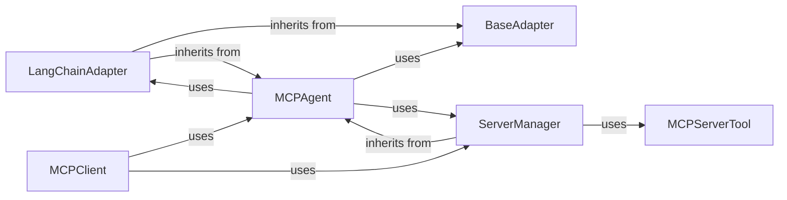

<Info>
This documentation was generated by [CodeBoarding](https://github.com/CodeBoarding/GeneratedOnBoardings) to provide comprehensive architectural insights into the mcp-agent framework.
</Info>

## Details

This analysis provides accurate and verifiable information about the components, their relationships, and their roles within the `mcp_use` subsystem, based on updated feedback.

### BaseAdapter
BaseAdapter (located at mcp_use.adapters.base.BaseAdapter) serves as the abstract base class for all adapters within the framework. It defines a standardized interface for converting and managing external tools, resources, and prompts, making them consumable by the MCPAgent. This class is crucial for promoting a consistent and extensible integration strategy across diverse external systems.

**Related Classes/Methods**:

- <a href="https://github.com/CodeBoarding/mcp-use/blob/main/mcp_use/adapters/base.py#L1-L1" target="_blank" rel="noopener noreferrer">`mcp_use.adapters.base.BaseAdapter` (1:1)</a>
- <a href="https://github.com/CodeBoarding/mcp-use/blob/main/mcp_use/adapters/langchain_adapter.py#L1-L1" target="_blank" rel="noopener noreferrer">`mcp_use.adapters.langchain_adapter.LangChainAdapter` (1:1)</a>

### LangChainAdapter
LangChainAdapter (located at mcp_use.adapters.langchain_adapter.LangChainAdapter) is a concrete implementation that integrates with the LangChain framework. It translates LangChain-specific tools, prompts, and resources into a format compatible with the MCPAgent. Notably, LangChainAdapter inherits from both BaseAdapter and MCPAgent, indicating its dual role: it acts as a specialized adapter for LangChain and can also function as an MCPAgent instance capable of directly leveraging LangChain functionalities.

**Related Classes/Methods**:

- <a href="https://github.com/CodeBoarding/mcp-use/blob/main/mcp_use/adapters/langchain_adapter.py#L1-L1" target="_blank" rel="noopener noreferrer">`mcp_use.adapters.langchain_adapter.LangChainAdapter` (1:1)</a>
- <a href="https://github.com/CodeBoarding/mcp-use/blob/main/mcp_use/adapters/base.py#L1-L1" target="_blank" rel="noopener noreferrer">`mcp_use.adapters.base.BaseAdapter` (1:1)</a>
- <a href="https://github.com/CodeBoarding/mcp-use/blob/main/mcp_use/agents/mcpagent.py#L1-L1" target="_blank" rel="noopener noreferrer">`mcp_use.agents.mcpagent.MCPAgent` (1:1)</a>
- <a href="https://github.com/CodeBoarding/mcp-use/blob/main/mcp_use/adapters/langchain_adapter.py#L1-L1" target="_blank" rel="noopener noreferrer">`mcp_use.adapters.langchain_adapter.LangChainAdapter._convert_prompt` (1:1)</a>
- <a href="https://github.com/CodeBoarding/mcp-use/blob/main/mcp_use/adapters/langchain_adapter.py#L1-L1" target="_blank" rel="noopener noreferrer">`mcp_use.adapters.langchain_adapter.LangChainAdapter._convert_resource` (1:1)</a>
- <a href="https://github.com/CodeBoarding/mcp-use/blob/main/mcp_use/adapters/langchain_adapter.py#L1-L1" target="_blank" rel="noopener noreferrer">`mcp_use.adapters.langchain_adapter.LangChainAdapter._convert_tool` (1:1)</a>

### MCPAgent
MCPAgent (located at mcp_use.agents.mcpagent.MCPAgent) is the core AI agent responsible for orchestrating tasks, making decisions, and executing actions. It interacts with various adapters (like LangChainAdapter) to access and utilize tools and resources from external AI frameworks. The MCPAgent consumes the standardized output provided by these adapters, ensuring it remains decoupled from the specifics of external system implementations.

**Related Classes/Methods**:

- <a href="https://github.com/CodeBoarding/mcp-use/blob/main/mcp_use/agents/mcpagent.py#L1-L1" target="_blank" rel="noopener noreferrer">`mcp_use.agents.mcpagent.MCPAgent` (1:1)</a>
- <a href="https://github.com/CodeBoarding/mcp-use/blob/main/mcp_use/adapters/langchain_adapter.py#L1-L1" target="_blank" rel="noopener noreferrer">`mcp_use.adapters.langchain_adapter.LangChainAdapter` (1:1)</a>
- <a href="https://github.com/CodeBoarding/mcp-use/blob/main/mcp_use/managers/server_manager.py#L16-L89" target="_blank" rel="noopener noreferrer">`mcp_use.managers.server_manager.ServerManager` (16:89)</a>
- <a href="https://github.com/CodeBoarding/mcp-use/blob/main/mcp_use/client.py#L1-L1" target="_blank" rel="noopener noreferrer">`mcp_use.client.MCPClient` (1:1)</a>
- <a href="https://github.com/CodeBoarding/mcp-use/blob/main/mcp_use/connectors/base.py#L1-L1" target="_blank" rel="noopener noreferrer">`mcp_use.connectors.base.BaseConnector` (1:1)</a>
- <a href="https://github.com/CodeBoarding/mcp-use/blob/main/mcp_use/telemetry/telemetry.py#L55-L305" target="_blank" rel="noopener noreferrer">`mcp_use.telemetry.telemetry.Telemetry` (55:305)</a>

### ServerManager
ServerManager (located at mcp_use.managers.server_manager.ServerManager) is responsible for managing connections and interactions with various external servers. Contrary to the previous analysis, ServerManager inherits directly from MCPAgent, not BaseAdapter. This indicates that ServerManager is a specialized MCPAgent designed to handle server-related tasks, leveraging the agent's capabilities for managing connections and executing server-specific tools. It utilizes tools within mcp_use.managers.tools to perform its functions.

**Related Classes/Methods**:

- <a href="https://github.com/CodeBoarding/mcp-use/blob/main/mcp_use/managers/server_manager.py#L16-L89" target="_blank" rel="noopener noreferrer">`mcp_use.managers.server_manager.ServerManager` (16:89)</a>
- <a href="https://github.com/CodeBoarding/mcp-use/blob/main/mcp_use/agents/mcpagent.py#L1-L1" target="_blank" rel="noopener noreferrer">`mcp_use.agents.mcpagent.MCPAgent` (1:1)</a>
- <a href="https://github.com/CodeBoarding/mcp-use/blob/main/mcp_use/client.py#L1-L1" target="_blank" rel="noopener noreferrer">`mcp_use.client.MCPClient` (1:1)</a>
- <a href="https://github.com/CodeBoarding/mcp-use/blob/main/mcp_use/managers/tools/connect_server.py#L15-L68" target="_blank" rel="noopener noreferrer">`mcp_use.managers.tools.connect_server.ConnectServerTool` (15:68)</a>
- <a href="https://github.com/CodeBoarding/mcp-use/blob/main/mcp_use/managers/tools/disconnect_server.py#L15-L42" target="_blank" rel="noopener noreferrer">`mcp_use.managers.tools.disconnect_server.DisconnectServerTool` (15:42)</a>
- <a href="https://github.com/CodeBoarding/mcp-use/blob/main/mcp_use/managers/tools/list_servers_tool.py#L15-L51" target="_blank" rel="noopener noreferrer">`mcp_use.managers.tools.list_servers_tool.ListServersTool` (15:51)</a>
- <a href="https://github.com/CodeBoarding/mcp-use/blob/main/mcp_use/managers/tools/get_active_server.py#L13-L28" target="_blank" rel="noopener noreferrer">`mcp_use.managers.tools.get_active_server.GetActiveServerTool` (13:28)</a>

### MCPClient
MCPClient is responsible for managing sessions and connections, interacting with MCPAgent and ServerManager.

**Related Classes/Methods**:

- <a href="https://github.com/CodeBoarding/mcp-use/blob/main/mcp_use/client.py#L1-L1" target="_blank" rel="noopener noreferrer">`mcp_use.client.MCPClient` (1:1)</a>
- <a href="https://github.com/CodeBoarding/mcp-use/blob/main/mcp_use/agents/mcpagent.py#L1-L1" target="_blank" rel="noopener noreferrer">`mcp_use.agents.mcpagent.MCPAgent` (1:1)</a>
- <a href="https://github.com/CodeBoarding/mcp-use/blob/main/mcp_use/managers/server_manager.py#L16-L89" target="_blank" rel="noopener noreferrer">`mcp_use.managers.server_manager.ServerManager` (16:89)</a>

### MCPServerTool
MCPServerTool serves as the base class for various server management tools used by ServerManager.

**Related Classes/Methods**:

- <a href="https://github.com/CodeBoarding/mcp-use/blob/main/mcp_use/managers/tools/base_tool.py#L5-L18" target="_blank" rel="noopener noreferrer">`mcp_use.managers.tools.base_tool.MCPServerTool` (5:18)</a>
- <a href="https://github.com/CodeBoarding/mcp-use/blob/main/mcp_use/managers/tools/connect_server.py#L15-L68" target="_blank" rel="noopener noreferrer">`mcp_use.managers.tools.connect_server.ConnectServerTool` (15:68)</a>
- <a href="https://github.com/CodeBoarding/mcp-use/blob/main/mcp_use/managers/tools/disconnect_server.py#L15-L42" target="_blank" rel="noopener noreferrer">`mcp_use.managers.tools.disconnect_server.DisconnectServerTool` (15:42)</a>
- <a href="https://github.com/CodeBoarding/mcp-use/blob/main/mcp_use/managers/tools/list_servers_tool.py#L15-L51" target="_blank" rel="noopener noreferrer">`mcp_use.managers.tools.list_servers_tool.ListServersTool` (15:51)</a>
- <a href="https://github.com/CodeBoarding/mcp-use/blob/main/mcp_use/managers/tools/get_active_server.py#L13-L28" target="_blank" rel="noopener noreferrer">`mcp_use.managers.tools.get_active_server.GetActiveServerTool` (13:28)</a>

### [FAQ](https://github.com/CodeBoarding/GeneratedOnBoardings/tree/main?tab=readme-ov-file#faq)
