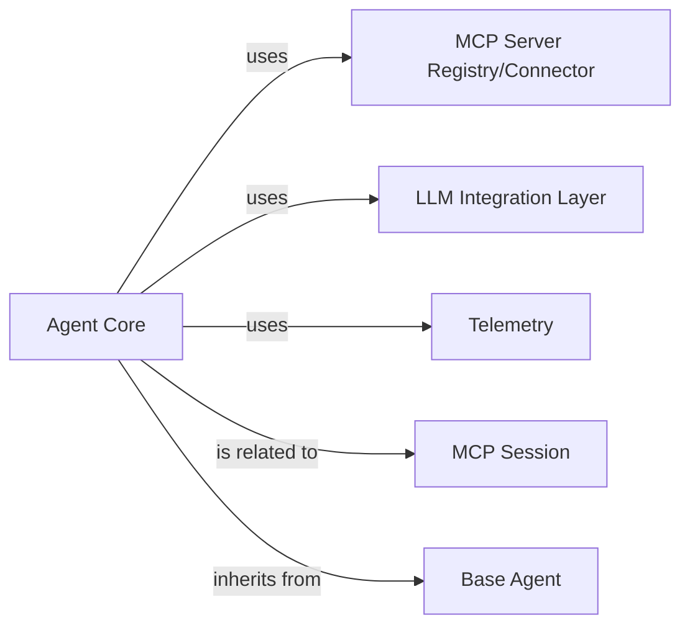

# Agent Core

### Details

The `Agent Core` subsystem is the central orchestrator within the `mcp-use` framework, responsible for the agent's decision-making, lifecycle, and overall execution flow. It integrates various components to interact with the external environment and manage its operational state.

The primary intelligence and orchestration unit. It manages the agent's lifecycle, decision-making processes, and coordinates interactions with other components to execute tasks and communicate with external services.

**Related Classes/Methods**:

- <a href="https://github.com/CodeBoarding/mcp-use/blob/main/mcp_use/agents/mcpagent.py#L1-L1" target="_blank" rel="noopener noreferrer">`mcp_use.agents.mcpagent.MCPAgent` (1:1)</a>

Provides the foundational structure and common functionalities for all agents within the framework. It serves as an abstract base class that `Agent Core` extends.

**Related Classes/Methods**:

- <a href="https://github.com/CodeBoarding/mcp-use/blob/main/mcp_use/agents/base.py#L1-L1" target="_blank" rel="noopener noreferrer">`mcp_use.agents.base.BaseAgent` (1:1)</a>

Manages connections and interactions with various MCP (Multi-Agent Communication Protocol) servers. It acts as an interface for the `Agent Core` to discover and communicate with available services.

**Related Classes/Methods**:

- <a href="https://github.com/CodeBoarding/mcp-use/blob/main/mcp_use/managers/server_manager.py#L16-L89" target="_blank" rel="noopener noreferrer">`mcp_use.managers.server_manager.ServerManager` (16:89)</a>

Facilitates the processing of outputs from Large Language Models (LLMs) and integrates with LangChain-based tools. It acts as an adapter, translating agent requests into LLM-compatible formats and vice-versa.

**Related Classes/Methods**:

- <a href="https://github.com/CodeBoarding/mcp-use/blob/main/mcp_use/adapters/langchain_adapter.py#L1-L1" target="_blank" rel="noopener noreferrer">`mcp_use.adapters.langchain_adapter.LangChainAdapter` (1:1)</a>

Responsible for emitting telemetry events, providing insights into the agent's operational status, performance, and interactions. This component supports observability within the `Agent Core` subsystem.

**Related Classes/Methods**:

- <a href="https://github.com/CodeBoarding/mcp-use/blob/main/mcp_use/telemetry/telemetry.py#L55-L305" target="_blank" rel="noopener noreferrer">`mcp_use.telemetry.telemetry.Telemetry` (55:305)</a>

Manages the state and context of an agent's session. It encapsulates session-specific data and provides mechanisms for maintaining continuity across interactions.

**Related Classes/Methods**:

- <a href="https://github.com/CodeBoarding/mcp-use/blob/main/mcp_use/session.py#L1-L1" target="_blank" rel="noopener noreferrer">`mcp_use.session.MCPSession` (1:1)</a>
