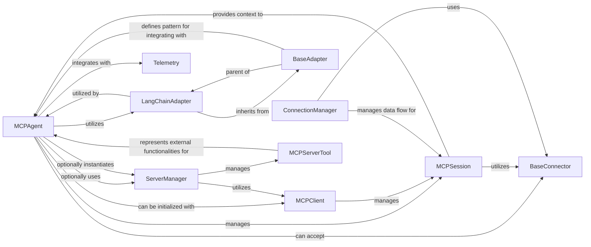

<Info>
This documentation was generated by [CodeBoarding](https://github.com/CodeBoarding/GeneratedOnBoardings) to provide comprehensive architectural insights into the mcp-agent framework.
</Info>

## Details

The `Agent Core` subsystem, centered around the `MCPAgent`, serves as the central intelligence and orchestration unit of the `mcp-use` system. It is responsible for processing user queries, making decisions, executing actions, and managing the agent's internal state and interactions with various external components and services.

### MCPAgent
The primary orchestrator and decision-maker of the `mcp-use` system. It processes inputs, manages the agent's state and history, interacts with LLMs, and coordinates the use of various tools and services to achieve its objectives.

**Related Classes/Methods**:

- <a href="https://github.com/CodeBoarding/mcp-use/blob/main/mcp_use/agents/mcpagent.py#L1-L1" target="_blank" rel="noopener noreferrer">`MCPAgent` (1:1)</a>

### LangChainAdapter
Acts as a bridge, converting `mcp-use`'s internal tool representations into a format compatible with LangChain's `BaseTool`. This enables `MCPAgent` to leverage LangChain's `AgentExecutor` for robust tool execution and interaction with various LLMs.

**Related Classes/Methods**:

- <a href="https://github.com/CodeBoarding/mcp-use/blob/main/mcp_use/adapters/langchain_adapter.py#L1-L1" target="_blank" rel="noopener noreferrer">`LangChainAdapter` (1:1)</a>

### ServerManager
Responsible for managing connections to external servers and dynamically discovering tools exposed by those servers. It provides `MCPAgent` with access to a broader range of functionalities beyond locally defined tools, enabling distributed agent capabilities.

**Related Classes/Methods**:

- <a href="https://github.com/CodeBoarding/mcp-use/blob/main/mcp_use/managers/server_manager.py#L16-L89" target="_blank" rel="noopener noreferrer">`ServerManager` (16:89)</a>

### MCPClient
Provides a higher-level abstraction for managing `MCPSession`s and the underlying connections. It simplifies the process for `MCPAgent` to establish and maintain communication channels and discover available tools.

**Related Classes/Methods**:

- <a href="https://github.com/CodeBoarding/mcp-use/blob/main/mcp_use/client/MCPClient.py#L1-L1" target="_blank" rel="noopener noreferrer">`MCPClient` (1:1)</a>

### BaseConnector
An abstract base class that defines the interface for various low-level communication protocols (e.g., WebSocket, HTTP, Stdio, Sandbox). Concrete implementations handle the specifics of establishing and maintaining connections, allowing `MCPAgent` to interact with diverse endpoints.

**Related Classes/Methods**:

- <a href="https://github.com/CodeBoarding/mcp-use/blob/main/mcp_use/connectors/base.py#L1-L1" target="_blank" rel="noopener noreferrer">`BaseConnector` (1:1)</a>

### MCPSession
Represents a single, continuous interaction session of the `MCPAgent`. It maintains the agent's state, conversation history, and manages the lifecycle of connections and tools relevant to that specific session, ensuring coherent and persistent interactions.

**Related Classes/Methods**:

- <a href="https://github.com/CodeBoarding/mcp-use/blob/main/mcp_use/session.py#L1-L1" target="_blank" rel="noopener noreferrer">`MCPSession` (1:1)</a>

### Telemetry [[Expand]](./Telemetry)
Provides observability into the `MCPAgent`'s operations by tracking and logging various execution events. This component is crucial for monitoring, debugging, performance analysis, and understanding the agent's behavior.

**Related Classes/Methods**:

- <a href="https://github.com/CodeBoarding/mcp-use/blob/main/mcp_use/telemetry/telemetry.py#L55-L305" target="_blank" rel="noopener noreferrer">`Telemetry` (55:305)</a>

### BaseAdapter
An abstract base class that establishes a standardized interface for creating adapters. It defines how `mcp-use`'s internal representations can be converted to integrate with various external frameworks, promoting modularity and extensibility.

**Related Classes/Methods**:

- <a href="https://github.com/CodeBoarding/mcp-use/blob/main/mcp_use/adapters/base.py#L1-L1" target="_blank" rel="noopener noreferrer">`BaseAdapter` (1:1)</a>

### ConnectionManager
An abstract base class for managing different types of connections (e.g., SSE, Stdio, WebSocket). Concrete implementations handle the specifics of connection establishment, data flow, and lifecycle management for various communication protocols.

**Related Classes/Methods**:

- <a href="https://github.com/CodeBoarding/mcp-use/blob/main/mcp_use/task_managers/base.py#L1-L1" target="_blank" rel="noopener noreferrer">`ConnectionManager` (1:1)</a>

### MCPServerTool
An abstract base class for tools that are exposed and managed by the `ServerManager`. These tools represent functionalities available from external servers, allowing `MCPAgent` to discover and utilize remote capabilities.

**Related Classes/Methods**:

- <a href="https://github.com/CodeBoarding/mcp-use/blob/main/mcp_use/managers/tools/base_tool.py#L1-L1" target="_blank" rel="noopener noreferrer">`MCPServerTool` (1:1)</a>

### [FAQ](https://github.com/CodeBoarding/GeneratedOnBoardings/tree/main?tab=readme-ov-file#faq)
