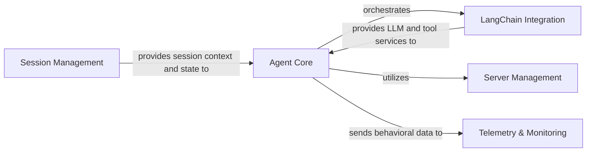

## Details

One paragraph explaining the functionality which is represented by this graph. What the main flow is and what is its purpose.

### Agent Core [[Expand]](./Agent_Core)
The primary orchestration component responsible for managing the lifecycle, execution flow, and decision-making process of AI agents. It drives the overall agent behavior and coordinates interactions with other components.

**Related Classes/Methods**:

- <a href="https://github.com/CodeBoarding/mcp-use/blob/main/mcp_use/agents/mcpagent.py" target="_blank" rel="noopener noreferrer">`mcp_use.agents.mcpagent.MCPAgent`</a>

### LangChain Integration
Provides the necessary abstraction and adaptation layer for seamless integration with LangChain, enabling the Agent Core to leverage large language models (LLMs) and execute various tools defined within the LangChain ecosystem.

**Related Classes/Methods**:

- <a href="https://github.com/CodeBoarding/mcp-use/blob/main/mcp_use/adapters/langchain_adapter.py" target="_blank" rel="noopener noreferrer">`mcp_use.adapters.langchain_adapter.LangChainAdapter`</a>

### Server Management
Manages the lifecycle, communication, and operational aspects of the underlying MCP server infrastructure. It handles server startup, shutdown, and facilitates the agent's interaction with the server environment.

**Related Classes/Methods**:

- <a href="https://github.com/CodeBoarding/mcp-use/blob/main/mcp_use/managers/server_manager.py#L16-L89" target="_blank" rel="noopener noreferrer">`mcp_use.managers.server_manager.ServerManager` (16:89)</a>

### Session Management
Responsible for creating, maintaining, and managing individual agent sessions. It ensures state continuity, context isolation, and proper resource allocation for ongoing agent interactions.

**Related Classes/Methods**:

- <a href="https://github.com/CodeBoarding/mcp-use/blob/main/mcp_use/session.py" target="_blank" rel="noopener noreferrer">`mcp_use.session.MCPSession`</a>

### Telemetry & Monitoring
Collects, processes, and reports operational metrics, logs, and behavioral data related to agent activities. This component is vital for debugging, performance analysis, and understanding agent behavior.

**Related Classes/Methods**:

- <a href="https://github.com/CodeBoarding/mcp-use/blob/main/mcp_use/telemetry/telemetry.py#L55-L305" target="_blank" rel="noopener noreferrer">`mcp_use.telemetry.telemetry.Telemetry` (55:305)</a>
