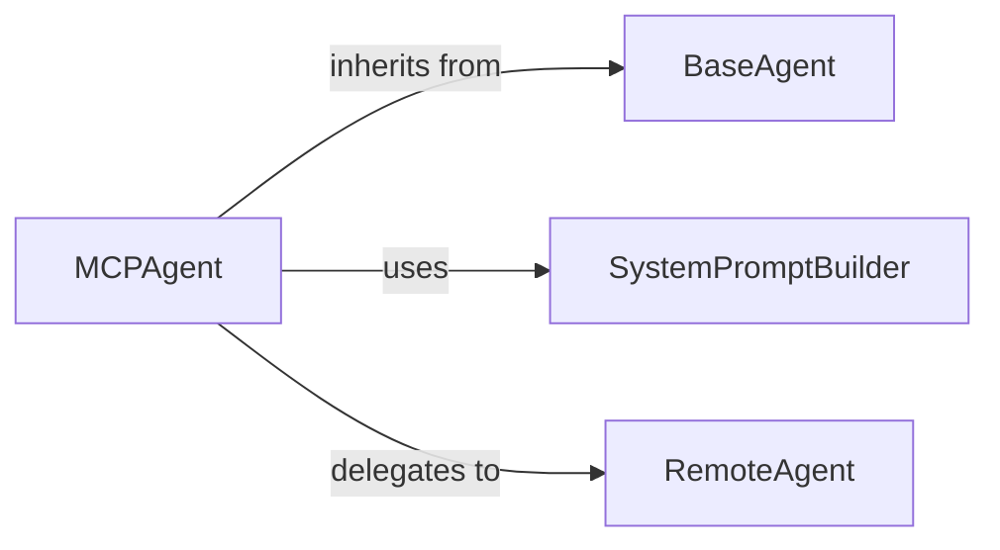

# Agent Core

### Details

The Agent Core subsystem is the central intelligence unit responsible for orchestrating AI agent behavior, managing conversation flow, and coordinating tool usage within the mcp_use project. It is primarily encapsulated within the mcp_use.agents package.

### MCPAgent
The central orchestrator and concrete implementation of an AI agent. It manages the agent's reasoning loop, maintains conversation history, integrates with Large Language Models (LLMs), handles tool execution, and processes structured outputs. It embodies the core intelligence and operational flow of the agent.

**Related Classes/Methods**:

- <a href="https://github.com/mcp-use/mcp-use/blob/main/mcp_use/agents/mcpagent.py#L44-L1011" target="_blank" rel="noopener noreferrer">QName:`mcp_use.agents.mcpagent.MCPAgent` FileRef: `/home/ubuntu/CodeBoarding/repo/mcp-use/mcp_use/agents/mcpagent.py`, Lines:(44:1011)</a>

### BaseAgent
An abstract base class that defines the foundational interface and common behaviors for all agents within the framework. It establishes a contract for agent lifecycle management (e.g., initialization, execution, querying) and state tracking (e.g., maximum steps, previous steps).

**Related Classes/Methods**:

- <a href="https://github.com/mcp-use/mcp-use/blob/main/mcp_use/agents/base.py#L13-L61" target="_blank" rel="noopener noreferrer">QName:`mcp_use.agents.base.BaseAgent` FileRef: `/home/ubuntu/CodeBoarding/repo/mcp-use/mcp_use/agents/base.py`, Lines:(13:61)</a>

### SystemPromptBuilder
A utility component responsible for dynamically constructing the system prompt provided to the LLM. It incorporates descriptions of available tools, additional instructions, and selects appropriate prompt templates based on the agent's configuration.

**Related Classes/Methods**:

- <a href="https://github.com/mcp-use/mcp-use/blob/main/mcp_use/agents/prompts/system_prompt_builder.py#L1-L1000" target="_blank" rel="noopener noreferrer">QName:`mcp_use.agents.prompts.system_prompt_builder.SystemPromptBuilder` FileRef: `/home/ubuntu/CodeBoarding/repo/mcp-use/mcp_use/agents/prompts/system_prompt_builder.py`, Lines:(1:1000)</a>

### RemoteAgent
A specialized agent implementation or a component that facilitates communication with external, remotely hosted agent services. It handles the serialization of requests, deserialization of responses, and manages underlying network interactions (e.g., API keys, base URLs). It also includes logic for parsing structured output received from remote services.

**Related Classes/Methods**:

- <a href="https://github.com/mcp-use/mcp-use/blob/main/mcp_use/agents/remote.py#L18-L239" target="_blank" rel="noopener noreferrer">QName:`mcp_use.agents.remote.RemoteAgent` FileRef: `/home/ubuntu/CodeBoarding/repo/mcp-use/mcp_use/agents/remote.py`, Lines:(18:239)</a>
