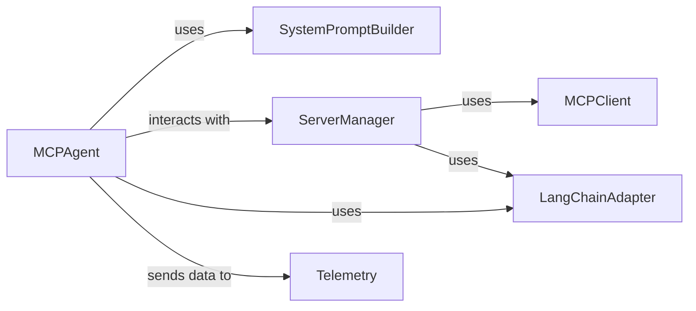

<Info>
This documentation was generated by [CodeBoarding](https://github.com/CodeBoarding/GeneratedOnBoardings) to provide comprehensive architectural insights into the mcp-agent framework.
</Info>

## Details

Abstract Components Overview

### MCPAgent
The primary class for the LLM agent, orchestrating its behavior, managing interactions with LLMs, and utilizing available tools. It is the core of the 'Agent Core & Orchestration' component, responsible for the overall decision-making and execution flow.

**Related Classes/Methods**:

### SystemPromptBuilder
This function is responsible for dynamically constructing the system prompt for the LLM agent. It incorporates tool descriptions, conversation history, and additional instructions, which are crucial for guiding the LLM's behavior and enabling it to effectively use available tools.

**Related Classes/Methods**:

### ServerManager
Manages the discovery, connection, and organization of tools from multiple MCP servers. It acts as a central registry for all available tools that the `MCPAgent` can potentially utilize, abstracting away the complexities of tool retrieval from various sources.

**Related Classes/Methods**:

- <a href="https://github.com/CodeBoarding/mcp-use/blob/main/mcp_use/managers/server_manager.py#L16-L89" target="_blank" rel="noopener noreferrer">`ServerManager` (16:89)</a>

### MCPClient
Handles the underlying communication and session management with MCP servers. It is responsible for establishing connections, authenticating, and retrieving raw tool definitions from remote servers, which are then processed by the `ServerManager`.

**Related Classes/Methods**:

### LangChainAdapter
This component is crucial for interoperability. It converts the generic MCP tool definitions into a format compatible with the LangChain framework, allowing the `MCPAgent` to seamlessly integrate and execute these tools within a LangChain-based agent executor.

**Related Classes/Methods**:

### Telemetry
Provides observability into the agent's execution. It tracks key events, performance metrics, and debugging information throughout the agent's lifecycle, which is essential for monitoring, analysis, and improving the agent's behavior.

**Related Classes/Methods**:

- <a href="https://github.com/CodeBoarding/mcp-use/blob/main/mcp_use/telemetry/telemetry.py#L55-L305" target="_blank" rel="noopener noreferrer">`Telemetry` (55:305)</a>

### [FAQ](https://github.com/CodeBoarding/GeneratedOnBoardings/tree/main?tab=readme-ov-file#faq)
