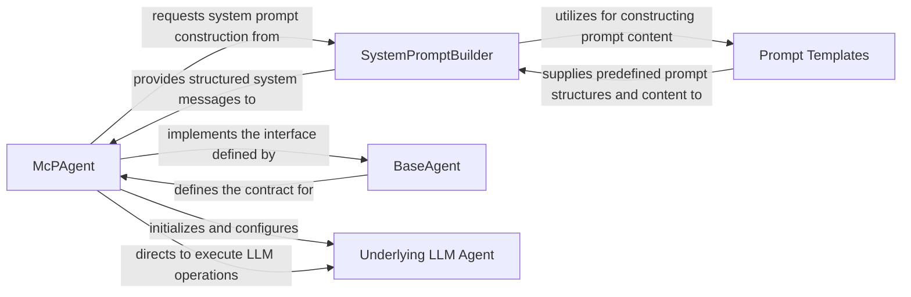

# Agent Core Orchestration

### Details

The `mcp-use` agent subsystem is orchestrated by the `McPAgent`, which acts as the core intelligence, managing interactions with an "Underlying LLM Agent" for reasoning and response generation. The `McPAgent` dynamically constructs system prompts using the `SystemPromptBuilder`, which in turn leverages `Prompt Templates` for modular and reusable prompt content. All agents within the system adhere to the `BaseAgent` interface, ensuring a consistent contract for agent behavior. The "Underlying LLM Agent" represents the actual LLM integration, either directly through a LangChain `BaseLanguageModel` or via a `RemoteAgent` for remote execution, abstracting the specifics of the LLM provider. This architecture promotes modularity, prompt engineering best practices, and flexible LLM integration.

### McPAgent
The central orchestrator of the agent's lifecycle, responsible for LLM interaction, reasoning, dynamic prompt construction, and coordinating external tool utilization. It embodies the "Agent Core" pattern.

**Related Classes/Methods**:

- <a href="https://github.com/mcp-use/mcp-use/blob/main/mcp_use/agents/mcpagent.py#L48-L1107" target="_blank" rel="noopener noreferrer">QName:`mcp_use.agents.mcpagent.McPAgent` FileRef: `/home/ubuntu/CodeBoarding/repo/mcp-use/mcp_use/agents/mcpagent.py`, Lines:(48:1107)</a>

### SystemPromptBuilder
Manages the dynamic construction of the comprehensive system prompt for the LLM, aligning with "Prompt Engineering" principles.

**Related Classes/Methods**:

- <a href="https://github.com/mcp-use/mcp-use/blob/main/mcp_use/agents/prompts/system_prompt_builder.py" target="_blank" rel="noopener noreferrer">QName:`mcp_use.agents.prompts.system_prompt_builder.SystemPromptBuilder` FileRef: `/home/ubuntu/CodeBoarding/repo/mcp-use/mcp_use/agents/prompts/system_prompt_builder.py`</a>

### Prompt Templates
Provides reusable, predefined structures and content for various parts of the system prompt, supporting "Prompt Engineering" and "Modular Design."

**Related Classes/Methods**:

- <a href="https://github.com/mcp-use/mcp-use/blob/main/mcp_use/agents/prompts/templates.py" target="_blank" rel="noopener noreferrer">QName:`mcp_use.agents.prompts.templates` FileRef: `/home/ubuntu/CodeBoarding/repo/mcp-use/mcp_use/agents/prompts/templates.py`</a>

### BaseAgent
Defines the foundational contract and common interface that all agents must adhere to, promoting "Modular Design" and the "Adapter Pattern."

**Related Classes/Methods**:

- <a href="https://github.com/mcp-use/mcp-use/blob/main/mcp_use/agents/base.py#L13-L61" target="_blank" rel="noopener noreferrer">QName:`mcp_use.agents.base.BaseAgent` FileRef: `/home/ubuntu/CodeBoarding/repo/mcp-use/mcp_use/agents/base.py`, Lines:(13:61)</a>

### Underlying LLM Agent
Represents the "LLM Integration Layer," abstracting the specifics of the LLM provider and focusing on core function calling and response generation. This is a conceptual component that `McPAgent` interacts with, either directly via a LangChain `BaseLanguageModel` instance or through a `RemoteAgent` for remote execution.

**Related Classes/Methods**:

- <a href="https://github.com/mcp-use/mcp-use/blob/main/" target="_blank" rel="noopener noreferrer">QName:`langchain_core.language_models.BaseLanguageModel` FileRef: `/home/ubuntu/CodeBoarding/repo/mcp-use/`</a>
- <a href="https://github.com/mcp-use/mcp-use/blob/main/mcp_use/agents/remote.py#L34-L327" target="_blank" rel="noopener noreferrer">QName:`mcp_use.agents.remote.RemoteAgent` FileRef: `/home/ubuntu/CodeBoarding/repo/mcp-use/mcp_use/agents/remote.py`, Lines:(34:327)</a>
