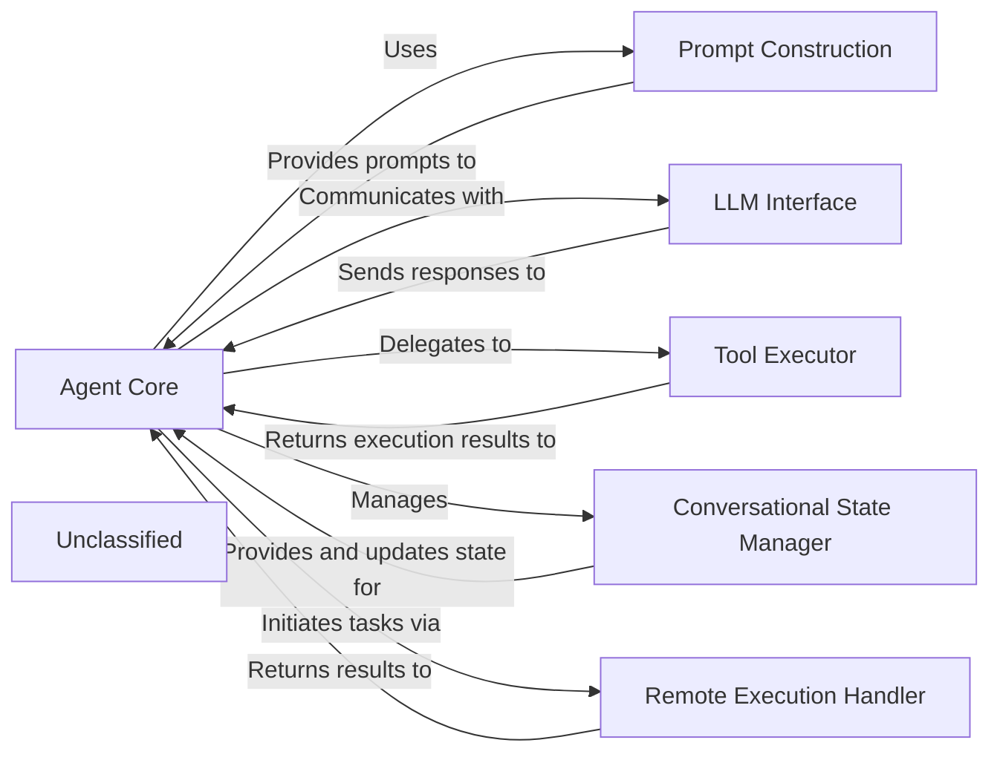

# Agent Orchestration Core

### Details

The `mcp-use` agent subsystem is designed around a central `Agent Core` that orchestrates interactions with various components to achieve its goals. It leverages a `Prompt Construction` module to dynamically generate context-rich prompts for the `LLM Interface`, which abstracts communication with large language models. For executing specific tasks, the `Agent Core` delegates to a `Tool Executor`, which manages the invocation of external capabilities. The `Conversational State Manager`, an intrinsic part of the `Agent Core`, maintains the dialogue history and context, ensuring coherent interactions. Additionally, a `Remote Execution Handler` allows the agent to offload tasks to remote MCP servers, extending its operational reach. This architecture emphasizes modularity, allowing for flexible integration of different LLMs and tools while maintaining a clear separation of concerns.

### Agent Core
The primary orchestrator and decision-making unit of the agent. It manages the overall flow, interprets LLM outputs, and decides on subsequent actions, including tool usage or further LLM interactions. It also encapsulates the conversational state management.

**Related Classes/Methods**:

- <a href="https://github.com/mcp-use/mcp-use/blob/main/mcp_use/agents/mcpagent.py#L48-L1145" target="_blank" rel="noopener noreferrer">QName:`mcp_use.agents.mcpagent.MCPAgent` FileRef: `mcp_use/agents/mcpagent.py`, Lines:(48:1145)</a>
- <a href="https://github.com/mcp-use/mcp-use/blob/main/mcp_use/agents/base.py#L13-L61" target="_blank" rel="noopener noreferrer">QName:`mcp_use.agents.base.BaseAgent` FileRef: `mcp_use/agents/base.py`, Lines:(13:61)</a>

### Prompt Construction
Responsible for dynamically generating and formatting prompts for the LLM, incorporating conversational context, available tools, and specific instructions to guide the LLM's behavior.

**Related Classes/Methods**:

- <a href="https://github.com/mcp-use/mcp-use/blob/main/mcp_use/agents/prompts/system_prompt_builder.py#L59-L103" target="_blank" rel="noopener noreferrer">QName:`mcp_use.agents.prompts.system_prompt_builder.create_system_message` FileRef: `mcp_use/agents/prompts/system_prompt_builder.py`, Lines:(59:103)</a>

### Remote Execution Handler
Manages the delegation and execution of tasks or tool calls on remote MCP (Multi-Component Platform) servers, handling the communication protocol and result retrieval.

**Related Classes/Methods**:

- <a href="https://github.com/mcp-use/mcp-use/blob/main/mcp_use/agents/remote.py#L34-L327" target="_blank" rel="noopener noreferrer">QName:`mcp_use.agents.remote.RemoteAgent` FileRef: `mcp_use/agents/remote.py`, Lines:(34:327)</a>

### LLM Interface
Provides a standardized abstraction layer for interacting with various Large Language Models, handling request formatting, sending prompts, and parsing responses.

**Related Classes/Methods**:

- <a href="https://github.com/mcp-use/mcp-use/blob/main/full/path/to/file.txt#L10-L25" target="_blank" rel="noopener noreferrer">QName:`langchain_core.language_models.BaseLanguageModel` FileRef: `full/path/to/file.txt`, Lines:(10:25)</a>

### Tool Executor
Manages the invocation and execution of external tools or internal functions that the agent decides to use to achieve its goals. It handles tool input, execution, and output processing.

**Related Classes/Methods**:

- QName:`langchain.agents.AgentExecutor` FileRef: ``

### Conversational State Manager
Responsible for maintaining and updating the ongoing conversational context, including message history, user inputs, and agent thoughts, ensuring coherent and context-aware interactions. This functionality is integrated within the `Agent Core`.

**Related Classes/Methods**:

- <a href="https://github.com/mcp-use/mcp-use/blob/main/mcp_use/agents/mcpagent.py#L48-L1145" target="_blank" rel="noopener noreferrer">QName:`mcp_use.agents.mcpagent.MCPAgent` FileRef: `mcp_use/agents/mcpagent.py`, Lines:(48:1145)</a>

### Unclassified
Component for all unclassified files and utility functions (Utility functions/External Libraries/Dependencies)

**Related Classes/Methods**: _None_
