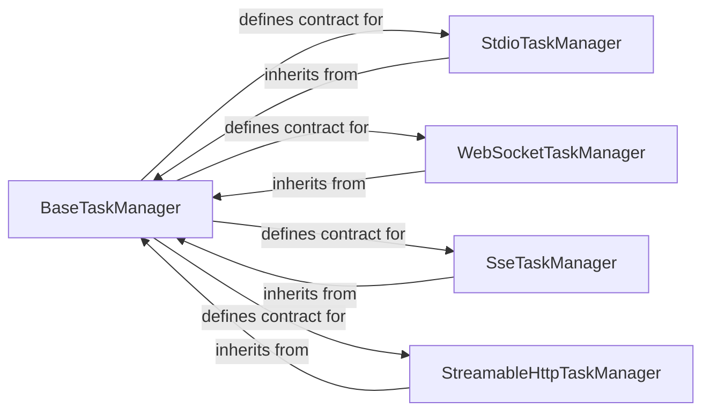

# Asynchronous Task Management

### Details

The `Asynchronous Task Management` subsystem is critical for the `mcp-use` project, an LLM Agent Framework/Library, as it provides the foundational mechanisms for agents to interact with various communication channels asynchronously. This aligns with the project's architectural bias towards extensibility and modularity, allowing different transport layers to be plugged in seamlessly.

### BaseTaskManager
Defines the abstract interface and core lifecycle management for asynchronous connections and background tasks. It provides a common structure for establishing, maintaining, and closing connections, acting as the blueprint for all specific task managers.

**Related Classes/Methods**:

- <a href="https://github.com/mcp-use/mcp-use/blob/main/mcp_use/task_managers/base.py#L1-L1" target="_blank" rel="noopener noreferrer">QName:`mcp_use.task_managers.base.BaseTaskManager` FileRef: `/home/ubuntu/CodeBoarding/repo/mcp-use/mcp_use/task_managers/base.py`</a>

### StdioTaskManager
Manages asynchronous tasks specifically for standard input/output (stdio) streams, enabling console-based communication for agents. This is crucial for local development, debugging, and simple interactive agent sessions.

**Related Classes/Methods**:

- <a href="https://github.com/mcp-use/mcp-use/blob/main/mcp_use/task_managers/stdio.py#L1-L1" target="_blank" rel="noopener noreferrer">QName:`mcp_use.task_managers.stdio.StdioTaskManager` FileRef: `/home/ubuntu/CodeBoarding/repo/mcp-use/mcp_use/task_managers/stdio.py`</a>

### WebSocketTaskManager
Manages asynchronous tasks for WebSocket connections, facilitating persistent, full-duplex communication channels for agents. This is vital for real-time, interactive agent-to-agent or agent-to-client communication.

**Related Classes/Methods**:

- <a href="https://github.com/mcp-use/mcp-use/blob/main/mcp_use/task_managers/websocket.py#L1-L1" target="_blank" rel="noopener noreferrer">QName:`mcp_use.task_managers.websocket.WebSocketTaskManager` FileRef: `/home/ubuntu/CodeBoarding/repo/mcp-use/mcp_use/task_managers/websocket.py`</a>

### SseTaskManager
Manages asynchronous tasks for Server-Sent Events (SSE), enabling agents to receive continuous event streams from a server. This is useful for one-way, server-initiated updates or notifications to agents.

**Related Classes/Methods**:

- <a href="https://github.com/mcp-use/mcp-use/blob/main/mcp_use/task_managers/sse.py#L1-L1" target="_blank" rel="noopener noreferrer">QName:`mcp_use.task_managers.sse.SseTaskManager` FileRef: `/home/ubuntu/CodeBoarding/repo/mcp-use/mcp_use/task_managers/sse.py`</a>

### StreamableHttpTaskManager
Manages asynchronous tasks for streamable HTTP connections, allowing for long-lived HTTP requests that continuously stream data, potentially for agent communication or data ingestion. This supports scenarios requiring continuous data flow over HTTP without full-duplex WebSockets.

**Related Classes/Methods**:

- <a href="https://github.com/mcp-use/mcp-use/blob/main/mcp_use/task_managers/streamable_http.py#L1-L1" target="_blank" rel="noopener noreferrer">QName:`mcp_use.task_managers.streamable_http.StreamableHttpTaskManager` FileRef: `/home/ubuntu/CodeBoarding/repo/mcp-use/mcp_use/task_managers/streamable_http.py`</a>
