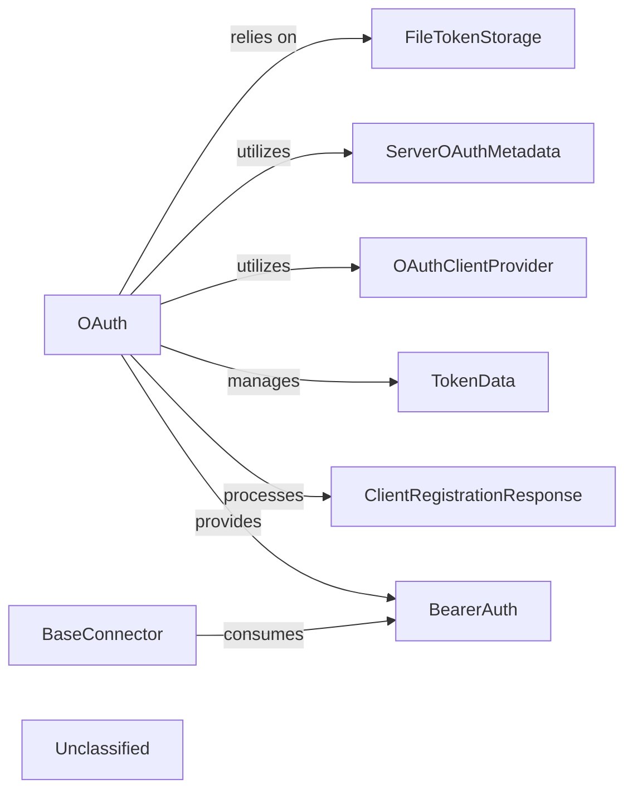

# Authentication Authorization

### Details

The `Authentication & Authorization` subsystem in `mcp-use` is designed to manage secure access to MCP servers using OAuth 2.0. The central `OAuth` component orchestrates the entire authentication flow, from server metadata discovery and dynamic client registration to the lifecycle management of access tokens. It relies on `FileTokenStorage` for persistent token storage and utilizes `ServerOAuthMetadata` and `OAuthClientProvider` for configuration and server capabilities. The subsystem produces `BearerAuth` tokens, which are then consumed by `BaseConnector` instances to make authenticated requests to MCP servers. This design ensures a clear separation of concerns, with dedicated components handling different aspects of the OAuth process and providing a robust mechanism for secure communication.

### OAuth
The central orchestrator for the entire OAuth authentication flow. It manages server metadata discovery, dynamic client registration, token lifecycle (loading, saving, refreshing, deleting), and facilitates authenticated requests to secure MCP servers. It acts as the primary interface for clients requiring OAuth-based authentication.

**Related Classes/Methods**:

- <a href="https://github.com/mcp-use/mcp-use/blob/main/mcp_use/connectors/http.py#L68-L68" target="_blank" rel="noopener noreferrer">QName:`OAuth` FileRef: `/home/ubuntu/CodeBoarding/repo/mcp-use/mcp_use/connectors/http.py`</a>

### FileTokenStorage
Provides a concrete mechanism for securely persisting and retrieving OAuth tokens on the local file system. This ensures token durability across application restarts and manages tokens based on the server URL.

**Related Classes/Methods**:

- <a href="https://github.com/mcp-use/mcp-use/blob/main/mcp_use/auth/oauth.py#L102-L164" target="_blank" rel="noopener noreferrer">QName:`FileTokenStorage` FileRef: `/home/ubuntu/CodeBoarding/repo/mcp-use/mcp_use/auth/oauth.py`, Lines:(102:164)</a>

### ServerOAuthMetadata
A data model that encapsulates the OAuth server's capabilities, endpoints, and other essential metadata required for initiating and managing the OAuth flow.

**Related Classes/Methods**:

- <a href="https://github.com/mcp-use/mcp-use/blob/main/mcp_use/auth/oauth.py#L22-L48" target="_blank" rel="noopener noreferrer">QName:`ServerOAuthMetadata` FileRef: `/home/ubuntu/CodeBoarding/repo/mcp-use/mcp_use/auth/oauth.py`, Lines:(22:48)</a>

### OAuthClientProvider
Responsible for providing the necessary OAuth client configuration and capabilities, including client ID and secrets, which are crucial for dynamic client registration and token requests.

**Related Classes/Methods**:

- <a href="https://github.com/mcp-use/mcp-use/blob/main/mcp_use/auth/oauth.py#L51-L66" target="_blank" rel="noopener noreferrer">QName:`OAuthClientProvider` FileRef: `/home/ubuntu/CodeBoarding/repo/mcp-use/mcp_use/auth/oauth.py`, Lines:(51:66)</a>

### TokenData
A data model representing the structure and content of an OAuth token, including access tokens, refresh tokens, expiration times, and scopes.

**Related Classes/Methods**:

- <a href="https://github.com/mcp-use/mcp-use/blob/main/mcp_use/auth/oauth.py#L69-L79" target="_blank" rel="noopener noreferrer">QName:`TokenData` FileRef: `/home/ubuntu/CodeBoarding/repo/mcp-use/mcp_use/auth/oauth.py`, Lines:(69:79)</a>

### ClientRegistrationResponse
A data model that captures the response received from an OAuth server during the dynamic client registration process, containing details like the registered client ID and client secret.

**Related Classes/Methods**:

- <a href="https://github.com/mcp-use/mcp-use/blob/main/mcp_use/auth/oauth.py#L82-L99" target="_blank" rel="noopener noreferrer">QName:`ClientRegistrationResponse` FileRef: `/home/ubuntu/CodeBoarding/repo/mcp-use/mcp_use/auth/oauth.py`, Lines:(82:99)</a>

### BearerAuth
An authentication object that provides the Bearer token, ready to be included in HTTP request headers for authenticating requests to secure MCP servers. It is the direct output of a successful authentication process.

**Related Classes/Methods**:

- <a href="https://github.com/mcp-use/mcp-use/blob/main/mcp_use/auth/bearer.py#L9-L17" target="_blank" rel="noopener noreferrer">QName:`BearerAuth` FileRef: `/home/ubuntu/CodeBoarding/repo/mcp-use/mcp_use/auth/bearer.py`, Lines:(9:17)</a>

### BaseConnector
A base class for connectors that interact with secure MCP servers. It defines the interface for consuming authentication credentials (like `BearerAuth`) to make authenticated requests. This component represents the external consumer of the `Authentication & Authorization` subsystem's output.

**Related Classes/Methods**:

- <a href="https://github.com/mcp-use/mcp-use/blob/main/mcp_use/connectors/base.py#L37-L453" target="_blank" rel="noopener noreferrer">QName:`BaseConnector` FileRef: `/home/ubuntu/CodeBoarding/repo/mcp-use/mcp_use/connectors/base.py`, Lines:(37:453)</a>

### Unclassified
Component for all unclassified files and utility functions (Utility functions/External Libraries/Dependencies)

**Related Classes/Methods**: _None_
