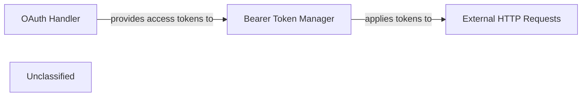

# Authentication Service

### Details

The authentication subsystem in `mcp_use.auth` is designed to handle OAuth 2.0 authentication flows and apply bearer tokens to outgoing HTTP requests. The `OAuth Handler` component, implemented by the `mcp_use.auth.oauth.OAuth` class, is responsible for orchestrating the OAuth process, including discovering server capabilities, dynamic client registration, and managing token storage. Once access tokens are acquired, the `Bearer Token Manager` component, implemented by `mcp_use.auth.bearer.BearerAuth`, takes these tokens and applies them as `Authorization: Bearer` headers to `External HTTP Requests`. This ensures secure communication with external services, such as MCP servers. The `OAuth Handler` provides the necessary access tokens to the `Bearer Token Manager`, which then uses them to authenticate `External HTTP Requests`.

### OAuth Handler
Manages the entire OAuth 2.0 protocol flow. This includes initiating authentication requests with external OAuth providers, handling redirects, and securely obtaining and storing access tokens. It acts as the primary interface for acquiring the necessary authentication credentials.

**Related Classes/Methods**:

- <a href="https://github.com/mcp-use/mcp-use/blob/main/mcp_use/auth/oauth.py#L167-L625" target="_blank" rel="noopener noreferrer">QName:`mcp_use.auth.oauth.OAuth` FileRef: `mcp_use/auth/oauth.py`, Lines:(167:625)</a>

### Bearer Token Manager
Responsible for taking an acquired access token (typically from the OAuth Handler) and correctly formatting it as a bearer token. It then integrates this token into the Authorization header of outgoing HTTP requests, ensuring secure and authenticated communication with MCP servers.

**Related Classes/Methods**:

- <a href="https://github.com/mcp-use/mcp-use/blob/main/mcp_use/auth/bearer.py#L9-L17" target="_blank" rel="noopener noreferrer">QName:`mcp_use.auth.bearer.BearerAuth` FileRef: `mcp_use/auth/bearer.py`, Lines:(9:17)</a>

### External HTTP Requests
Represents any HTTP requests made to external services or APIs, typically to MCP servers, that require authentication.

**Related Classes/Methods**:

- QName:`requests.request` FileRef: ``

### Unclassified
Component for all unclassified files and utility functions (Utility functions/External Libraries/Dependencies)

**Related Classes/Methods**: _None_
