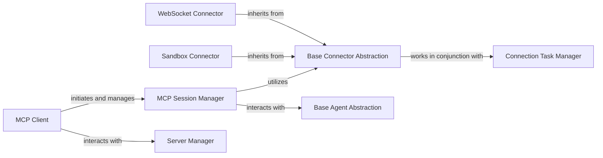

# Client Server Connectivity

### Details

One paragraph explaining the functionality which is represented by this graph. What the main flow is and what is its purpose.

### MCP Client
Serves as the primary client-side interface for initiating and managing interactions with MCP servers. It orchestrates the creation and lifecycle of communication sessions.

**Related Classes/Methods**:

- <a href="https://github.com/CodeBoarding/mcp-use/blob/main/mcp_use/client.py" target="_blank" rel="noopener noreferrer">`mcp_use.client.MCPClient`</a>

### MCP Session Manager
Manages the state, lifecycle, and communication flow of an individual session with an MCP server. It acts as an intermediary, utilizing specific connectors for underlying communication.

**Related Classes/Methods**:

- <a href="https://github.com/CodeBoarding/mcp-use/blob/main/mcp_use/session.py" target="_blank" rel="noopener noreferrer">`mcp_use.session.MCPSession`</a>

### Base Connector Abstraction
Defines the abstract interface for all concrete connection types (e.g., WebSocket, Sandbox). It provides a unified contract for establishing and managing connections, enabling extensibility for new protocols.

**Related Classes/Methods**:

- <a href="https://github.com/CodeBoarding/mcp-use/blob/main/mcp_use/connectors/base.py" target="_blank" rel="noopener noreferrer">`mcp_use.connectors.base.BaseConnector`</a>

### Sandbox Connector
A concrete implementation of the Base Connector Abstraction, specifically designed to handle connections and communication with Sandbox MCP servers.

**Related Classes/Methods**:

- <a href="https://github.com/CodeBoarding/mcp-use/blob/main/mcp_use/connectors/sandbox.py" target="_blank" rel="noopener noreferrer">`mcp_use.connectors.sandbox.SandboxConnector`</a>

### WebSocket Connector
A concrete implementation of the Base Connector Abstraction, responsible for establishing and managing connections using the WebSocket protocol with MCP servers.

**Related Classes/Methods**:

- <a href="https://github.com/CodeBoarding/mcp-use/blob/main/mcp_use/connectors/websocket.py" target="_blank" rel="noopener noreferrer">`mcp_use.connectors.websocket.WebSocketConnector`</a>

### Connection Task Manager
Manages the asynchronous tasks and operational lifecycle associated with specific connector types, ensuring robust and efficient connection handling.

**Related Classes/Methods**:

- <a href="https://github.com/CodeBoarding/mcp-use/blob/main/mcp_use/task_managers/base.py" target="_blank" rel="noopener noreferrer">`mcp_use.task_managers.base.ConnectionManager`</a>

### Server Manager
Manages the lifecycle and state of various MCP servers, providing an interface for clients to connect, disconnect, and retrieve server information. It orchestrates server-side operations and interacts with agents.

**Related Classes/Methods**:

- <a href="https://github.com/CodeBoarding/mcp-use/blob/main/mcp_use/managers/server_manager.py#L16-L89" target="_blank" rel="noopener noreferrer">`mcp_use.managers.server_manager.ServerManager` (16:89)</a>

### Base Agent Abstraction
Defines the abstract interface for all agent types within the MCP system. It provides a common contract for agents to interact with sessions and execute operations.

**Related Classes/Methods**:

- <a href="https://github.com/CodeBoarding/mcp-use/blob/main/mcp_use/agents/base.py" target="_blank" rel="noopener noreferrer">`mcp_use.agents.base.BaseAgent`</a>
