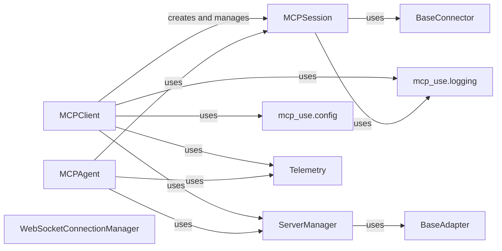

<Info>
This documentation was generated by [CodeBoarding](https://github.com/CodeBoarding/GeneratedOnBoardings) to provide comprehensive architectural insights into the mcp-agent framework.
</Info>

## Details

One paragraph explaining the functionality which is represented by this graph. What the main flow is and what is its purpose.

### MCPClient
Serves as the primary entry point for users. It is responsible for loading and managing configurations, adding/removing MCP server definitions, and crucially, creating and managing multiple `MCPSession` instances. It acts as the central hub for client-side server and session orchestration.

**Related Classes/Methods**:

- <a href="https://github.com/CodeBoarding/mcp-use/blob/main/mcp_use/client.py" target="_blank" rel="noopener noreferrer">`mcp_use.client`</a>

### MCPSession
Encapsulates a single, active connection to an MCP server. It handles the low-level details of connecting, disconnecting, and initializing the session, which includes discovering available tools from the connected server. It acts as a wrapper around various `BaseConnector` implementations for actual network communication.

**Related Classes/Methods**:

- <a href="https://github.com/CodeBoarding/mcp-use/blob/main/mcp_use/session.py" target="_blank" rel="noopener noreferrer">`mcp_use.session`</a>

### BaseConnector
An abstract base class that defines the interface for various network communication protocols (e.g., HTTP, WebSocket, StdIO, Sandbox). Concrete connector implementations inherit from this class, providing the actual mechanism for `MCPSession` to communicate with MCP servers.

**Related Classes/Methods**:

- <a href="https://github.com/CodeBoarding/mcp-use/blob/main/mcp_use/connectors/base.py" target="_blank" rel="noopener noreferrer">`mcp_use.connectors.base`</a>

### ServerManager
Manages the registry of active MCP servers and their exposed tools. It provides functionalities to register, retrieve, and manage server definitions, which are then utilized by `MCPClient` and `MCPAgent`.

**Related Classes/Methods**:

- <a href="https://github.com/CodeBoarding/mcp-use/blob/main/mcp_use/managers/server_manager.py" target="_blank" rel="noopener noreferrer">`mcp_use.managers.server_manager`</a>

### MCPAgent
Represents the core LLM agent within the framework. It interacts with `MCPSession` to establish and manage its connection to the MCP server, enabling it to utilize the tools and functionalities exposed by the server for task execution.

**Related Classes/Methods**:

- <a href="https://github.com/CodeBoarding/mcp-use/blob/main/mcp_use/agents/mcpagent.py" target="_blank" rel="noopener noreferrer">`mcp_use.agents.mcpagent`</a>

### mcp_use.config
This module is responsible for managing configuration settings for the `mcp-use` framework, including server definitions and other operational parameters. It provides mechanisms for loading, saving, and accessing these settings.

**Related Classes/Methods**:

- <a href="https://github.com/CodeBoarding/mcp-use/blob/main/mcp_use/config.py" target="_blank" rel="noopener noreferrer">`mcp_use.config`</a>

### mcp_use.logging
Provides a centralized logging utility for the entire `mcp-use` framework. It ensures consistent and configurable logging of events, errors, and debugging information across various components, including client and session activities.

**Related Classes/Methods**:

- <a href="https://github.com/CodeBoarding/mcp-use/blob/main/mcp_use/logging.py" target="_blank" rel="noopener noreferrer">`mcp_use.logging`</a>

### BaseAdapter
An abstract base class for adapters that convert between `mcp-use`'s internal tool representation and external frameworks (e.g., LangChain). While not directly part of session management, it's crucial for the discoverability and usability of tools exposed through sessions.

**Related Classes/Methods**:

- <a href="https://github.com/CodeBoarding/mcp-use/blob/main/mcp_use/adapters/base.py" target="_blank" rel="noopener noreferrer">`mcp_use.adapters.base`</a>

### Telemetry
This component is responsible for collecting and reporting telemetry data and events related to the framework's operation, including agent executions and client interactions. It provides insights into usage and performance.

**Related Classes/Methods**:

- <a href="https://github.com/CodeBoarding/mcp-use/blob/main/mcp_use/telemetry/telemetry.py" target="_blank" rel="noopener noreferrer">`mcp_use.telemetry.telemetry`</a>

### WebSocketConnectionManager
Manages the lifecycle of WebSocket connections, handling the low-level details of establishing, maintaining, and closing WebSocket communication channels. It works in conjunction with `WebSocketConnector`.

**Related Classes/Methods**:

- <a href="https://github.com/CodeBoarding/mcp-use/blob/main/mcp_use/task_managers/websocket.py" target="_blank" rel="noopener noreferrer">`mcp_use.task_managers.websocket`</a>

### [FAQ](https://github.com/CodeBoarding/GeneratedOnBoardings/tree/main?tab=readme-ov-file#faq)
