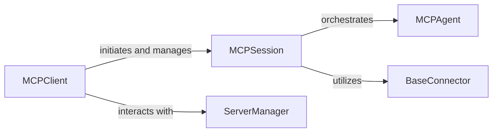

<Info>
This documentation was generated by [CodeBoarding](https://github.com/CodeBoarding/GeneratedOnBoardings) to provide comprehensive architectural insights into the mcp-agent framework.
</Info>

## Details

This section details the Client & Session Management subsystem, which serves as the primary interface for users to interact with the MCP framework. It is responsible for initiating and managing user sessions, providing the necessary context for agent interactions. These components are fundamental because they establish the entry point for user interaction (MCPClient) and manage the entire lifecycle and context of that interaction (MCPSession). Without them, the MCP framework would lack a structured way for users to engage with the LLM agents and for the agents to maintain conversational state and continuity. They embody the core principles of a client-server architecture and session management, which are critical for any interactive system, especially one involving complex, multi-turn agent interactions.

### MCPClient
The MCPClient is the direct entry point for any user or application wishing to interact with the MCP framework. It embodies the "Client" aspect of the Client-Server Architectural Pattern, making it indispensable for external interaction. Its core responsibility is to initiate connections and manage the overall client-side interaction flow, including the creation and termination of individual MCP sessions. Without the MCPClient, there would be no standardized way to establish communication or send requests to the agents within the MCP system.

**Related Classes/Methods**:

- <a href="https://github.com/CodeBoarding/mcp-use/blob/main/mcp_use/client.py#L1-L1" target="_blank" rel="noopener noreferrer">`MCPClient` (1:1)</a>

### MCPSession
The MCPSession manages the state and context of an ongoing MCP interaction or session. In an LLM Agent Framework, conversations and task executions often span multiple turns, and the MCPSession is crucial for maintaining state and context across these interactions. It orchestrates the flow between agents, connectors, and managers, ensuring continuity by maintaining session-specific data. It acts as the orchestrator for a single user's interaction flow, connecting the client, the core agent logic (MCPAgent), and various communication mechanisms (BaseConnector implementations). This component is fundamental for managing the lifecycle of an agent's engagement with a user, ensuring coherent and continuous responses.

**Related Classes/Methods**:

- <a href="https://github.com/CodeBoarding/mcp-use/blob/main/mcp_use/session.py#L1-L1" target="_blank" rel="noopener noreferrer">`MCPSession` (1:1)</a>

### [FAQ](https://github.com/CodeBoarding/GeneratedOnBoardings/tree/main?tab=readme-ov-file#faq)
