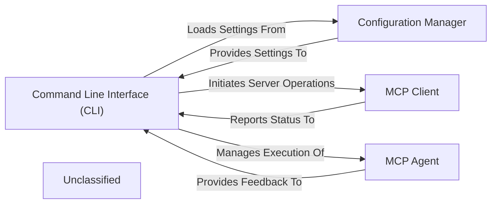

# Command Line Interface CLI

### Details

The `mcp-use` subsystem is orchestrated by the Command Line Interface (CLI), which serves as the primary user interaction point. The CLI is responsible for initiating various operations, including project setup and managing agent workflows. It interacts with the Configuration Manager to load and persist application and project-specific settings, ensuring consistent behavior across sessions. For interacting with external MCP servers, the CLI leverages the MCP Client, which handles communication, server command execution, and status reporting. The core intelligence of the system resides within the MCP Agent, which executes agentic workflows and integrates LLMs and tools. The CLI manages the execution of the MCP Agent and receives feedback on its operations. This architecture ensures a clear separation of concerns, with the CLI handling user input and orchestration, the Configuration Manager providing persistent settings, the MCP Client managing external server interactions, and the MCP Agent performing the core intelligent tasks.

### Command Line Interface (CLI)
The primary user interface for `mcp-use`, responsible for parsing command-line arguments, validating inputs, and dispatching commands to initiate project setup, manage server configurations, or execute agent workflows. It serves as the initial entry point for user interaction.

**Related Classes/Methods**:

- QName:`mcp_use.cli` FileRef: `mcp_use/cli.py`

### Configuration Manager
Manages the loading, saving, and access of all application and project-specific settings, including server endpoints, agent parameters, and tool configurations. It ensures persistent and consistent configuration across sessions. This component is crucial for any framework requiring customizable behavior.

**Related Classes/Methods**:

- QName:`mcp_use.config` FileRef: `mcp_use/config.py`

### MCP Client
Facilitates communication with external MCP (Multi-Agent Communication Protocol) servers. It handles connection establishment, sending requests (e.g., start server, get status), and processing responses, acting as the network interface for server interactions. This is essential for a framework that interacts with external services or agents.

**Related Classes/Methods**:

- <a href="https://github.com/mcp-use/mcp-use/blob/main/mcp_use/client.py#L21-L326" target="_blank" rel="noopener noreferrer">QName:`mcp_use.client.MCPClient` FileRef: `mcp_use/client.py`, Lines:(21:326)</a>

### MCP Agent
The core intelligent component responsible for executing agentic workflows, leveraging LLMs, and integrating various tools. The CLI can initiate, monitor, or configure aspects of its operation. This is the central "brain" of an LLM Agent Framework.

**Related Classes/Methods**:

- <a href="https://github.com/mcp-use/mcp-use/blob/main/mcp_use/agents/mcpagent.py#L48-L1145" target="_blank" rel="noopener noreferrer">QName:`mcp_use.agents.mcpagent.MCPAgent` FileRef: `mcp_use/agents/mcpagent.py`, Lines:(48:1145)</a>

### Unclassified
Component for all unclassified files and utility functions (Utility functions/External Libraries/Dependencies)

**Related Classes/Methods**: _None_
