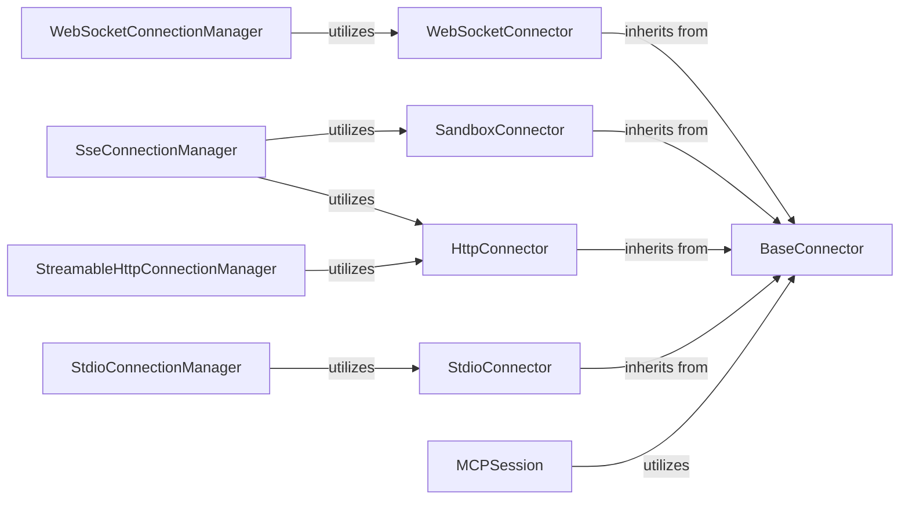

<Info>
This documentation was generated by [CodeBoarding](https://github.com/CodeBoarding/GeneratedOnBoardings) to provide comprehensive architectural insights into the mcp-agent framework.
</Info>

## Details

The `Communication Connectors` component is fundamental to the `LLM Agent Framework/Orchestration Library` because it provides the essential communication layer for the `MCPAgent` to interact with various MCP servers and execute tools. This component embodies the **Adapter Pattern**, abstracting the complexities of different communication protocols (WebSocket, HTTP, Sandbox, Stdio) behind a unified `BaseConnector` interface. This modular design allows for easy integration of new communication methods without altering the core agent logic, which is crucial for the framework's extensibility and adaptability in diverse deployment environments.

### BaseConnector
This is an abstract base class that defines the common interface for all communication protocols. It establishes the contract for how different connectors should operate, ensuring consistency across various communication methods.

**Related Classes/Methods**:

- <a href="https://github.com/CodeBoarding/mcp-use/blob/main/mcp_use/connectors/base.py#L1-L1" target="_blank" rel="noopener noreferrer">`BaseConnector` (1:1)</a>

### WebSocketConnector
A concrete implementation of `BaseConnector` specifically designed for WebSocket communication. It handles the establishment, maintenance, and termination of WebSocket connections, enabling real-time, bidirectional data exchange.

**Related Classes/Methods**:

- <a href="https://github.com/CodeBoarding/mcp-use/blob/main/mcp_use/connectors/websocket.py#L1-L1" target="_blank" rel="noopener noreferrer">`WebSocketConnector` (1:1)</a>

### HttpConnector
A concrete implementation of `BaseConnector` for HTTP-based communication. It manages standard HTTP requests and responses, supporting various RESTful interactions with MCP servers.

**Related Classes/Methods**:

- <a href="https://github.com/CodeBoarding/mcp-use/blob/main/mcp_use/connectors/http.py#L1-L1" target="_blank" rel="noopener noreferrer">`HttpConnector` (1:1)</a>

### SandboxConnector
A concrete implementation of `BaseConnector` tailored for secure, sandboxed environments. This connector facilitates communication with tools or agents running in isolated environments, ensuring security and preventing malicious code execution.

**Related Classes/Methods**:

- <a href="https://github.com/CodeBoarding/mcp-use/blob/main/mcp_use/connectors/sandbox.py#L1-L1" target="_blank" rel="noopener noreferrer">`SandboxConnector` (1:1)</a>

### StdioConnector
A concrete implementation of `BaseConnector` for standard input/output (Stdio) communication. This connector is typically used for local process communication, allowing the agent to interact with tools or scripts running as child processes.

**Related Classes/Methods**:

- <a href="https://github.com/CodeBoarding/mcp-use/blob/main/mcp_use/connectors/stdio.py#L1-L1" target="_blank" rel="noopener noreferrer">`StdioConnector` (1:1)</a>

### MCPSession
Manages the lifecycle of a communication session with an MCP server. It utilizes a `BaseConnector` to send and receive messages, abstracting the underlying communication details from the higher-level agent logic.

**Related Classes/Methods**:

- <a href="https://github.com/CodeBoarding/mcp-use/blob/main/mcp_use/session.py#L1-L1" target="_blank" rel="noopener noreferrer">`MCPSession` (1:1)</a>

### WebSocketConnectionManager
Manages the specific details of WebSocket connections, including connection pooling, error handling, and message routing for `WebSocketConnector`.

**Related Classes/Methods**:

- <a href="https://github.com/CodeBoarding/mcp-use/blob/main/mcp_use/task_managers/websocket.py#L1-L1" target="_blank" rel="noopener noreferrer">`WebSocketConnectionManager` (1:1)</a>

### SseConnectionManager
Manages Server-Sent Events (SSE) connections, often used for one-way communication from the server to the client. It utilizes `SandboxConnector` and `HttpConnector` for its operations.

**Related Classes/Methods**:

- <a href="https://github.com/CodeBoarding/mcp-use/blob/main/mcp_use/task_managers/sse.py#L1-L1" target="_blank" rel="noopener noreferrer">`SseConnectionManager` (1:1)</a>

### StdioConnectionManager
Manages the specifics of Stdio connections, handling input and output streams for the `StdioConnector`.

**Related Classes/Methods**:

- <a href="https://github.com/CodeBoarding/mcp-use/blob/main/mcp_use/task_managers/stdio.py#L1-L1" target="_blank" rel="noopener noreferrer">`StdioConnectionManager` (1:1)</a>

### StreamableHttpConnectionManager
Manages streamable HTTP connections, allowing for efficient handling of large data transfers or continuous streams of information over HTTP. It utilizes the `HttpConnector`.

**Related Classes/Methods**:

- <a href="https://github.com/CodeBoarding/mcp-use/blob/main/mcp_use/task_managers/streamable_http.py#L1-L1" target="_blank" rel="noopener noreferrer">`StreamableHttpConnectionManager` (1:1)</a>

### [FAQ](https://github.com/CodeBoarding/GeneratedOnBoardings/tree/main?tab=readme-ov-file#faq)
