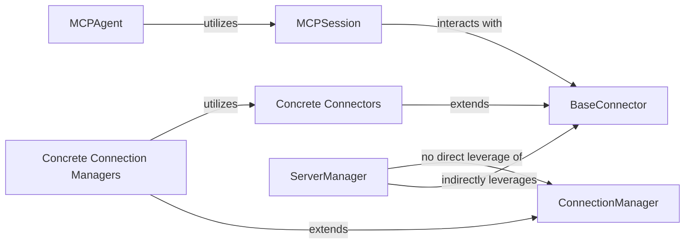

<Info>
This documentation was generated by [CodeBoarding](https://github.com/CodeBoarding/GeneratedOnBoardings) to provide comprehensive architectural insights into the mcp-agent framework.
</Info>

## Details

Abstract Components Overview and Relationships

### BaseConnector
The abstract base class that defines a standardized interface for all communication protocols. It provides the fundamental methods for sending and receiving data, acting as the primary abstraction for low-level communication.

**Related Classes/Methods**:

- <a href="https://github.com/CodeBoarding/mcp-use/blob/main/mcp_use/connectors/base.py" target="_blank" rel="noopener noreferrer">`mcp_use.connectors.base.BaseConnector`</a>

### Concrete Connectors
These classes are concrete implementations of `BaseConnector`, each handling the specifics of a particular communication protocol (e.g., WebSocket, HTTP, Standard I/O, Sandbox environment). They encapsulate the protocol-specific logic for data exchange.

**Related Classes/Methods**:

- <a href="https://github.com/CodeBoarding/mcp-use/blob/main/mcp_use/connectors/websocket.py" target="_blank" rel="noopener noreferrer">`mcp_use.connectors.websocket.WebSocketConnector`</a>
- <a href="https://github.com/CodeBoarding/mcp-use/blob/main/mcp_use/connectors/http.py" target="_blank" rel="noopener noreferrer">`mcp_use.connectors.http.HttpConnector`</a>
- <a href="https://github.com/CodeBoarding/mcp-use/blob/main/mcp_use/connectors/stdio.py" target="_blank" rel="noopener noreferrer">`mcp_use.connectors.stdio.StdioConnector`</a>
- <a href="https://github.com/CodeBoarding/mcp-use/blob/main/mcp_use/connectors/sandbox.py" target="_blank" rel="noopener noreferrer">`mcp_use.connectors.sandbox.SandboxConnector`</a>

### ConnectionManager
The abstract base class for managing the lifecycle of connections. It defines the interface for handling asynchronous operations, maintaining persistent connections, and ensuring non-blocking I/O for various communication channels.

**Related Classes/Methods**:

- <a href="https://github.com/CodeBoarding/mcp-use/blob/main/mcp_use/task_managers/base.py" target="_blank" rel="noopener noreferrer">`mcp_use.task_managers.base.ConnectionManager`</a>

### Concrete Connection Managers
These classes are concrete implementations of `ConnectionManager`, each tailored to manage connections for specific protocols. They utilize the corresponding `Connector` implementations to perform their tasks.

**Related Classes/Methods**:

- <a href="https://github.com/CodeBoarding/mcp-use/blob/main/mcp_use/task_managers/websocket.py" target="_blank" rel="noopener noreferrer">`mcp_use.task_managers.websocket.WebSocketConnectionManager`</a>
- <a href="https://github.com/CodeBoarding/mcp-use/blob/main/mcp_use/task_managers/stdio.py" target="_blank" rel="noopener noreferrer">`mcp_use.task_managers.stdio.StdioConnectionManager`</a>
- <a href="https://github.com/CodeBoarding/mcp-use/blob/main/mcp_use/task_managers/sse.py" target="_blank" rel="noopener noreferrer">`mcp_use.task_managers.sse.SseConnectionManager`</a>
- <a href="https://github.com/CodeBoarding/mcp-use/blob/main/mcp_use/task_managers/streamable_http.py" target="_blank" rel="noopener noreferrer">`mcp_use.task_managers.streamable_http.StreamableHttpConnectionManager`</a>

### MCPSession
Represents a communication session within the MCP framework. It encapsulates a `BaseConnector` and manages the lifecycle of a connection, including connecting, disconnecting, and initializing the session through its contained connector. **Note: Contrary to previous feedback, `MCPSession` does not inherit from `BaseAgent`.**

**Related Classes/Methods**:

- <a href="https://github.com/CodeBoarding/mcp-use/blob/main/mcp_use/session.py" target="_blank" rel="noopener noreferrer">`mcp_use.session.MCPSession`</a>

### MCPAgent
The core LLM agent component that performs actions and interacts with its environment. It interacts with the communication layer by either directly using a list of `BaseConnector` instances or by leveraging an `MCPClient` to manage and access `MCPSession`s (and their underlying `BaseConnector`s). It uses these connectors to interact with tools or external services.

**Related Classes/Methods**:

- <a href="https://github.com/CodeBoarding/mcp-use/blob/main/mcp_use/agents/mcpagent.py" target="_blank" rel="noopener noreferrer">`mcp_use.agents.mcpagent.MCPAgent`</a>

### ServerManager
Responsible for managing connections to various MCP servers. It leverages an `MCPClient` to discover, connect to, and retrieve tools from different servers. It indirectly interacts with `BaseConnector` instances by obtaining them from `MCPSession` objects provided by the `MCPClient`. **It does not directly leverage `ConnectionManager`.**

**Related Classes/Methods**:

- <a href="https://github.com/CodeBoarding/mcp-use/blob/main/mcp_use/managers/server_manager.py#L16-L89" target="_blank" rel="noopener noreferrer">`mcp_use.managers.server_manager.ServerManager` (16:89)</a>

### [FAQ](https://github.com/CodeBoarding/GeneratedOnBoardings/tree/main?tab=readme-ov-file#faq)
