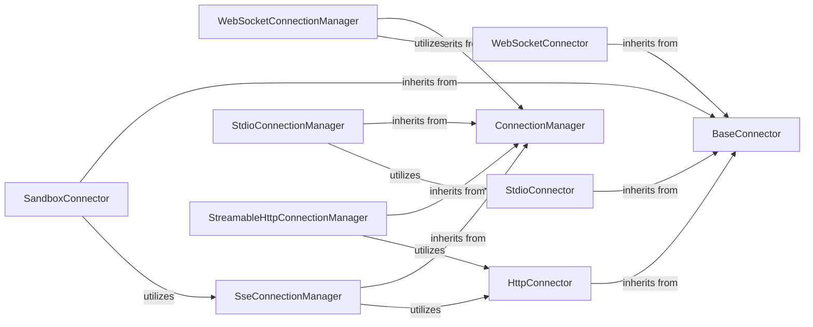

<Info>
This documentation was generated by [CodeBoarding](https://github.com/CodeBoarding/GeneratedOnBoardings) to provide comprehensive architectural insights into the mcp-agent framework.
</Info>

## Details

Abstract Components Overview

### ConnectionManager
This is the abstract base class (mcp_use.task_managers.base.ConnectionManager) that defines the core interface and lifecycle for managing connections. It provides a standardized way to establish, maintain, and close connections, ensuring consistency across different communication protocols. It's fundamental because it enforces a common contract for all connection types, promoting modularity and extensibility.

**Related Classes/Methods**:

- <a href="https://github.com/CodeBoarding/mcp-use/blob/main/mcp_use/task_managers/base.py" target="_blank" rel="noopener noreferrer">`mcp_use.task_managers.base.ConnectionManager`</a>

### BaseConnector
This abstract base class (mcp_use.connectors.base.BaseConnector) defines the low-level interface for interacting with various communication protocols. It abstracts away the specifics of network communication, allowing ConnectionManager implementations to focus on connection lifecycle management. It's fundamental as it provides the necessary abstraction for protocol-agnostic connection handling.

**Related Classes/Methods**:

- <a href="https://github.com/CodeBoarding/mcp-use/blob/main/mcp_use/connectors/base.py" target="_blank" rel="noopener noreferrer">`mcp_use.connectors.base.BaseConnector`</a>

### WebSocketConnectionManager
A concrete implementation of ConnectionManager specifically designed to manage real-time, bidirectional WebSocket connections. It handles the intricacies of WebSocket protocol for persistent communication. It's fundamental for applications requiring real-time interaction with MCP servers.

**Related Classes/Methods**:

- <a href="https://github.com/CodeBoarding/mcp-use/blob/main/mcp_use/task_managers/websocket.py" target="_blank" rel="noopener noreferrer">`mcp_use.task_managers.websocket.WebSocketConnectionManager`</a>

### WebSocketConnector
A concrete implementation of BaseConnector that handles the specifics of establishing and managing WebSocket connections at the protocol level. It provides the actual mechanism for sending and receiving data over WebSockets. It's fundamental as it provides the concrete implementation for WebSocket communication.

**Related Classes/Methods**:

- <a href="https://github.com/CodeBoarding/mcp-use/blob/main/mcp_use/connectors/websocket.py" target="_blank" rel="noopener noreferrer">`mcp_use.connectors.websocket.WebSocketConnector`</a>

### SseConnectionManager
A concrete implementation of ConnectionManager for managing Server-Sent Events (SSE) connections. This is crucial for scenarios where the server needs to push updates to the client over a persistent HTTP connection. It's fundamental for one-way, server-initiated communication.

**Related Classes/Methods**:

- <a href="https://github.com/CodeBoarding/mcp-use/blob/main/mcp_use/task_managers/sse.py" target="_blank" rel="noopener noreferrer">`mcp_use.task_managers.sse.SseConnectionManager`</a>

### StdioConnectionManager
A concrete implementation of ConnectionManager for managing connections over standard input/output (stdio). This is particularly useful for local or sandboxed environments where communication happens via console I/O. It's fundamental for local process communication.

**Related Classes/Methods**:

- <a href="https://github.com/CodeBoarding/mcp-use/blob/main/mcp_use/task_managers/stdio.py" target="_blank" rel="noopener noreferrer">`mcp_use.task_managers.stdio.StdioConnectionManager`</a>

### StdioConnector
A concrete implementation of BaseConnector that handles communication via standard input and output streams. It provides the low-level mechanism for reading from and writing to stdio. It's fundamental for local process communication.

**Related Classes/Methods**:

- <a href="https://github.com/CodeBoarding/mcp-use/blob/main/mcp_use/connectors/stdio.py" target="_blank" rel="noopener noreferrer">`mcp_use.connectors.stdio.StdioConnector`</a>

### StreamableHttpConnectionManager
A concrete implementation of ConnectionManager for managing streamable HTTP connections. This is important for handling large data transfers or continuous streams of data over HTTP. It's fundamental for flexible HTTP-based streaming.

**Related Classes/Methods**:

- <a href="https://github.com/CodeBoarding/mcp-use/blob/main/mcp_use/task_managers/streamable_http.py" target="_blank" rel="noopener noreferrer">`mcp_use.task_managers.streamable_http.StreamableHttpConnectionManager`</a>

### HttpConnector
A concrete implementation of BaseConnector that manages standard HTTP-based connections. This is a versatile connector used by various connection managers for general HTTP communication, including SSE and streamable HTTP. It's fundamental for all HTTP-based interactions.

**Related Classes/Methods**:

- <a href="https://github.com/CodeBoarding/mcp-use/blob/main/mcp_use/connectors/http.py" target="_blank" rel="noopener noreferrer">`mcp_use.connectors.http.HttpConnector`</a>

### SandboxConnector
A concrete implementation of BaseConnector likely designed to handle connections within a sandboxed environment. This is crucial for security and isolation in an LLM agent framework, ensuring that external code execution is contained. It's fundamental for secure and isolated execution.

**Related Classes/Methods**:

- <a href="https://github.com/CodeBoarding/mcp-use/blob/main/mcp_use/connectors/sandbox.py" target="_blank" rel="noopener noreferrer">`mcp_use.connectors.sandbox.SandboxConnector`</a>

### [FAQ](https://github.com/CodeBoarding/GeneratedOnBoardings/tree/main?tab=readme-ov-file#faq)
