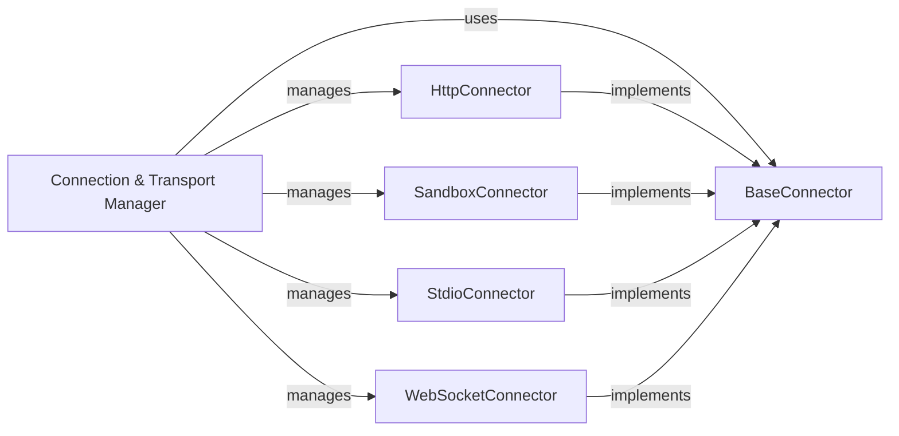

## Details

The Connection & Transport Manager subsystem is a critical part of the mcp-use library, responsible for abstracting and managing the underlying network communication and transport protocols. It adheres to the Adapter/Plugin Pattern, allowing for flexible integration with various MCP server environments.

### Connection & Transport Manager [[Expand]](./Connection_Transport_Manager)
This is the overarching component that orchestrates and manages the various concrete connector implementations. It provides a unified interface for the rest of the system to establish and manage low-level connections to the MCP server or other external services, abstracting away the complexities of different transport mechanisms. It acts as a factory or registry for obtaining the appropriate BaseConnector instance based on the desired environment.

**Related Classes/Methods**:

- <a href="https://github.com/CodeBoarding/mcp-use/blob/main/mcp_use/connectors/__init__.py" target="_blank" rel="noopener noreferrer">`mcp_use.connectors`</a>

### BaseConnector
Defines the abstract interface and common lifecycle management (e.g., connect, disconnect, ensure_active_connection) for all concrete MCP connectors. It establishes a consistent API for core operations like call_tool, list_tools, list_resources, read_resource, list_prompts, get_prompt, and request, ensuring that any specific transport implementation adheres to a standard contract. This is the core of the Adapter pattern.

**Related Classes/Methods**:

- <a href="https://github.com/CodeBoarding/mcp-use/blob/main/mcp_use/connectors/base.py" target="_blank" rel="noopener noreferrer">`mcp_use.connectors.base.BaseConnector`</a>

### HttpConnector
Implements the BaseConnector interface specifically for HTTP-based communication with the MCP server. It handles the details of making HTTP requests and parsing responses, translating them into the standardized BaseConnector operations.

**Related Classes/Methods**:

- <a href="https://github.com/CodeBoarding/mcp-use/blob/main/mcp_use/connectors/http.py" target="_blank" rel="noopener noreferrer">`mcp_use.connectors.http.HttpConnector`</a>

### SandboxConnector
Implements the BaseConnector interface for interacting with a local or sandboxed MCP environment. This component is responsible for managing the lifecycle of a local MCP server process (e.g., starting, stopping, communicating via inter-process mechanisms) and translating these interactions into the BaseConnector API.

**Related Classes/Methods**:

- <a href="https://github.com/CodeBoarding/mcp-use/blob/main/mcp_use/connectors/sandbox.py" target="_blank" rel="noopener noreferrer">`mcp_use.connectors.sandbox.SandboxConnector`</a>

### StdioConnector
Implements the BaseConnector interface for standard input/output (stdio) based communication. This is typically used for local, embedded, or command-line interactions where the MCP server communicates via stdin/stdout streams. It handles the serialization and deserialization of messages over these streams.

**Related Classes/Methods**:

- <a href="https://github.com/CodeBoarding/mcp-use/blob/main/mcp_use/connectors/stdio.py" target="_blank" rel="noopener noreferrer">`mcp_use.connectors.stdio.StdioConnector`</a>

### WebSocketConnector
Implements the BaseConnector interface for establishing and managing real-time, persistent communication with a remote MCP server via the WebSocket protocol. It handles WebSocket connection establishment, message framing, and asynchronous communication, translating these into the BaseConnector operations.

**Related Classes/Methods**:

- <a href="https://github.com/CodeBoarding/mcp-use/blob/main/mcp_use/connectors/websocket.py" target="_blank" rel="noopener noreferrer">`mcp_use.connectors.websocket.WebSocketConnector`</a>
