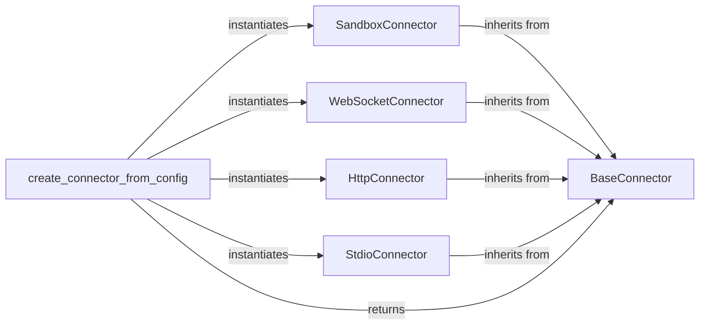

# Connector Layer

### Details

The `Connector Layer` subsystem is crucial for abstracting how the system communicates with various MCP server implementations. It adheres to the Adapter Pattern, providing a unified interface for diverse communication protocols.

### BaseConnector
Defines the abstract interface and contract for all MCP server interactions. It provides a unified set of methods (`connect()`, `disconnect()`, `is_connected()`, `call_tool()`, `list_tools()`, `request()`, etc.) that concrete connectors must implement. This component embodies the Adapter Pattern, abstracting the underlying communication protocol from the agent core.

**Related Classes/Methods**:

- <a href="https://github.com/mcp-use/mcp-use/blob/main/mcp_use/connectors/base.py#L37-L453" target="_blank" rel="noopener noreferrer">QName:`BaseConnector` FileRef: `/home/ubuntu/CodeBoarding/repo/mcp-use/mcp_use/connectors/base.py`, Lines:(37:453)</a>

### SandboxConnector
Implements the `BaseConnector` interface specifically for interacting with MCP servers running in a sandboxed environment. It manages the lifecycle of the sandbox process, redirects standard I/O, and handles communication specific to the sandbox's execution context.

**Related Classes/Methods**:

- <a href="https://github.com/mcp-use/mcp-use/blob/main/mcp_use/connectors/sandbox.py#L35-L302" target="_blank" rel="noopener noreferrer">QName:`SandboxConnector` FileRef: `/home/ubuntu/CodeBoarding/repo/mcp-use/mcp_use/connectors/sandbox.py`, Lines:(35:302)</a>

### WebSocketConnector
Implements the `BaseConnector` interface for real-time, event-driven communication with MCP servers over WebSockets. It manages WebSocket connection establishment, message sending, and asynchronous message reception.

**Related Classes/Methods**:

- <a href="https://github.com/mcp-use/mcp-use/blob/main/mcp_use/connectors/websocket.py#L21-L248" target="_blank" rel="noopener noreferrer">QName:`WebSocketConnector` FileRef: `/home/ubuntu/CodeBoarding/repo/mcp-use/mcp_use/connectors/websocket.py`, Lines:(21:248)</a>

### HttpConnector
Implements the `BaseConnector` interface for standard HTTP-based communication with MCP servers. It handles HTTP request/response cycles, making it suitable for RESTful or RPC-style interactions.

**Related Classes/Methods**:

- <a href="https://github.com/mcp-use/mcp-use/blob/main/mcp_use/connectors/http.py#L18-L213" target="_blank" rel="noopener noreferrer">QName:`HttpConnector` FileRef: `/home/ubuntu/CodeBoarding/repo/mcp-use/mcp_use/connectors/http.py`, Lines:(18:213)</a>

### StdioConnector
Implements the `BaseConnector` interface for communication via standard input/output (stdio) streams. This is typically used for interacting with local processes or command-line tools that communicate over stdin/stdout.

**Related Classes/Methods**:

- <a href="https://github.com/mcp-use/mcp-use/blob/main/mcp_use/connectors/stdio.py#L18-L101" target="_blank" rel="noopener noreferrer">QName:`StdioConnector` FileRef: `/home/ubuntu/CodeBoarding/repo/mcp-use/mcp_use/connectors/stdio.py`, Lines:(18:101)</a>

### create_connector_from_config
Acts as a Simple Factory responsible for dynamically creating and returning the appropriate concrete `BaseConnector` instance based on the provided configuration. This decouples the client code from the specific connector implementation, promoting flexibility and extensibility.

**Related Classes/Methods**:

- <a href="https://github.com/mcp-use/mcp-use/blob/main/mcp_use/config.py#L31-L99" target="_blank" rel="noopener noreferrer">QName:`create_connector_from_config` FileRef: `/home/ubuntu/CodeBoarding/repo/mcp-use/mcp_use/config.py`, Lines:(31:99)</a>
