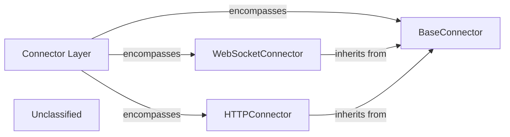

# Connector Layer

### Details

The Connector Layer subsystem provides a robust and standardized mechanism for the MCPClient to interact with various external MCP servers and tools. It acts as a crucial abstraction layer, enabling protocol-agnostic communication. At its core, the BaseConnector defines a common interface for all communication protocols, ensuring consistency and extensibility. Concrete implementations, such as WebSocketConnector and HTTPConnector, extend this base to handle specific protocol intricacies, facilitating real-time and traditional request-response interactions for the MCPClient.

### Connector Layer
The overarching subsystem providing a standardized, protocol-agnostic mechanism for the `MCPClient` to communicate with diverse external `MCP servers` and tools. It acts as the entry point for establishing and managing connections.

**Related Classes/Methods**:

- <a href="https://github.com/mcp-use/mcp-use/blob/main/mcp_use/connectors/base.py#L37-L453" target="_blank" rel="noopener noreferrer">QName:`mcp_use.connectors.base.BaseConnector` FileRef: `/home/ubuntu/CodeBoarding/repo/mcp-use/mcp_use/connectors/base.py`, Lines:(37:453)</a>
- <a href="https://github.com/mcp-use/mcp-use/blob/main/mcp_use/connectors/websocket.py#L22-L257" target="_blank" rel="noopener noreferrer">QName:`mcp_use.connectors.websocket.WebSocketConnector` FileRef: `/home/ubuntu/CodeBoarding/repo/mcp-use/mcp_use/connectors/websocket.py`, Lines:(22:257)</a>
- <a href="https://github.com/mcp-use/mcp-use/blob/main/mcp_use/connectors/http.py#L24-L301" target="_blank" rel="noopener noreferrer">QName:`mcp_use.connectors.http.HTTPConnector` FileRef: `/home/ubuntu/CodeBoarding/repo/mcp-use/mcp_use/connectors/http.py`, Lines:(24:301)</a>

### BaseConnector
Defines the abstract interface and common contract for all concrete connectors. It establishes fundamental operations for connecting, sending requests, and receiving responses, ensuring a consistent API across different communication protocols. This component is crucial for extensibility and adherence to the Adapter Pattern.

**Related Classes/Methods**:

- <a href="https://github.com/mcp-use/mcp-use/blob/main/mcp_use/connectors/base.py#L37-L453" target="_blank" rel="noopener noreferrer">QName:`mcp_use.connectors.base.BaseConnector` FileRef: `/home/ubuntu/CodeBoarding/repo/mcp-use/mcp_use/connectors/base.py`, Lines:(37:453)</a>

### WebSocketConnector
Implements the `BaseConnector` interface specifically for WebSocket-based communication. It handles the intricacies of WebSocket connections, including establishing, maintaining, closing, and managing asynchronous message exchange, vital for real-time agent interactions.

**Related Classes/Methods**:

- <a href="https://github.com/mcp-use/mcp-use/blob/main/mcp_use/connectors/websocket.py#L22-L257" target="_blank" rel="noopener noreferrer">QName:`mcp_use.connectors.websocket.WebSocketConnector` FileRef: `/home/ubuntu/CodeBoarding/repo/mcp-use/mcp_use/connectors/websocket.py`, Lines:(22:257)</a>

### HTTPConnector
Implements the `BaseConnector` interface for HTTP-based communication. It manages the sending of HTTP requests and processing of HTTP responses, handling various HTTP methods and status codes, suitable for traditional request-response interactions with `MCP Servers`.

**Related Classes/Methods**:

- <a href="https://github.com/mcp-use/mcp-use/blob/main/mcp_use/connectors/http.py#L24-L301" target="_blank" rel="noopener noreferrer">QName:`mcp_use.connectors.http.HTTPConnector` FileRef: `/home/ubuntu/CodeBoarding/repo/mcp-use/mcp_use/connectors/http.py`, Lines:(24:301)</a>

### Unclassified
Component for all unclassified files and utility functions (Utility functions/External Libraries/Dependencies)

**Related Classes/Methods**: _None_
