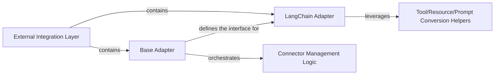

# External Integration Layer

### Details

Abstract Components Overview

### External Integration Layer
The overarching component responsible for abstracting and managing interactions with external AI frameworks and systems. It acts as the primary interface for `mcp-use` to leverage external functionalities, ensuring loose coupling and adaptability.

**Related Classes/Methods**:

- <a href="https://github.com/CodeBoarding/mcp-use/blob/main/mcp_use/adapters/base.py" target="_blank" rel="noopener noreferrer">`mcp_use.adapters.base.BaseAdapter`</a>
- <a href="https://github.com/CodeBoarding/mcp-use/blob/main/mcp_use/adapters/langchain_adapter.py" target="_blank" rel="noopener noreferrer">`mcp_use.adapters.langchain_adapter.LangChainAdapter`</a>

### Base Adapter
Defines the abstract interface and contract for all external integrations. It establishes the common methods and properties that any concrete adapter must implement, ensuring a consistent approach to integrating diverse external systems. It also orchestrates the lifecycle of connectors.

**Related Classes/Methods**:

- <a href="https://github.com/CodeBoarding/mcp-use/blob/main/mcp_use/adapters/base.py" target="_blank" rel="noopener noreferrer">`mcp_use.adapters.base.BaseAdapter`</a>

### LangChain Adapter
A concrete implementation of the `BaseAdapter` specifically tailored for integrating with the LangChain framework. It translates `mcp-use`'s internal requests and data structures into LangChain-compatible formats and vice-versa, enabling the use of LangChain's agents, tools, and chains.

**Related Classes/Methods**:

- <a href="https://github.com/CodeBoarding/mcp-use/blob/main/mcp_use/adapters/langchain_adapter.py" target="_blank" rel="noopener noreferrer">`mcp_use.adapters.langchain_adapter.LangChainAdapter`</a>

### Connector Management Logic
An internal helper component responsible for the initialization, configuration, and lifecycle management of connectors to external systems. It ensures that the necessary connections are established and maintained for adapters to function correctly.

**Related Classes/Methods**:

- <a href="https://github.com/CodeBoarding/mcp-use/blob/main/mcp_use/connectors/base.py" target="_blank" rel="noopener noreferrer">`mcp_use.connectors.base.BaseConnector`</a>
- <a href="https://github.com/CodeBoarding/mcp-use/blob/main/mcp_use/connectors/http.py" target="_blank" rel="noopener noreferrer">`mcp_use.connectors.http.HttpConnector`</a>
- <a href="https://github.com/CodeBoarding/mcp-use/blob/main/mcp_use/connectors/sandbox.py" target="_blank" rel="noopener noreferrer">`mcp_use.connectors.sandbox.SandboxConnector`</a>
- <a href="https://github.com/CodeBoarding/mcp-use/blob/main/mcp_use/connectors/stdio.py" target="_blank" rel="noopener noreferrer">`mcp_use.connectors.stdio.StdioConnector`</a>
- <a href="https://github.com/CodeBoarding/mcp-use/blob/main/mcp_use/connectors/websocket.py" target="_blank" rel="noopener noreferrer">`mcp_use.connectors.websocket.WebSocketConnector`</a>
- <a href="https://github.com/CodeBoarding/mcp-use/blob/main/mcp_use/session.py" target="_blank" rel="noopener noreferrer">`mcp_use.session.MCPSession`</a>

### Tool/Resource/Prompt Conversion Helpers
An internal helper component that performs specific data transformations, such as converting `mcp-use`'s internal tool definitions, resources, or prompt templates into formats compatible with external frameworks (e.g., LangChain's tool schema or prompt templates), and vice-versa.

**Related Classes/Methods**:

- <a href="https://github.com/CodeBoarding/mcp-use/blob/main/mcp_use/adapters/langchain_adapter.py" target="_blank" rel="noopener noreferrer">`mcp_use.adapters.langchain_adapter.LangChainAdapter._convert_prompt`</a>
- <a href="https://github.com/CodeBoarding/mcp-use/blob/main/mcp_use/adapters/langchain_adapter.py" target="_blank" rel="noopener noreferrer">`mcp_use.adapters.langchain_adapter.LangChainAdapter._convert_resource`</a>
- <a href="https://github.com/CodeBoarding/mcp-use/blob/main/mcp_use/adapters/langchain_adapter.py" target="_blank" rel="noopener noreferrer">`mcp_use.adapters.langchain_adapter.LangChainAdapter._convert_tool`</a>
