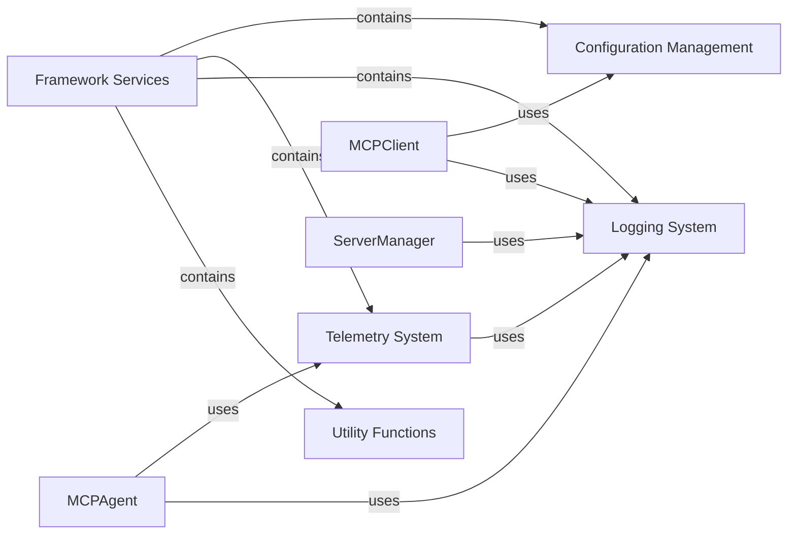

<Info>
This documentation was generated by [CodeBoarding](https://github.com/CodeBoarding/GeneratedOnBoardings) to provide comprehensive architectural insights into the mcp-agent framework.
</Info>

## Details

The Framework Services component provides essential cross-cutting functionalities that are fundamental for the entire mcp_use framework's operation, consistency, and observability. It acts as a foundational layer, offering shared utilities and systems that various other core components rely upon. In an LLM Agent Framework, robust infrastructure services are crucial. Framework Services ensures that agents, clients, and managers can consistently access configuration, log events for debugging and monitoring, and collect performance metrics without reimplementing these functionalities. This promotes modularity, reduces boilerplate, and enhances the overall maintainability and observability of the system.

### Framework Services [[Expand]](./Framework_Services)
The Framework Services component provides essential cross-cutting functionalities that are fundamental for the entire mcp_use framework's operation, consistency, and observability. It acts as a foundational layer, offering shared utilities and systems that various other core components rely upon.

**Related Classes/Methods**:

- <a href="https://github.com/CodeBoarding/mcp-use/blob/main/mcp_use/config.py" target="_blank" rel="noopener noreferrer">`config.py`</a>
- <a href="https://github.com/CodeBoarding/mcp-use/blob/main/mcp_use/logging.py" target="_blank" rel="noopener noreferrer">`logging.py`</a>
- <a href="https://github.com/CodeBoarding/mcp-use/blob/main/mcp_use/telemetry/telemetry.py" target="_blank" rel="noopener noreferrer">`telemetry.py`</a>
- <a href="https://github.com/CodeBoarding/mcp-use/blob/main/mcp_use/telemetry/events.py" target="_blank" rel="noopener noreferrer">`events.py`</a>
- <a href="https://github.com/CodeBoarding/mcp-use/blob/main/mcp_use/utils.py" target="_blank" rel="noopener noreferrer">`utils.py`</a>

### Configuration Management
Responsible for loading, parsing, and providing access to application-wide configuration settings. This ensures that various parts of the framework can operate with consistent parameters, which can be easily modified without code changes.

**Related Classes/Methods**:

- <a href="https://github.com/CodeBoarding/mcp-use/blob/main/mcp_use/config.py" target="_blank" rel="noopener noreferrer">`config.py`</a>

### Telemetry System
Collects anonymous usage data and agent execution metrics, providing insights into the framework's performance and user interactions. This is vital for understanding how agents are used and for identifying areas for optimization.

**Related Classes/Methods**:

- <a href="https://github.com/CodeBoarding/mcp-use/blob/main/mcp_use/telemetry/telemetry.py" target="_blank" rel="noopener noreferrer">`telemetry.py`</a>
- <a href="https://github.com/CodeBoarding/mcp-use/blob/main/mcp_use/telemetry/events.py" target="_blank" rel="noopener noreferrer">`events.py`</a>

### Logging System
Offers a centralized and standardized mechanism for logging operational insights, debugging information, warnings, and errors across the entire framework. This is critical for monitoring the application's health and diagnosing issues.

**Related Classes/Methods**:

- <a href="https://github.com/CodeBoarding/mcp-use/blob/main/mcp_use/logging.py" target="_blank" rel="noopener noreferrer">`logging.py`</a>

### Utility Functions
Provides a collection of general-purpose helper functions and common utilities that are used across various modules within the framework, promoting code reusability and reducing redundancy.

**Related Classes/Methods**:

- <a href="https://github.com/CodeBoarding/mcp-use/blob/main/mcp_use/utils.py" target="_blank" rel="noopener noreferrer">`utils.py`</a>

### [FAQ](https://github.com/CodeBoarding/GeneratedOnBoardings/tree/main?tab=readme-ov-file#faq)
