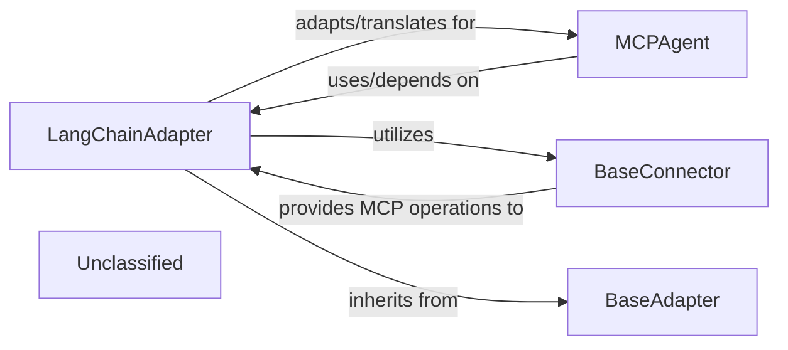

# LLM Integration Adapters

### Details

This subsystem is dedicated to enabling seamless communication and data translation between MCP's internal agent representations and external Large Language Model (LLM) frameworks, primarily LangChain. Its core responsibility is to adapt MCP's tools, resources, and prompts into a format consumable by LLMs, manage the execution of MCP operations within an LLM context, and ensure proper error handling and schema compatibility. It acts as the crucial bridge for MCP agents to leverage the capabilities of various LLM providers.

### LangChainAdapter
This is the central component of the subsystem. It acts as a translator and orchestrator, adapting MCP's internal tools, resources, and prompts into a LangChain-compatible format. It handles schema translation, manages asynchronous execution of MCP operations (via `BaseConnector`), and formats errors for effective LLM consumption. This component is crucial for enabling MCP agents to interact with LLMs through LangChain.

**Related Classes/Methods**:

- <a href="https://github.com/mcp-use/mcp-use/blob/main/mcp_use/adapters/langchain_adapter.py#L29-L268" target="_blank" rel="noopener noreferrer">QName:`LangChainAdapter` FileRef: `/home/ubuntu/CodeBoarding/repo/mcp-use/mcp_use/adapters/langchain_adapter.py`, Lines:(29:268)</a>

### BaseConnector
An abstract base class defining the interface for connecting to MCP servers. It provides methods for executing MCP tool calls, reading resources, and retrieving prompts. `LangChainAdapter` relies on concrete implementations of `BaseConnector` to perform actual MCP operations, abstracting the specifics of MCP server communication.

**Related Classes/Methods**:

- <a href="https://github.com/mcp-use/mcp-use/blob/main/mcp_use/connectors/base.py#L37-L453" target="_blank" rel="noopener noreferrer">QName:`BaseConnector` FileRef: `/home/ubuntu/CodeBoarding/repo/mcp-use/mcp_use/connectors/base.py`, Lines:(37:453)</a>

### MCPAgent
Represents the core agent component that integrates MCP functionalities into its workflow. It utilizes the `LangChainAdapter` to interact with external LLM frameworks, allowing it to leverage LLMs for decision-making and task execution based on MCP's tools and resources. It is the primary consumer of the `LLM Integration & Adapters` subsystem.

**Related Classes/Methods**:

- <a href="https://github.com/mcp-use/mcp-use/blob/main/mcp_use/agents/mcpagent.py#L48-L1107" target="_blank" rel="noopener noreferrer">QName:`MCPAgent` FileRef: `/home/ubuntu/CodeBoarding/repo/mcp-use/mcp_use/agents/mcpagent.py`, Lines:(48:1107)</a>

### BaseAdapter
An abstract base class that defines a common interface and contract for all adapter implementations within the project. `LangChainAdapter` inherits from this class, ensuring a consistent structure and adherence to the Adapter Pattern for different integration points.

**Related Classes/Methods**:

- <a href="https://github.com/mcp-use/mcp-use/blob/main/mcp_use/adapters/base.py#L20-L190" target="_blank" rel="noopener noreferrer">QName:`BaseAdapter` FileRef: `/home/ubuntu/CodeBoarding/repo/mcp-use/mcp_use/adapters/base.py`, Lines:(20:190)</a>

### Unclassified
Component for all unclassified files and utility functions (Utility functions/External Libraries/Dependencies)

**Related Classes/Methods**: _None_
