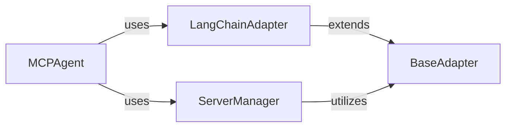

<Info>
This documentation was generated by [CodeBoarding](https://github.com/CodeBoarding/GeneratedOnBoardings) to provide comprehensive architectural insights into the mcp-agent framework.
</Info>

## Details

This component provides a standardized and extensible mechanism for integrating diverse external LLM frameworks, such as LangChain, and their associated components (tools, resources, prompts) into the MCP's internal operational model. It leverages the Adapter Pattern to ensure compatibility and facilitate seamless interaction with various LLM providers, abstracting away framework-specific complexities. This is fundamental for the "LLM Agent Framework/Orchestration Library" as it allows the agent to be agnostic to the underlying LLM framework.

### BaseAdapter
An abstract base class that defines the common interface for adapting external LLM framework components (tools, resources, prompts) into a format usable by the MCP system. It serves as the blueprint for all concrete adapters, ensuring a consistent integration approach. It is fundamental to the "Adapter Pattern" and enables the integration of various LLM providers by providing a standardized contract for conversion.

**Related Classes/Methods**: _None_

### LangChainAdapter
A concrete implementation of BaseAdapter specifically designed to convert LangChain-specific tools, resources, and prompts into the MCP's internal representation. This allows the MCP agent to seamlessly utilize functionalities and assets defined within the LangChain framework. It plays a crucial role in "LLM Integration" by bridging the gap between the MCP and LangChain, demonstrating the practical application of the "Adapter Pattern."

**Related Classes/Methods**: _None_

### ServerManager
Manages tools that originate from integrated LLM frameworks. It acts as a registry and orchestrator for these tools, making them available to the MCPAgent. This component is crucial for the "Tool/Service Abstraction" pattern, providing a unified way to access diverse tools regardless of their origin.

**Related Classes/Methods**: _None_

### MCPAgent
The central orchestrator of the MCP system. It interacts with and utilizes LLM-based tools and resources, which are made available through the LLM Integration & Adapters component. It embodies the "Orchestration Pattern" by coordinating various components to achieve complex tasks.

**Related Classes/Methods**: _None_

### [FAQ](https://github.com/CodeBoarding/GeneratedOnBoardings/tree/main?tab=readme-ov-file#faq)
