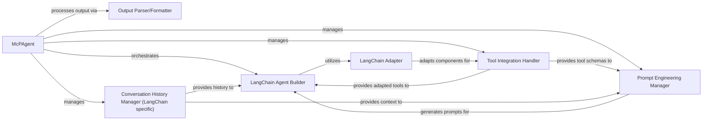

# LLM Integration Layer

### Details

The `mcp-use` agent subsystem is orchestrated by the `McPAgent`, which acts as the central control unit for building and managing LangChain-based conversational agents. It leverages a `LangChain Adapter` to seamlessly integrate various MCP-defined components (tools, resources, prompts) into the LangChain framework. The `McPAgent` interacts with a `LangChain Agent Builder` to construct the agent, a `Tool Integration Handler` for managing tool definitions, a `Prompt Engineering Manager` for dynamic prompt generation, and a `Conversation History Manager` to maintain context. Finally, an `Output Parser/Formatter` processes the agent's responses, ensuring structured and validated output. This architecture emphasizes modularity and adaptability, allowing for flexible agent configurations and interactions with diverse external capabilities.

### McPAgent
The central orchestrator of the agent's lifecycle, responsible for initialization, tool integration, prompt management, conversation history, and output processing. It coordinates interactions between various sub-components to create and manage the LangChain agent.

**Related Classes/Methods**:

- <a href="https://github.com/mcp-use/mcp-use/blob/main/mcp_use/agents/mcpagent.py#L48-L1095" target="_blank" rel="noopener noreferrer">QName:`mcp_use.agents.mcpagent.McPAgent` FileRef: `/home/ubuntu/CodeBoarding/repo/mcp-use/mcp_use/agents/mcpagent.py`, Lines:(48:1095)</a>
- <a href="https://github.com/mcp-use/mcp-use/blob/main/mcp_use/agents/mcpagent.py#L239-L275" target="_blank" rel="noopener noreferrer">QName:`mcp_use.agents.mcpagent.McPAgent:_create_agent` FileRef: `/home/ubuntu/CodeBoarding/repo/mcp-use/mcp_use/agents/mcpagent.py`, Lines:(239:275)</a>
- <a href="https://github.com/mcp-use/mcp-use/blob/main/mcp_use/agents/mcpagent.py#L216-L237" target="_blank" rel="noopener noreferrer">QName:`mcp_use.agents.mcpagent.McPAgent:_create_system_message_from_tools` FileRef: `/home/ubuntu/CodeBoarding/repo/mcp-use/mcp_use/agents/mcpagent.py`, Lines:(216:237)</a>
- <a href="https://github.com/mcp-use/mcp-use/blob/main/mcp_use/agents/mcpagent.py#L310-L330" target="_blank" rel="noopener noreferrer">QName:`mcp_use.agents.mcpagent.McPAgent:set_system_message` FileRef: `/home/ubuntu/CodeBoarding/repo/mcp-use/mcp_use/agents/mcpagent.py`, Lines:(310:330)</a>
- <a href="https://github.com/mcp-use/mcp-use/blob/main/mcp_use/agents/mcpagent.py#L871-L904" target="_blank" rel="noopener noreferrer">QName:`mcp_use.agents.mcpagent.McPAgent:_attempt_structured_output` FileRef: `/home/ubuntu/CodeBoarding/repo/mcp-use/mcp_use/agents/mcpagent.py`, Lines:(871:904)</a>
- <a href="https://github.com/mcp-use/mcp-use/blob/main/mcp_use/agents/mcpagent.py#L293-L300" target="_blank" rel="noopener noreferrer">QName:`mcp_use.agents.mcpagent.McPAgent:add_to_history` FileRef: `/home/ubuntu/CodeBoarding/repo/mcp-use/mcp_use/agents/mcpagent.py`, Lines:(293:300)</a>
- <a href="https://github.com/mcp-use/mcp-use/blob/main/mcp_use/agents/mcpagent.py#L906-L933" target="_blank" rel="noopener noreferrer">QName:`mcp_use.agents.mcpagent.McPAgent:_enhance_query_with_schema` FileRef: `/home/ubuntu/CodeBoarding/repo/mcp-use/mcp_use/agents/mcpagent.py`, Lines:(906:933)</a>

### LangChain Adapter
Adapts MCP tools, resources, and prompts into LangChain-compatible formats, enabling their seamless integration within the LangChain agent. It handles schema conversions and ensures proper execution of MCP components within the LangChain framework.

**Related Classes/Methods**:

- <a href="https://github.com/mcp-use/mcp-use/blob/main/mcp_use/adapters/langchain_adapter.py#L29-L268" target="_blank" rel="noopener noreferrer">QName:`mcp_use.adapters.langchain_adapter.LangChainAdapter` FileRef: `/home/ubuntu/CodeBoarding/repo/mcp-use/mcp_use/adapters/langchain_adapter.py`, Lines:(29:268)</a>

### LangChain Agent Builder
Responsible for constructing and configuring the core LangChain agent instance. This involves assembling the chosen LLM, integrated tools, dynamic prompt templates, and other LangChain runnables into a cohesive, executable agent.

**Related Classes/Methods**:

- <a href="https://github.com/mcp-use/mcp-use/blob/main/mcp_use/agents/mcpagent.py#L239-L275" target="_blank" rel="noopener noreferrer">QName:`mcp_use.agents.mcpagent.McPAgent:_create_agent` FileRef: `/home/ubuntu/CodeBoarding/repo/mcp-use/mcp_use/agents/mcpagent.py`, Lines:(239:275)</a>

### Tool Integration Handler
Manages the integration of external tools with the LangChain agent. This includes converting tool definitions into a format compatible with LangChain and generating structured tool schemas that can be incorporated into prompts for enhanced LLM reasoning.

**Related Classes/Methods**:

- <a href="https://github.com/mcp-use/mcp-use/blob/main/mcp_use/agents/mcpagent.py#L216-L237" target="_blank" rel="noopener noreferrer">QName:`mcp_use.agents.mcpagent.McPAgent:_create_system_message_from_tools` FileRef: `/home/ubuntu/CodeBoarding/repo/mcp-use/mcp_use/agents/mcpagent.py`, Lines:(216:237)</a>
- <a href="https://github.com/mcp-use/mcp-use/blob/main/mcp_use/agents/mcpagent.py#L906-L933" target="_blank" rel="noopener noreferrer">QName:`mcp_use.agents.mcpagent.McPAgent:_enhance_query_with_schema` FileRef: `/home/ubuntu/CodeBoarding/repo/mcp-use/mcp_use/agents/mcpagent.py`, Lines:(906:933)</a>

### Prompt Engineering Manager
Dynamically generates and manages the system prompts, few-shot examples, and other prompt elements required by the LLM. It incorporates tool schemas, conversation history, and specific instructions to guide the LLM's behavior and reasoning.

**Related Classes/Methods**:

- <a href="https://github.com/mcp-use/mcp-use/blob/main/mcp_use/agents/mcpagent.py#L310-L330" target="_blank" rel="noopener noreferrer">QName:`mcp_use.agents.mcpagent.McPAgent:set_system_message` FileRef: `/home/ubuntu/CodeBoarding/repo/mcp-use/mcp_use/agents/mcpagent.py`, Lines:(310:330)</a>
- <a href="https://github.com/mcp-use/mcp-use/blob/main/mcp_use/agents/mcpagent.py#L216-L237" target="_blank" rel="noopener noreferrer">QName:`mcp_use.agents.mcpagent.McPAgent:_create_system_message_from_tools` FileRef: `/home/ubuntu/CodeBoarding/repo/mcp-use/mcp_use/agents/mcpagent.py`, Lines:(216:237)</a>

### Output Parser/Formatter
Post-processes the raw output received from the LangChain agent. Its responsibilities include parsing the LLM's response into expected structured formats (e.g., JSON), performing validation, and handling potential errors or malformed outputs to ensure reliable data flow.

**Related Classes/Methods**:

- <a href="https://github.com/mcp-use/mcp-use/blob/main/mcp_use/agents/mcpagent.py#L871-L904" target="_blank" rel="noopener noreferrer">QName:`mcp_use.agents.mcpagent.McPAgent:_attempt_structured_output` FileRef: `/home/ubuntu/CodeBoarding/repo/mcp-use/mcp_use/agents/mcpagent.py`, Lines:(871:904)</a>

### Conversation History Manager (LangChain specific)
Manages the ongoing conversation history in a format compatible with LangChain's agent. It ensures that context is accurately maintained and provided to the LLM across multiple turns, facilitating coherent and stateful interactions.

**Related Classes/Methods**:

- <a href="https://github.com/mcp-use/mcp-use/blob/main/mcp_use/agents/mcpagent.py#L293-L300" target="_blank" rel="noopener noreferrer">QName:`mcp_use.agents.mcpagent.McPAgent:add_to_history` FileRef: `/home/ubuntu/CodeBoarding/repo/mcp-use/mcp_use/agents/mcpagent.py`, Lines:(293:300)</a>
