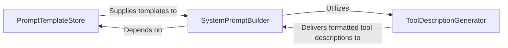

# LLM Integration Prompting

### Details

The LLM Integration & Prompting subsystem is responsible for constructing and managing the prompts sent to Large Language Models. Its boundaries encompass the storage of prompt templates, the dynamic generation of tool descriptions, and the final assembly of the system prompt.

### PromptTemplateStore
Manages and provides access to predefined system prompt templates, acting as a centralized repository for various prompt structures. This component ensures consistency and configurability in prompt generation, aligning with the "Configuration-Driven" and "Modular Design" architectural patterns.

**Related Classes/Methods**:

- <a href="https://github.com/mcp-use/mcp-use/blob/main/mcp_use/agents/prompts/templates.py#L1-L1" target="_blank" rel="noopener noreferrer">QName:`PromptTemplateStore` FileRef: `/home/ubuntu/CodeBoarding/repo/mcp-use/mcp_use/agents/prompts/templates.py`</a>

### ToolDescriptionGenerator
Dynamically generates and formats descriptions of the tools available to the agent, including logic for handling disallowed tools. This is critical for the "Tool Abstraction and Registry" pattern, enabling the LLM to accurately understand and utilize its capabilities.

**Related Classes/Methods**:

- <a href="https://github.com/mcp-use/mcp-use/blob/main/mcp_use/agents/prompts/system_prompt_builder.py#L5-L25" target="_blank" rel="noopener noreferrer">QName:`generate_tool_descriptions` FileRef: `/home/ubuntu/CodeBoarding/repo/mcp-use/mcp_use/agents/prompts/system_prompt_builder.py`, Lines:(5:25)</a>

### SystemPromptBuilder
The orchestrating component responsible for constructing the complete system prompt. It selects appropriate base templates, integrates dynamically generated tool descriptions, and incorporates additional instructions. This component directly embodies the "LLM Integration Layer" by preparing the final input for the AI model.

**Related Classes/Methods**:

- <a href="https://github.com/mcp-use/mcp-use/blob/main/mcp_use/agents/prompts/system_prompt_builder.py#L1-L1" target="_blank" rel="noopener noreferrer">QName:`SystemPromptBuilder` FileRef: `/home/ubuntu/CodeBoarding/repo/mcp-use/mcp_use/agents/prompts/system_prompt_builder.py`</a>
