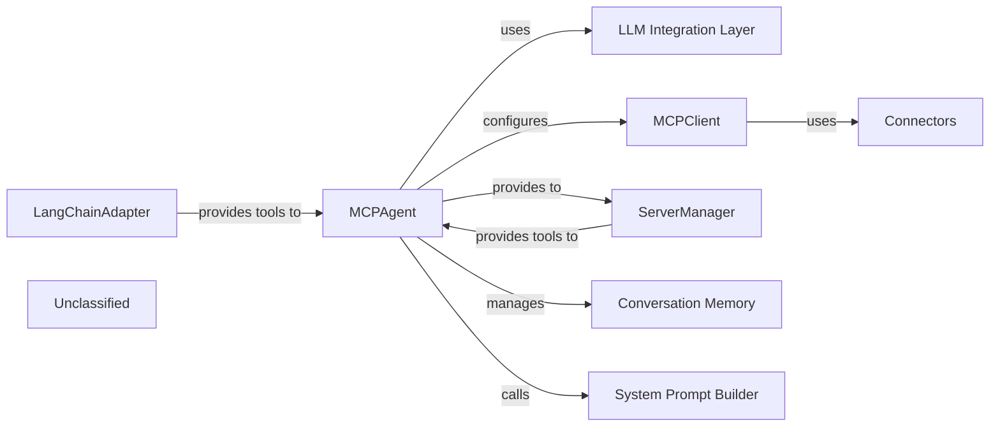

# MCPAgent Core

### Details

The mcp-use project's core subsystem is centered around the MCPAgent, an intelligent orchestrator that leverages Large Language Models (LLMs) to interact with various MCP (Multi-Cloud Platform) services. The MCPAgent utilizes an LLM Integration Layer for its reasoning and decision-making, enabling it to interpret user requests and execute actions. It connects to MCP services through the MCPClient, which in turn manages Connectors for specific communication protocols. To ensure compatibility with the LLM framework, the LangChainAdapter translates MCP-specific tools into a standardized format. An optional ServerManager can dynamically discover and provision tools, enhancing the agent's capabilities. The MCPAgent maintains conversational context through its Conversation Memory and dynamically constructs its operational guidelines using the System Prompt Builder. This architecture allows the MCPAgent to provide a flexible and powerful interface for interacting with diverse MCP tools and services.

### MCPAgent
The central orchestrator, responsible for interpreting user requests, planning actions, interacting with tools, managing conversation flow, and formulating responses. It leverages LLMs for reasoning and integrates various components to achieve its goals.

**Related Classes/Methods**:

- <a href="https://github.com/mcp-use/mcp-use/blob/main/mcp_use/agents/mcpagent.py#L48-L1107" target="_blank" rel="noopener noreferrer">QName:`mcp_use.agents.mcpagent.MCPAgent` FileRef: `/home/ubuntu/CodeBoarding/repo/mcp-use/mcp_use/agents/mcpagent.py`, Lines:(48:1107)</a>

### LLM Integration Layer
This component encapsulates the interaction with Large Language Models. It includes the BaseLanguageModel (e.g., OpenAI, Anthropic, Groq) used by MCPAgent and the LangChain AgentExecutor and create_tool_calling_agent which facilitate the LLM's reasoning and tool-calling capabilities.

**Related Classes/Methods**:

- QName:`langchain_core.language_models.base.BaseLanguageModel` FileRef: `/home/ubuntu/CodeBoarding/repo/mcp-use/`
- QName:`langchain.agents.agent_executor.AgentExecutor` FileRef: `/home/ubuntu/CodeBoarding/repo/mcp-use/`
- QName:`langchain.agents.tool_calling_agent.create_tool_calling_agent` FileRef: `/home/ubuntu/CodeBoarding/repo/mcp-use/`

### MCPClient
Manages the creation, retrieval, and closure of multiple sessions with various MCP servers/connectors. It provides a high-level interface for connection management and tool aggregation from these sessions.

**Related Classes/Methods**:

- <a href="https://github.com/mcp-use/mcp-use/blob/main/mcp_use/client.py#L21-L326" target="_blank" rel="noopener noreferrer">QName:`mcp_use.client.MCPClient` FileRef: `/home/ubuntu/CodeBoarding/repo/mcp-use/mcp_use/client.py`, Lines:(21:326)</a>

### Connectors
Implement the concrete communication protocols (e.g., HTTP, WebSocket, Sandbox) for interacting with individual MCP servers. They handle low-level request/response mechanisms and resource management for specific server types.

**Related Classes/Methods**:

- <a href="https://github.com/mcp-use/mcp-use/blob/main/mcp_use/connectors/base.py#L37-L453" target="_blank" rel="noopener noreferrer">QName:`mcp_use.connectors.base.BaseConnector` FileRef: `/home/ubuntu/CodeBoarding/repo/mcp-use/mcp_use/connectors/base.py`, Lines:(37:453)</a>

### LangChainAdapter
Translates between the MCP's internal tool and resource formats and the LangChain framework's BaseTool format, ensuring compatibility and a unified interface for the MCPAgent to interact with diverse MCP tools.

**Related Classes/Methods**:

- <a href="https://github.com/mcp-use/mcp-use/blob/main/mcp_use/adapters/langchain_adapter.py#L29-L268" target="_blank" rel="noopener noreferrer">QName:`mcp_use.adapters.langchain_adapter.LangChainAdapter` FileRef: `/home/ubuntu/CodeBoarding/repo/mcp-use/mcp_use/adapters/langchain_adapter.py`, Lines:(29:268)</a>
- QName:`langchain_core.tools.base.BaseTool` FileRef: `/home/ubuntu/CodeBoarding/repo/mcp-use/`

### ServerManager
When enabled, dynamically discovers and provisions available MCP servers and their associated tools, including management tools like ListServersTool. It provides a layer of abstraction for tool discovery.

**Related Classes/Methods**:

- <a href="https://github.com/mcp-use/mcp-use/blob/main/mcp_use/managers/server_manager.py#L11-L124" target="_blank" rel="noopener noreferrer">QName:`mcp_use.managers.server_manager.ServerManager` FileRef: `/home/ubuntu/CodeBoarding/repo/mcp-use/mcp_use/managers/server_manager.py`, Lines:(11:124)</a>

### Conversation Memory
Managed internally by MCPAgent through _conversation_history (a list of BaseMessage objects). It stores the ongoing dialogue, including system messages, human queries, and AI responses, to provide context for subsequent interactions.

**Related Classes/Methods**:

- QName:`mcp_use.agents.mcpagent.MCPAgent._conversation_history` FileRef: `/home/ubuntu/CodeBoarding/repo/mcp-use/mcp_use/agents/mcpagent.py`
- QName:`langchain_core.messages.base.BaseMessage` FileRef: `/home/ubuntu/CodeBoarding/repo/mcp-use/`

### System Prompt Builder
An external utility (create_system_message function) used by MCPAgent to dynamically construct the agent's system prompt based on available tools, user-provided instructions, and server manager mode.

**Related Classes/Methods**:

- <a href="https://github.com/mcp-use/mcp-use/blob/main/mcp_use/agents/prompts/system_prompt_builder.py#L59-L103" target="_blank" rel="noopener noreferrer">QName:`mcp_use.agents.prompts.system_prompt_builder.create_system_message` FileRef: `/home/ubuntu/CodeBoarding/repo/mcp-use/mcp_use/agents/prompts/system_prompt_builder.py`, Lines:(59:103)</a>

### Unclassified
Component for all unclassified files and utility functions (Utility functions/External Libraries/Dependencies)

**Related Classes/Methods**: _None_
