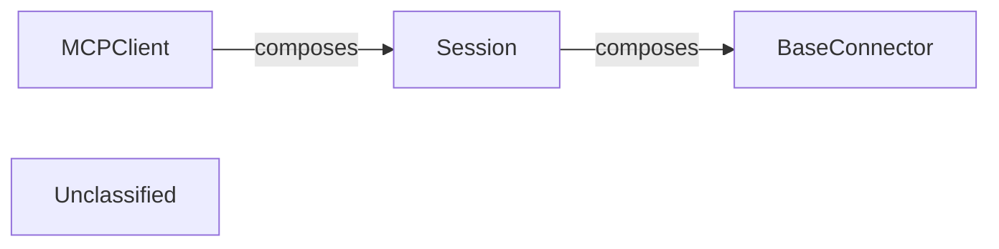

# MCP Client Session Management

### Details

The `mcp-use` project facilitates agent interaction with external services through a well-defined client-connector architecture. The `MCPClient` acts as the central orchestrator, managing multiple `Session` instances. Each `Session` represents a single, isolated connection to an MCP server, handling its lifecycle from establishment to termination. The `Session` relies on `BaseConnector` implementations to abstract the underlying communication protocols, allowing for flexible integration with various MCP server types. This design promotes modularity and extensibility, enabling the agent framework to adapt to diverse communication requirements without significant changes to its core logic.

### MCPClient
The high-level manager for all MCP server connections. It orchestrates the creation, management, and closing of multiple Session instances, providing a unified interface for the MCPAgent to interact with external services. This component is crucial for an agent framework as it centralizes the management of diverse external tool connections.

**Related Classes/Methods**:

- QName:`mcp_use.client.MCPClient` FileRef: `/home/ubuntu/CodeBoarding/repo/mcp-use/mcp_use/client.py`

### Session
Manages the lifecycle of a single, individual connection to an MCP server. This includes establishing the connection, ensuring its proper termination, and providing an asynchronous context for interaction. It encapsulates the state and operations related to a specific connection, which is fundamental for robust and isolated communication within an agent system.

**Related Classes/Methods**:

- QName:`mcp_use.session.Session` FileRef: `/home/ubuntu/CodeBoarding/repo/mcp-use/mcp_use/session.py`

### BaseConnector
An abstract base class that defines the interface for concrete communication mechanisms. Its implementations (e.g., WebSocketConnector, SandboxConnector) provide the actual underlying protocol for a Session to connect and exchange messages with an MCP server. This component embodies the Adapter Pattern, allowing the agent framework to support various communication protocols without altering the core Session logic.

**Related Classes/Methods**:

- <a href="https://github.com/mcp-use/mcp-use/blob/main/mcp_use/connectors/base.py#L37-L453" target="_blank" rel="noopener noreferrer">QName:`mcp_use.connectors.base.BaseConnector` FileRef: `/home/ubuntu/CodeBoarding/repo/mcp-use/mcp_use/connectors/base.py`, Lines:(37:453)</a>

### Unclassified
Component for all unclassified files and utility functions (Utility functions/External Libraries/Dependencies)

**Related Classes/Methods**: _None_
