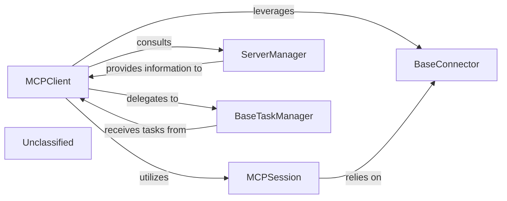

# MCP Communication Management

### Details

The mcp_use subsystem is designed to facilitate robust and flexible interaction with various MCP servers. At its core, the MCPClient acts as the central orchestrator, managing server configurations, session lifecycles, and task execution. It leverages the ServerManager to discover and manage available MCP servers and their associated tools, providing a centralized registry. For establishing and maintaining connections, MCPClient creates MCPSession instances, which in turn rely on BaseConnector to abstract the complexities of different communication protocols. Asynchronous or long-running operations are delegated to BaseTaskManager, ensuring efficient resource management and task completion. This architecture promotes modularity, allowing for easy integration of new server types and communication methods while maintaining a clear separation of concerns.

### MCPClient
Orchestrates direct communication with MCP servers, sending requests, and processing responses, acting as the agent's primary gateway to MCP services. It manages the overall interaction flow with the backend.

**Related Classes/Methods**:

- <a href="https://github.com/mcp-use/mcp-use/blob/main/mcp_use/client.py#L21-L326" target="_blank" rel="noopener noreferrer">QName:`mcp_use.client.MCPClient` FileRef: `mcp_use/client.py`, Lines:(21:326)</a>

### MCPSession
Manages the state and lifecycle of a connection to an MCP server, including authentication, session establishment, and graceful termination, ensuring reliable and secure communication channels.

**Related Classes/Methods**:

- <a href="https://github.com/mcp-use/mcp-use/blob/main/mcp_use/session.py#L17-L154" target="_blank" rel="noopener noreferrer">QName:`mcp_use.session.MCPSession` FileRef: `mcp_use/session.py`, Lines:(17:154)</a>

### BaseConnector
Provides an abstraction layer for connecting to diverse MCP server types, encapsulating the specifics of various communication protocols or APIs. This allows for flexible integration with different server implementations.

**Related Classes/Methods**:

- <a href="https://github.com/mcp-use/mcp-use/blob/main/mcp_use/connectors/base.py#L37-L453" target="_blank" rel="noopener noreferrer">QName:`mcp_use.connectors.base.BaseConnector` FileRef: `mcp_use/connectors/base.py`, Lines:(37:453)</a>

### ServerManager
Discovers, registers, and provides access to available MCP servers and their capabilities (e.g., tools), centralizing server configuration and lookup for the subsystem. It acts as a registry for available services.

**Related Classes/Methods**:

- <a href="https://github.com/mcp-use/mcp-use/blob/main/mcp_use/managers/server_manager.py#L11-L124" target="_blank" rel="noopener noreferrer">QName:`mcp_use.managers.server_manager.ServerManager` FileRef: `mcp_use/managers/server_manager.py`, Lines:(11:124)</a>

### BaseTaskManager
Manages the execution and lifecycle of tasks that involve interactions with MCP servers, particularly for asynchronous or long-running operations, ensuring proper handling, resource management, and result retrieval.

**Related Classes/Methods**:

- QName:`mcp_use.task_managers.base.BaseTaskManager` FileRef: `mcp_use/task_managers/base.py`

### Unclassified
Component for all unclassified files and utility functions (Utility functions/External Libraries/Dependencies)

**Related Classes/Methods**: _None_
