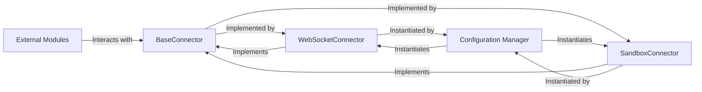

# MCP Connectors

### Details

The MCP Connectors subsystem provides foundational interfaces and concrete implementations for various communication protocols used to interact with the Multi-Agent Communication Protocol (MCP).

### BaseConnector
An abstract base class that establishes the contract for all MCP communication. It defines a consistent interface for core operations such as connecting, disconnecting, initializing, calling tools, listing resources, and making general requests to the MCP. This component is crucial for enforcing a standardized interaction model across different communication protocols.

**Related Classes/Methods**:

- <a href="https://github.com/mcp-use/mcp-use/blob/main/mcp_use/connectors/base.py#L37-L453" target="_blank" rel="noopener noreferrer">QName:`BaseConnector` FileRef: `/home/ubuntu/CodeBoarding/repo/mcp-use/mcp_use/connectors/base.py`, Lines:(37:453)</a>

### WebSocketConnector
A concrete implementation of `BaseConnector` specifically designed for WebSocket-based communication with the MCP. It handles the low-level details of establishing and managing connections over the WebSocket protocol, translating abstract MCP operations into WebSocket messages.

**Related Classes/Methods**:

- <a href="https://github.com/mcp-use/mcp-use/blob/main/mcp_use/connectors/websocket.py#L21-L248" target="_blank" rel="noopener noreferrer">QName:`WebSocketConnector` FileRef: `/home/ubuntu/CodeBoarding/repo/mcp-use/mcp_use/connectors/websocket.py`, Lines:(21:248)</a>

### SandboxConnector
A concrete implementation of `BaseConnector` tailored for interacting with the MCP within a sandboxed environment. This connector abstracts the complexities of a sandboxed execution context, allowing agents to safely perform operations without direct system access.

**Related Classes/Methods**:

- <a href="https://github.com/mcp-use/mcp-use/blob/main/mcp_use/connectors/sandbox.py#L35-L302" target="_blank" rel="noopener noreferrer">QName:`SandboxConnector` FileRef: `/home/ubuntu/CodeBoarding/repo/mcp-use/mcp_use/connectors/sandbox.py`, Lines:(35:302)</a>

### Configuration Manager
Responsible for dynamically instantiating the appropriate concrete `BaseConnector` implementation (e.g., `WebSocketConnector`, `SandboxConnector`) based on the application's configuration. It acts as a factory for connectors, decoupling their creation from their usage.

**Related Classes/Methods**:

- <a href="https://github.com/mcp-use/mcp-use/blob/main/mcp_use/config.py#L31-L99" target="_blank" rel="noopener noreferrer">QName:`create_connector_from_config` FileRef: `/home/ubuntu/CodeBoarding/repo/mcp-use/mcp_use/config.py`, Lines:(31:99)</a>

### External Modules
Represents any module or component within the broader LLM Agent Framework that needs to interact with the MCP. These modules utilize the `BaseConnector` interface to perform operations like calling tools, listing resources, or sending requests, without needing to know the underlying communication protocol.

**Related Classes/Methods**:

- <a href="https://github.com/mcp-use/mcp-use/blob/main/mcp_use/adapters/base.py#L1-L1" target="_blank" rel="noopener noreferrer">QName:`mcp_use/adapters/base.py` FileRef: `/home/ubuntu/CodeBoarding/repo/mcp-use/mcp_use/adapters/base.py`</a>
