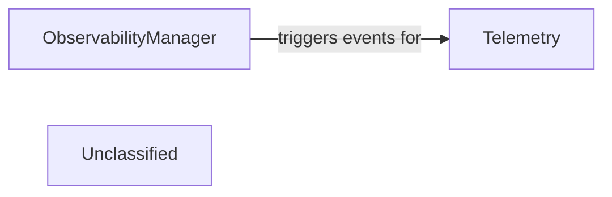

# Observability Telemetry

### Details

The mcp_use project employs a modular architecture for observability and telemetry. The ObservabilityManager serves as a central point for handling various observability callbacks, facilitating flexible integration with platforms like Langfuse and Laminar, and enabling other components to register for event notifications. Concurrently, the Telemetry component is responsible for collecting and transmitting anonymized usage data, including agent execution details and package download information, to external services such as PostHog and Scarf. The ObservabilityManager generates events that the Telemetry component can consume, allowing for the capture of detailed operational metrics and insights, thereby ensuring robust, extensible, and maintainable observability and telemetry functionalities through a clear separation of concerns.

### Telemetry
This component is responsible for the collection, formatting, and potential transmission of various telemetry data types, including metrics, traces, and logs. It captures data pertaining to agent execution, tool utilization, and interactions with LLMs, providing insights into the system's operational health and performance.

**Related Classes/Methods**:

- <a href="https://github.com/mcp-use/mcp-use/blob/main/mcp_use/telemetry/telemetry.py#L52-L303" target="_blank" rel="noopener noreferrer">QName:`mcp_use.telemetry.telemetry.Telemetry` FileRef: `mcp_use/telemetry/telemetry.py`, Lines:(52:303)</a>

### ObservabilityManager
This component acts as a central hub for managing callbacks and event listeners. It allows other components within the agent framework, or external systems, to subscribe to and react to specific events that occur throughout the agent's lifecycle and execution flow. It effectively decouples event producers from event consumers.

**Related Classes/Methods**:

- <a href="https://github.com/mcp-use/mcp-use/blob/main/mcp_use/observability/callbacks_manager.py#L13-L132" target="_blank" rel="noopener noreferrer">QName:`mcp_use.observability.callbacks_manager.ObservabilityManager` FileRef: `mcp_use/observability/callbacks_manager.py`, Lines:(13:132)</a>

### Unclassified
Component for all unclassified files and utility functions (Utility functions/External Libraries/Dependencies)

**Related Classes/Methods**: _None_
