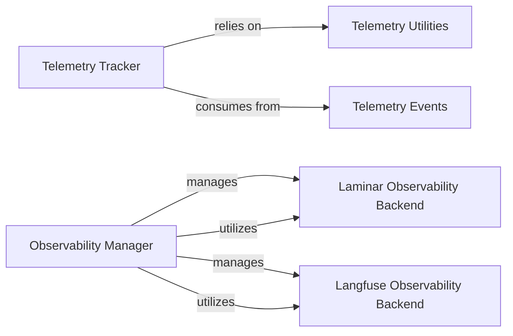

# Observability Telemetry

### Details

The Observability & Telemetry subsystem, comprising `mcp_use.telemetry` and `mcp_use.observability` packages, is responsible for monitoring agent execution, collecting performance metrics, and managing callbacks for external integrations and debugging within the `mcp-use` project. Its main flow involves tracking operational events and providing a flexible mechanism for integrating with various observability backends.

### Telemetry Tracker
This component serves as the primary interface for recording various operational events within the LLM agent framework. It focuses on monitoring agent execution, identifying users, and tracking package usage, providing critical insights into the agent's runtime behavior.

**Related Classes/Methods**:

- <a href="https://github.com/mcp-use/mcp-use/blob/main/mcp_use/telemetry/telemetry.py#L1-L1" target="_blank" rel="noopener noreferrer">QName:`mcp_use.telemetry.telemetry` FileRef: `/home/ubuntu/CodeBoarding/repo/mcp-use/mcp_use/telemetry/telemetry.py`</a>

### Telemetry Events
Defines the standardized schema and types for all telemetry events that can be captured by the `Telemetry Tracker`. This ensures consistency, clarity, and ease of analysis for the collected data, which is crucial for reliable monitoring.

**Related Classes/Methods**:

- <a href="https://github.com/mcp-use/mcp-use/blob/main/mcp_use/telemetry/events.py#L1-L1" target="_blank" rel="noopener noreferrer">QName:`mcp_use.telemetry.events` FileRef: `/home/ubuntu/CodeBoarding/repo/mcp-use/mcp_use/telemetry/events.py`</a>

### Telemetry Utilities
Provides helper functions and utilities specifically designed to assist the `Telemetry Tracker` in extracting and formatting relevant information for tracking, such as details about the LLM model (provider, name).

**Related Classes/Methods**:

- <a href="https://github.com/mcp-use/mcp-use/blob/main/mcp_use/telemetry/utils.py#L1-L1" target="_blank" rel="noopener noreferrer">QName:`mcp_use.telemetry.utils` FileRef: `/home/ubuntu/CodeBoarding/repo/mcp-use/mcp_use/telemetry/utils.py`</a>

### Observability Manager
Acts as a central registry and factory for managing and providing access to various observability callback handlers. This component is critical for enabling flexible integration with different external observability backends, a common requirement in LLM development for tracing and debugging.

**Related Classes/Methods**:

- <a href="https://github.com/mcp-use/mcp-use/blob/main/mcp_use/observability/callbacks_manager.py#L1-L1" target="_blank" rel="noopener noreferrer">QName:`mcp_use.observability.callbacks_manager` FileRef: `/home/ubuntu/CodeBoarding/repo/mcp-use/mcp_use/observability/callbacks_manager.py`</a>

### Laminar Observability Backend
A concrete implementation of an observability backend that integrates with the Laminar platform. It encapsulates the specific logic for sending traces, logs, and other observability data to Laminar.

**Related Classes/Methods**:

- <a href="https://github.com/mcp-use/mcp-use/blob/main/mcp_use/observability/laminar.py#L1-L1" target="_blank" rel="noopener noreferrer">QName:`mcp_use.observability.laminar` FileRef: `/home/ubuntu/CodeBoarding/repo/mcp-use/mcp_use/observability/laminar.py`</a>

### Langfuse Observability Backend
A concrete implementation of an observability backend that integrates with the Langfuse platform. It handles the specific logic for sending traces, logs, and other observability data to Langfuse, a popular tool for LLM application monitoring.

**Related Classes/Methods**:

- <a href="https://github.com/mcp-use/mcp-use/blob/main/mcp_use/observability/langfuse.py#L1-L1" target="_blank" rel="noopener noreferrer">QName:`mcp_use.observability.langfuse` FileRef: `/home/ubuntu/CodeBoarding/repo/mcp-use/mcp_use/observability/langfuse.py`</a>
