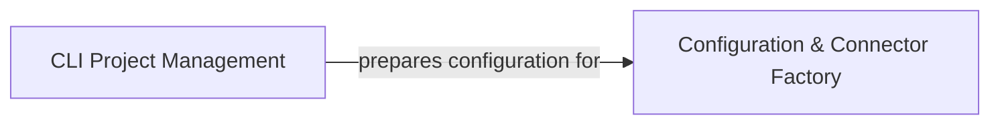

# Project Initialization Configuration

### Details

This graph describes the Project Initialization & Configuration subsystem of `mcp-use`. The main flow involves the `CLI Project Management` component handling command-line interactions, project scaffolding, and the creation of initial project structures, including configuration files. Subsequently, the `Configuration & Connector Factory` component loads and interprets these configurations to dynamically instantiate external connectors like LLMs and sandboxes, enabling flexible integration with various external services. The purpose of this subsystem is to provide a robust and extensible mechanism for setting up and configuring new `mcp-use` applications.

### CLI Project Management
This component serves as the primary command-line interface for `mcp-use`, orchestrating the entire project lifecycle from initial command parsing to interactive project creation and the generation of foundational project structures. It provides the user-facing mechanism for setting up new `mcp-use` applications.

**Related Classes/Methods**:

- <a href="https://github.com/mcp-use/mcp-use/blob/main/mcp_use/cli.py#L542-L577" target="_blank" rel="noopener noreferrer">QName:`mcp_use.cli.main` FileRef: `/home/ubuntu/CodeBoarding/repo/mcp-use/mcp_use/cli.py`, Lines:(542:577)</a>
- <a href="https://github.com/mcp-use/mcp-use/blob/main/mcp_use/cli.py#L481-L511" target="_blank" rel="noopener noreferrer">QName:`mcp_use.cli.handle_create` FileRef: `/home/ubuntu/CodeBoarding/repo/mcp-use/mcp_use/cli.py`, Lines:(481:511)</a>
- <a href="https://github.com/mcp-use/mcp-use/blob/main/mcp_use/cli.py#L399-L446" target="_blank" rel="noopener noreferrer">QName:`mcp_use.cli.create_project` FileRef: `/home/ubuntu/CodeBoarding/repo/mcp-use/mcp_use/cli.py`, Lines:(399:446)</a>
- <a href="https://github.com/mcp-use/mcp-use/blob/main/mcp_use/cli.py#L405-L405" target="_blank" rel="noopener noreferrer">QName:`mcp_use.cli.Spinner` FileRef: `/home/ubuntu/CodeBoarding/repo/mcp-use/mcp_use/cli.py`</a>

### Configuration & Connector Factory
Responsible for loading and interpreting project-specific configuration data, and dynamically instantiating various external connector objects (e.g., LLMs, sandboxes) based on these configurations. This component is vital for enabling flexible and extensible integration with diverse external services, aligning with the framework's modular design.

**Related Classes/Methods**:

- <a href="https://github.com/mcp-use/mcp-use/blob/main/mcp_use/config.py#L31-L99" target="_blank" rel="noopener noreferrer">QName:`mcp_use.config.create_connector_from_config` FileRef: `/home/ubuntu/CodeBoarding/repo/mcp-use/mcp_use/config.py`, Lines:(31:99)</a>
- <a href="https://github.com/mcp-use/mcp-use/blob/main/mcp_use/connectors/sandbox.py#L35-L302" target="_blank" rel="noopener noreferrer">QName:`mcp_use.connectors.sandbox.SandboxConnector` FileRef: `/home/ubuntu/CodeBoarding/repo/mcp-use/mcp_use/connectors/sandbox.py`, Lines:(35:302)</a>
