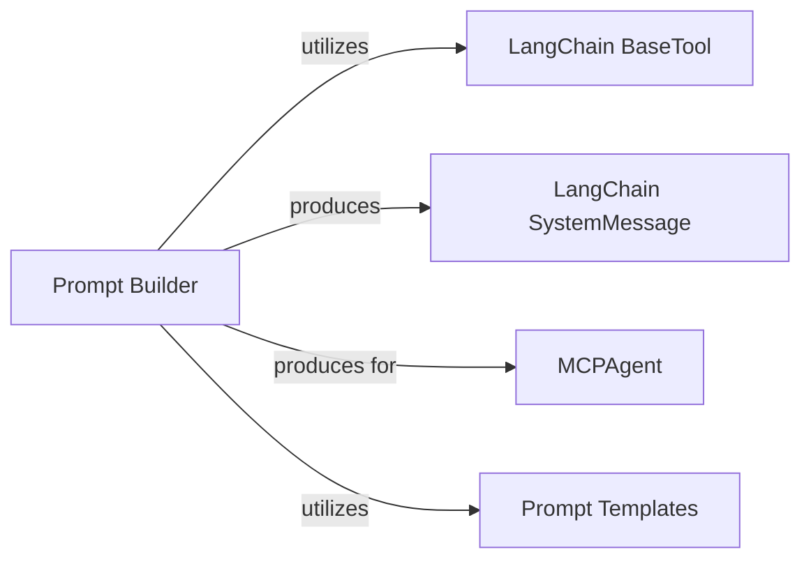

<Info>
This documentation was generated by [CodeBoarding](https://github.com/CodeBoarding/GeneratedOnBoardings) to provide comprehensive architectural insights into the mcp-agent framework.
</Info>

## Details

Abstract Components Overview

### Prompt Builder [[Expand]](./Prompt_Builder)
Constructs and formats system messages and prompts for the LLM, incorporating tool descriptions and other contextual information to guide the agent's reasoning. It dynamically generates prompts based on available tools, templates, and additional instructions. This component ensures that the LLM receives clear, concise, and comprehensive instructions, including details about the tools it can use, thereby enhancing the agent's decision-making and task execution capabilities.

**Related Classes/Methods**:

- <a href="https://github.com/CodeBoarding/mcp-use/blob/main/mcp_use/agents/prompts/system_prompt_builder.py#L4-L24" target="_blank" rel="noopener noreferrer">`mcp_use.agents.prompts.system_prompt_builder.generate_tool_descriptions` (4:24)</a>
- <a href="https://github.com/CodeBoarding/mcp-use/blob/main/mcp_use/agents/prompts/system_prompt_builder.py#L27-L55" target="_blank" rel="noopener noreferrer">`mcp_use.agents.prompts.system_prompt_builder.build_system_prompt_content` (27:55)</a>
- <a href="https://github.com/CodeBoarding/mcp-use/blob/main/mcp_use/agents/prompts/system_prompt_builder.py#L58-L102" target="_blank" rel="noopener noreferrer">`mcp_use.agents.prompts.system_prompt_builder.create_system_message` (58:102)</a>

### LangChain BaseTool
Represents a tool object from `langchain_core.tools`.

**Related Classes/Methods**:

- <a href="https://github.com/CodeBoarding/mcp-use/blob/main/langchain_core/tools.py#L1-L1" target="_blank" rel="noopener noreferrer">`langchain_core.tools.BaseTool` (1:1)</a>

### LangChain SystemMessage
Represents a system message object from `langchain.schema`.

**Related Classes/Methods**:

- <a href="https://github.com/CodeBoarding/mcp-use/blob/main/langchain/schema.py#L1-L1" target="_blank" rel="noopener noreferrer">`langchain.schema.SystemMessage` (1:1)</a>

### MCPAgent
The primary consumer of the `SystemMessage` generated by the `Prompt Builder`. It stores and utilizes the `SystemMessage` to configure the LangChain agent's prompt.

**Related Classes/Methods**:

- <a href="https://github.com/CodeBoarding/mcp-use/blob/main/mcp_use/agents/MCPAgent.py#L38-L785" target="_blank" rel="noopener noreferrer">`mcp_use.agents.MCPAgent` (38:785)</a>

### Prompt Templates
Predefined string templates (e.g., `system_prompt_template`, `server_manager_template`) used for the foundational structure of system prompts.

**Related Classes/Methods**:

- <a href="https://github.com/CodeBoarding/mcp-use/blob/main/mcp_use/agents/prompts/templates.py#L1-L1" target="_blank" rel="noopener noreferrer">`mcp_use.agents.prompts.templates` (1:1)</a>

### [FAQ](https://github.com/CodeBoarding/GeneratedOnBoardings/tree/main?tab=readme-ov-file#faq)
