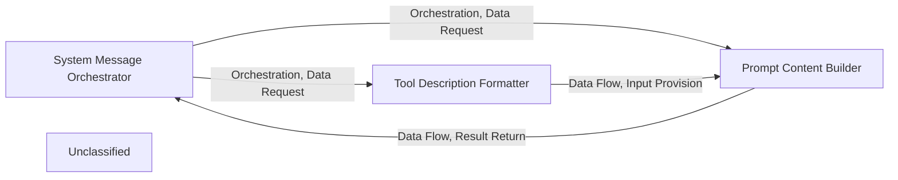

# Prompt Engineering System Message Builder

### Details

This subsystem is responsible for the dynamic construction of `SystemMessage` objects and prompts specifically tailored for the `MCPAgent`. Its scope includes gathering contextual information, formatting tool descriptions, and assembling these elements into a coherent and effective prompt for interaction with Large Language Models (LLMs). The core functionality is encapsulated within the `mcp_use/agents/prompts/system_prompt_builder.py` module, primarily centered around the `SystemPromptBuilder` concept.

### System Message Orchestrator
This component acts as the primary entry point and orchestrator for the entire system message construction process. It coordinates the generation of tool descriptions and the final assembly of the system prompt content, ensuring all necessary elements are integrated into the `SystemMessage` for the `MCPAgent`.

**Related Classes/Methods**:

- <a href="https://github.com/mcp-use/mcp-use/blob/main/mcp_use/agents/prompts/system_prompt_builder.py#L59-L103" target="_blank" rel="noopener noreferrer">QName:`mcp_use.agents.prompts.system_prompt_builder.create_system_message` FileRef: `/home/ubuntu/CodeBoarding/repo/mcp-use/mcp_use/agents/prompts/system_prompt_builder.py`, Lines:(59:103)</a>

### Tool Description Formatter
Responsible for transforming raw `BaseTool` objects into a structured, human-readable format suitable for inclusion in the system prompt. It also handles the logic for filtering out any tools that are explicitly disallowed, ensuring only relevant and permitted tools are described to the LLM.

**Related Classes/Methods**:

- <a href="https://github.com/mcp-use/mcp-use/blob/main/mcp_use/agents/prompts/system_prompt_builder.py#L5-L25" target="_blank" rel="noopener noreferrer">QName:`mcp_use.agents.prompts.system_prompt_builder.generate_tool_descriptions` FileRef: `/home/ubuntu/CodeBoarding/repo/mcp-use/mcp_use/agents/prompts/system_prompt_builder.py`, Lines:(5:25)</a>

### Prompt Content Builder
This component focuses on the templating and assembly of the actual system prompt content. It takes a base prompt template, injects the formatted tool descriptions provided by the `Tool Description Formatter`, and appends any additional instructions or contextual information, ensuring the final prompt adheres to a predefined structure and effectively guides the LLM.

**Related Classes/Methods**:

- <a href="https://github.com/mcp-use/mcp-use/blob/main/mcp_use/agents/prompts/system_prompt_builder.py#L28-L56" target="_blank" rel="noopener noreferrer">QName:`mcp_use.agents.prompts.system_prompt_builder.build_system_prompt_content` FileRef: `/home/ubuntu/CodeBoarding/repo/mcp-use/mcp_use/agents/prompts/system_prompt_builder.py`, Lines:(28:56)</a>

### Unclassified
Component for all unclassified files and utility functions (Utility functions/External Libraries/Dependencies)

**Related Classes/Methods**: _None_
