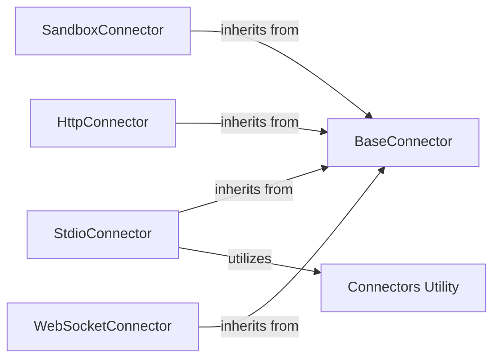

# Protocol Connector Layer

### Details

The `mcp_use.connectors` subsystem is designed to provide a flexible and extensible framework for various communication protocols. The core of this subsystem is the `BaseConnector` abstract class, which defines a unified interface for all connectors, ensuring consistent interaction patterns for operations like connecting, disconnecting, and handling agent requests (e.g., calling tools, listing resources, managing prompts). Concrete implementations like `SandboxConnector`, `StdioConnector`, `HttpConnector`, and `WebSocketConnector` extend this base, each specializing in a particular communication medium. The `Connectors Utility` module provides common helper functions that are leveraged by these concrete connectors, promoting code reuse and maintaining consistency across different protocol implementations.

Critical interaction pathways within this subsystem revolve around the `BaseConnector`'s defined interface. All concrete connectors implement methods such as `connect`, `disconnect`, `call_tool`, and `request`, allowing the higher-level agent components to interact with them uniformly, regardless of the underlying communication protocol. For instance, an agent can initiate a `call_tool` operation, and the specific connector (e.g., `SandboxConnector` for sandboxed execution or `WebSocketConnector` for real-time communication) will handle the protocol-specific details. The `Connectors Utility` module supports these interactions by providing shared functionalities that streamline the implementation of these protocol-specific behaviors.

The architecture of the `mcp_use.connectors` subsystem is centered around a clear abstraction-implementation pattern. The `BaseConnector` serves as the central abstract component, establishing the contract for all communication. Specialized connectors like `SandboxConnector`, `StdioConnector`, `HttpConnector`, and `WebSocketConnector` inherit from `BaseConnector`, providing concrete implementations for different communication protocols. This inheritance ensures that all connectors adhere to a common interface, simplifying their integration with other parts of the system. The `Connectors Utility` module acts as a supporting component, offering reusable functions that aid in the development and operation of these diverse connectors, thereby promoting modularity and maintainability within the subsystem.

### BaseConnector
The foundational abstract base class that defines the common interface and core functionalities expected from any protocol connector. It establishes the contract for connecting, disconnecting, checking connection status, and performing core agent operations like calling tools, listing resources, and handling prompts, ensuring a consistent API across different communication protocols.

**Related Classes/Methods**:

- <a href="https://github.com/mcp-use/mcp-use/blob/main/mcp_use/connectors/base.py" target="_blank" rel="noopener noreferrer">QName:`mcp_use.connectors.base.BaseConnector:connect` FileRef: `/home/ubuntu/CodeBoarding/repo/mcp-use/mcp_use/connectors/base.py`</a>
- <a href="https://github.com/mcp-use/mcp-use/blob/main/mcp_use/connectors/base.py" target="_blank" rel="noopener noreferrer">QName:`mcp_use.connectors.base.BaseConnector:disconnect` FileRef: `/home/ubuntu/CodeBoarding/repo/mcp-use/mcp_use/connectors/base.py`</a>
- <a href="https://github.com/mcp-use/mcp-use/blob/main/mcp_use/connectors/base.py" target="_blank" rel="noopener noreferrer">QName:`mcp_use.connectors.base.BaseConnector:is_connected` FileRef: `/home/ubuntu/CodeBoarding/repo/mcp-use/mcp_use/connectors/base.py`</a>
- <a href="https://github.com/mcp-use/mcp-use/blob/main/mcp_use/connectors/base.py" target="_blank" rel="noopener noreferrer">QName:`mcp_use.connectors.base.BaseConnector:call_tool` FileRef: `/home/ubuntu/CodeBoarding/repo/mcp-use/mcp_use/connectors/base.py`</a>
- <a href="https://github.com/mcp-use/mcp-use/blob/main/mcp_use/connectors/base.py" target="_blank" rel="noopener noreferrer">QName:`mcp_use.connectors.base.BaseConnector:list_tools` FileRef: `/home/ubuntu/CodeBoarding/repo/mcp-use/mcp_use/connectors/base.py`</a>
- <a href="https://github.com/mcp-use/mcp-use/blob/main/mcp_use/connectors/base.py" target="_blank" rel="noopener noreferrer">QName:`mcp_use.connectors.base.BaseConnector:list_resources` FileRef: `/home/ubuntu/CodeBoarding/repo/mcp-use/mcp_use/connectors/base.py`</a>
- <a href="https://github.com/mcp-use/mcp-use/blob/main/mcp_use/connectors/base.py" target="_blank" rel="noopener noreferrer">QName:`mcp_use.connectors.base.BaseConnector:read_resource` FileRef: `/home/ubuntu/CodeBoarding/repo/mcp-use/mcp_use/connectors/base.py`</a>
- <a href="https://github.com/mcp-use/mcp-use/blob/main/mcp_use/connectors/base.py" target="_blank" rel="noopener noreferrer">QName:`mcp_use.connectors.base.BaseConnector:list_prompts` FileRef: `/home/ubuntu/CodeBoarding/repo/mcp-use/mcp_use/connectors/base.py`</a>
- <a href="https://github.com/mcp-use/mcp-use/blob/main/mcp_use/connectors/base.py" target="_blank" rel="noopener noreferrer">QName:`mcp_use.connectors.base.BaseConnector:get_prompt` FileRef: `/home/ubuntu/CodeBoarding/repo/mcp-use/mcp_use/connectors/base.py`</a>
- <a href="https://github.com/mcp-use/mcp-use/blob/main/mcp_use/connectors/base.py" target="_blank" rel="noopener noreferrer">QName:`mcp_use.connectors.base.BaseConnector:request` FileRef: `/home/ubuntu/CodeBoarding/repo/mcp-use/mcp_use/connectors/base.py`</a>
- <a href="https://github.com/mcp-use/mcp-use/blob/main/mcp_use/connectors/base.py" target="_blank" rel="noopener noreferrer">QName:`mcp_use.connectors.base.BaseConnector:_ensure_connected` FileRef: `/home/ubuntu/CodeBoarding/repo/mcp-use/mcp_use/connectors/base.py`</a>
- <a href="https://github.com/mcp-use/mcp-use/blob/main/mcp_use/connectors/base.py" target="_blank" rel="noopener noreferrer">QName:`mcp_use.connectors.base.BaseConnector:_cleanup_resources` FileRef: `/home/ubuntu/CodeBoarding/repo/mcp-use/mcp_use/connectors/base.py`</a>

### SandboxConnector
A concrete implementation responsible for managing the lifecycle, input/output, and execution within a sandboxed environment. This is crucial for securely running untrusted code or processes.

**Related Classes/Methods**:

- <a href="https://github.com/mcp-use/mcp-use/blob/main/mcp_use/connectors/sandbox.py" target="_blank" rel="noopener noreferrer">QName:`mcp_use.connectors.sandbox.SandboxConnector:_handle_stderr` FileRef: `/home/ubuntu/CodeBoarding/repo/mcp-use/mcp_use/connectors/sandbox.py`</a>
- <a href="https://github.com/mcp-use/mcp-use/blob/main/mcp_use/connectors/sandbox.py" target="_blank" rel="noopener noreferrer">QName:`mcp_use.connectors.sandbox.SandboxConnector:_handle_stdout` FileRef: `/home/ubuntu/CodeBoarding/repo/mcp-use/mcp_use/connectors/sandbox.py`</a>
- <a href="https://github.com/mcp-use/mcp-use/blob/main/mcp_use/connectors/sandbox.py" target="_blank" rel="noopener noreferrer">QName:`mcp_use.connectors.sandbox.SandboxConnector:wait_for_server_response` FileRef: `/home/ubuntu/CodeBoarding/repo/mcp-use/mcp_use/connectors/sandbox.py`</a>

### StdioConnector
A concrete implementation handling communication over standard I/O streams (stdin, stdout, stderr), typically used for interacting with local processes or command-line applications.

**Related Classes/Methods**:

- <a href="https://github.com/mcp-use/mcp-use/blob/main/mcp_use/connectors/stdio.py" target="_blank" rel="noopener noreferrer">QName:`mcp_use.connectors.stdio.StdioConnector:read_stream` FileRef: `/home/ubuntu/CodeBoarding/repo/mcp-use/mcp_use/connectors/stdio.py`</a>
- <a href="https://github.com/mcp-use/mcp-use/blob/main/mcp_use/connectors/stdio.py" target="_blank" rel="noopener noreferrer">QName:`mcp_use.connectors.stdio.StdioConnector:write_stream` FileRef: `/home/ubuntu/CodeBoarding/repo/mcp-use/mcp_use/connectors/stdio.py`</a>

### HttpConnector
A concrete implementation designed for HTTP-based communication, supporting both traditional RESTful requests and Server-Sent Events (SSE) for streaming data. This is vital for interacting with web services and APIs.

**Related Classes/Methods**:

- <a href="https://github.com/mcp-use/mcp-use/blob/main/mcp_use/connectors/http.py" target="_blank" rel="noopener noreferrer">QName:`mcp_use.connectors.http.HttpConnector:read_stream` FileRef: `/home/ubuntu/CodeBoarding/repo/mcp-use/mcp_use/connectors/http.py`</a>
- <a href="https://github.com/mcp-use/mcp-use/blob/main/mcp_use/connectors/http.py" target="_blank" rel="noopener noreferrer">QName:`mcp_use.connectors.http.HttpConnector:write_stream` FileRef: `/home/ubuntu/CodeBoarding/repo/mcp-use/mcp_use/connectors/http.py`</a>

### WebSocketConnector
A concrete implementation facilitating real-time, bidirectional communication using the WebSocket protocol. This is essential for interactive and low-latency agent-server communication.

**Related Classes/Methods**:

- <a href="https://github.com/mcp-use/mcp-use/blob/main/mcp_use/connectors/websocket.py" target="_blank" rel="noopener noreferrer">QName:`mcp_use.connectors.websocket.WebSocketConnector:_receive_messages` FileRef: `/home/ubuntu/CodeBoarding/repo/mcp-use/mcp_use/connectors/websocket.py`</a>
- <a href="https://github.com/mcp-use/mcp-use/blob/main/mcp_use/connectors/websocket.py" target="_blank" rel="noopener noreferrer">QName:`mcp_use.connectors.websocket.WebSocketConnector:_send_request` FileRef: `/home/ubuntu/CodeBoarding/repo/mcp-use/mcp_use/connectors/websocket.py`</a>
- <a href="https://github.com/mcp-use/mcp-use/blob/main/mcp_use/connectors/websocket.py" target="_blank" rel="noopener noreferrer">QName:`mcp_use.connectors.websocket.WebSocketConnector:initialize` FileRef: `/home/ubuntu/CodeBoarding/repo/mcp-use/mcp_use/connectors/websocket.py`</a>
- <a href="https://github.com/mcp-use/mcp-use/blob/main/mcp_use/connectors/websocket.py" target="_blank" rel="noopener noreferrer">QName:`mcp_use.connectors.websocket.WebSocketConnector:list_tools` FileRef: `/home/ubuntu/CodeBoarding/repo/mcp-use/mcp_use/connectors/websocket.py`</a>
- <a href="https://github.com/mcp-use/mcp-use/blob/main/mcp_use/connectors/websocket.py" target="_blank" rel="noopener noreferrer">QName:`mcp_use.connectors.websocket.WebSocketConnector:call_tool` FileRef: `/home/ubuntu/CodeBoarding/repo/mcp-use/mcp_use/connectors/websocket.py`</a>
- <a href="https://github.com/mcp-use/mcp-use/blob/main/mcp_use/connectors/websocket.py" target="_blank" rel="noopener noreferrer">QName:`mcp_use.connectors.websocket.WebSocketConnector:list_resources` FileRef: `/home/ubuntu/CodeBoarding/repo/mcp-use/mcp_use/connectors/websocket.py`</a>
- <a href="https://github.com/mcp-use/mcp-use/blob/main/mcp_use/connectors/websocket.py" target="_blank" rel="noopener noreferrer">QName:`mcp_use.connectors.websocket.WebSocketConnector:read_resource` FileRef: `/home/ubuntu/CodeBoarding/repo/mcp-use/mcp_use/connectors/websocket.py`</a>
- <a href="https://github.com/mcp-use/mcp-use/blob/main/mcp_use/connectors/websocket.py" target="_blank" rel="noopener noreferrer">QName:`mcp_use.connectors.websocket.WebSocketConnector:request` FileRef: `/home/ubuntu/CodeBoarding/repo/mcp-use/mcp_use/connectors/websocket.py`</a>

### Connectors Utility
A module providing shared utility functions and helper methods that support the operations of various connector implementations, promoting code reuse and consistency.

**Related Classes/Methods**:

- <a href="https://github.com/mcp-use/mcp-use/blob/main/mcp_use/connectors/utils.py" target="_blank" rel="noopener noreferrer">QName:`mcp_use.connectors.utils` FileRef: `/home/ubuntu/CodeBoarding/repo/mcp-use/mcp_use/connectors/utils.py`</a>
