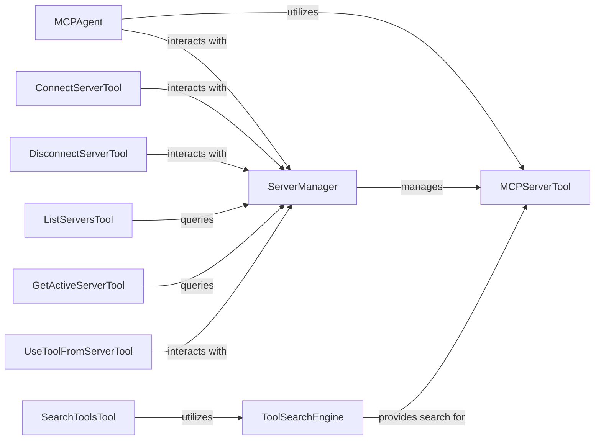

<Info>
This documentation was generated by [CodeBoarding](https://github.com/CodeBoarding/GeneratedOnBoardings) to provide comprehensive architectural insights into the mcp-agent framework.
</Info>

## Details

Updated analysis of MCP components, correcting source code references for ServerManager and validating ToolSearchEngine interaction.

### ServerManager
The central registry and orchestrator for MCP servers. It manages the connection, registration, and overall lifecycle of external MCP servers, ensuring the agent can keep track of and interact with available services. It initializes with an `MCPClient` and a `BaseAdapter`, manages an `active_server`, and caches initialized servers and their tools. It provides a `tools` property that returns a list of server management tools.

**Related Classes/Methods**:

- <a href="https://github.com/CodeBoarding/mcp-use/blob/main/mcp_use/managers/server_manager.py#L16-L89" target="_blank" rel="noopener noreferrer">`mcp_use.managers.server_manager.ServerManager` (16:89)</a>

### ToolSearchEngine
Provides the mechanism for discovering and semantically searching for tools exposed by registered servers. It enables the agent to find the most relevant tool for a given task, which is crucial for dynamic tool selection in an LLM agent. It uses vector similarity for semantic search and can cache results. It interacts with `ServerManager` to get tools for indexing.

**Related Classes/Methods**:

- <a href="https://github.com/CodeBoarding/mcp-use/blob/main/mcp_use/managers/tools/search_tools.py#L57-L327" target="_blank" rel="noopener noreferrer">`mcp_use.managers.tools.search_tools.ToolSearchEngine` (57:327)</a>

### MCPServerTool
The abstract base class for all tools that are exposed by or interact with MCP servers. It defines the common interface and properties for these server-managed functionalities, ensuring a consistent way for the agent to interact with diverse tools.

**Related Classes/Methods**:

- <a href="https://github.com/CodeBoarding/mcp-use/blob/main/mcp_use/managers/tools/base_tool.py#L5-L18" target="_blank" rel="noopener noreferrer">`mcp_use.managers.tools.base_tool.MCPServerTool` (5:18)</a>

### ConnectServerTool
A concrete implementation of `MCPServerTool` that encapsulates the logic for establishing a connection to an MCP server. It allows the `MCPAgent` to programmatically connect to new services.

**Related Classes/Methods**:

- <a href="https://github.com/CodeBoarding/mcp-use/blob/main/mcp_use/managers/tools/connect_server.py#L15-L68" target="_blank" rel="noopener noreferrer">`mcp_use.managers.tools.connect_server.ConnectServerTool` (15:68)</a>

### DisconnectServerTool
A concrete implementation of `MCPServerTool` responsible for terminating a connection to an MCP server. This allows the `MCPAgent` to manage its active server connections.

**Related Classes/Methods**:

- <a href="https://github.com/CodeBoarding/mcp-use/blob/main/mcp_use/managers/tools/disconnect_server.py#L15-L42" target="_blank" rel="noopener noreferrer">`mcp_use.managers.tools.disconnect_server.DisconnectServerTool` (15:42)</a>

### ListServersTool
A concrete implementation of `MCPServerTool` that provides the `MCPAgent` with the ability to list all currently registered and active MCP servers.

**Related Classes/Methods**:

- <a href="https://github.com/CodeBoarding/mcp-use/blob/main/mcp_use/managers/tools/list_servers_tool.py#L15-L51" target="_blank" rel="noopener noreferrer">`mcp_use.managers.tools.list_servers_tool.ListServersTool` (15:51)</a>

### GetActiveServerTool
A concrete implementation of `MCPServerTool` that allows the `MCPAgent` to retrieve information about the currently active or primary MCP server.

**Related Classes/Methods**:

- <a href="https://github.com/CodeBoarding/mcp-use/blob/main/mcp_use/managers/tools/get_active_server.py#L13-L28" target="_blank" rel="noopener noreferrer">`mcp_use.managers.tools.get_active_server.GetActiveServerTool` (13:28)</a>

### UseToolFromServerTool
A concrete implementation of `MCPServerTool` that facilitates the invocation of a specific tool provided by a registered MCP server. This is the primary mechanism for the agent to utilize external functionalities.

**Related Classes/Methods**:

- <a href="https://github.com/CodeBoarding/mcp-use/blob/main/mcp_use/managers/tools/use_tool.py#L21-L153" target="_blank" rel="noopener noreferrer">`mcp_use.managers.tools.use_tool.UseToolFromServerTool` (21:153)</a>

### SearchToolsTool
A concrete implementation of `MCPServerTool` that exposes the `ToolSearchEngine`'s capabilities to the `MCPAgent`, allowing the agent to perform semantic searches for available tools.

**Related Classes/Methods**:

- <a href="https://github.com/CodeBoarding/mcp-use/blob/main/mcp_use/managers/tools/search_tools.py#L22-L54" target="_blank" rel="noopener noreferrer">`mcp_use.managers.tools.search_tools.SearchToolsTool` (22:54)</a>

### [FAQ](https://github.com/CodeBoarding/GeneratedOnBoardings/tree/main?tab=readme-ov-file#faq)
