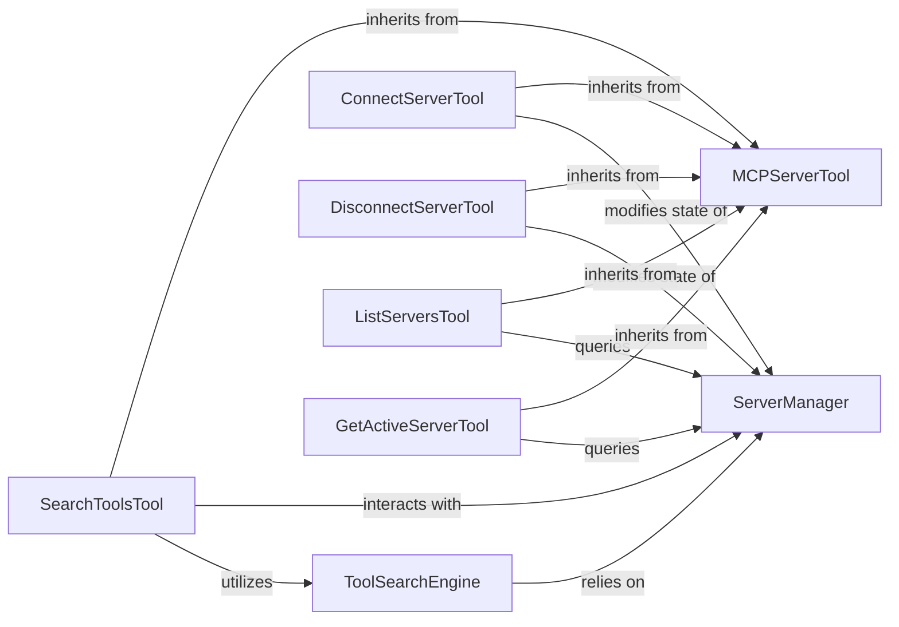

# Server Tool Management

### Details

The `Server & Tool Management` subsystem is responsible for the discovery, organization, and provision of access to tools exposed by connected servers within the `mcp-use` project. It embodies the "Tool Abstraction and Registry" and "Client-Server Architecture" patterns, central to an AI Agent Framework.

### ServerManager
The core orchestrator for server connections and tool registration. It maintains the state of active servers and their exposed tools, acting as a central registry. This aligns with the "Tool Abstraction and Registry" and "Client-Server Architecture" patterns.

**Related Classes/Methods**:

- <a href="https://github.com/mcp-use/mcp-use/blob/main/mcp_use/managers/server_manager.py#L10-L123" target="_blank" rel="noopener noreferrer">QName:`mcp_use.managers.server_manager.ServerManager` FileRef: `/home/ubuntu/CodeBoarding/repo/mcp-use/mcp_use/managers/server_manager.py`, Lines:(10:123)</a>

### MCPServerTool
An abstract base class that defines the common interface and properties for all tools designed to interact with the ServerManager. This is fundamental to the "Tool Abstraction and Registry" pattern, ensuring extensibility and consistency.

**Related Classes/Methods**:

- <a href="https://github.com/mcp-use/mcp-use/blob/main/mcp_use/managers/tools/base_tool.py#L6-L19" target="_blank" rel="noopener noreferrer">QName:`mcp_use.managers.tools.base_tool.MCPServerTool` FileRef: `/home/ubuntu/CodeBoarding/repo/mcp-use/mcp_use/managers/tools/base_tool.py`, Lines:(6:19)</a>

### ToolSearchEngine
Responsible for indexing and semantically searching available tools, potentially leveraging embeddings for advanced discovery. This component is vital for an AI agent to intelligently find and utilize relevant tools, fitting the "Tool Abstraction and Registry" and "Configuration-Driven" patterns.

**Related Classes/Methods**:

- <a href="https://github.com/mcp-use/mcp-use/blob/main/mcp_use/managers/tools/search_tools.py#L58-L328" target="_blank" rel="noopener noreferrer">QName:`mcp_use.managers.tools.search_tools.ToolSearchEngine` FileRef: `/home/ubuntu/CodeBoarding/repo/mcp-use/mcp_use/managers/tools/search_tools.py`, Lines:(58:328)</a>

### ConnectServerTool
A concrete tool that enables the agent to establish a connection to a specified server, modifying the state of the ServerManager.

**Related Classes/Methods**:

- <a href="https://github.com/mcp-use/mcp-use/blob/main/mcp_use/managers/tools/connect_server.py#L17-L70" target="_blank" rel="noopener noreferrer">QName:`mcp_use.managers.tools.connect_server.ConnectServerTool` FileRef: `/home/ubuntu/CodeBoarding/repo/mcp-use/mcp_use/managers/tools/connect_server.py`, Lines:(17:70)</a>

### DisconnectServerTool
A concrete tool that allows the agent to terminate an existing server connection, modifying the state of the ServerManager.

**Related Classes/Methods**:

- <a href="https://github.com/mcp-use/mcp-use/blob/main/mcp_use/managers/tools/disconnect_server.py#L17-L44" target="_blank" rel="noopener noreferrer">QName:`mcp_use.managers.tools.disconnect_server.DisconnectServerTool` FileRef: `/home/ubuntu/CodeBoarding/repo/mcp-use/mcp_use/managers/tools/disconnect_server.py`, Lines:(17:44)</a>

### ListServersTool
A concrete tool that provides the agent with a list of all currently available and active servers, along with their associated tools, by querying the ServerManager.

**Related Classes/Methods**:

- <a href="https://github.com/mcp-use/mcp-use/blob/main/mcp_use/managers/tools/list_servers_tool.py#L17-L54" target="_blank" rel="noopener noreferrer">QName:`mcp_use.managers.tools.list_servers_tool.ListServersTool` FileRef: `/home/ubuntu/CodeBoarding/repo/mcp-use/mcp_use/managers/tools/list_servers_tool.py`, Lines:(17:54)</a>

### SearchToolsTool
A concrete tool that utilizes the ToolSearchEngine to perform searches for tools across connected servers based on a given query, interacting with the ServerManager for tool data.

**Related Classes/Methods**:

- <a href="https://github.com/mcp-use/mcp-use/blob/main/mcp_use/managers/tools/search_tools.py#L23-L55" target="_blank" rel="noopener noreferrer">QName:`mcp_use.managers.tools.search_tools.SearchToolsTool` FileRef: `/home/ubuntu/CodeBoarding/repo/mcp-use/mcp_use/managers/tools/search_tools.py`, Lines:(23:55)</a>

### GetActiveServerTool
A concrete tool that queries the ServerManager.

**Related Classes/Methods**:

- <a href="https://github.com/mcp-use/mcp-use/blob/main/mcp_use/managers/tools/get_active_server.py#L14-L29" target="_blank" rel="noopener noreferrer">QName:`mcp_use.managers.tools.get_active_server.GetActiveServerTool` FileRef: `/home/ubuntu/CodeBoarding/repo/mcp-use/mcp_use/managers/tools/get_active_server.py`, Lines:(14:29)</a>
