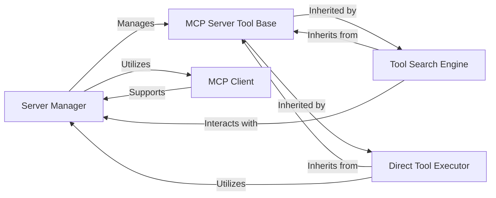

<Info>
This documentation was generated by [CodeBoarding](https://github.com/CodeBoarding/GeneratedOnBoardings) to provide comprehensive architectural insights into the mcp-agent framework.
</Info>

## Details

The `Server & Tool Management` subsystem is crucial for enabling AI agents to interact with external environments and leverage a diverse set of tools. It embodies the "Client-Server Architecture" and "Tool-Use/Function Calling Pattern" by providing mechanisms for server connectivity, tool discovery, and tool execution.

### Server Manager
The `ServerManager` is the central orchestrator for managing the lifecycle of external MCP servers. It handles connecting to, disconnecting from, and maintaining a registry of active servers. It also provides the interface for accessing tools available on these connected servers. This component is fundamental as it acts as the primary control point for all server-related operations, ensuring that agents can reliably connect to and manage their external environments.

**Related Classes/Methods**:

- <a href="https://github.com/CodeBoarding/mcp-use/blob/main/mcp_use/managers/server_manager.py#L16-L89" target="_blank" rel="noopener noreferrer">`mcp_use.managers.server_manager.ServerManager` (16:89)</a>

### MCP Server Tool Base
`MCPServerTool` is an abstract base class that defines a common interface and foundational methods for all tools designed to interact with MCP servers. It ensures consistency and reusability across various server-specific operations. This component is fundamental because it establishes the architectural pattern for all server-interacting tools, promoting modularity, extensibility, and a unified approach to tool development within the framework.

**Related Classes/Methods**:

- <a href="https://github.com/CodeBoarding/mcp-use/blob/main/mcp_use/managers/tools/base_tool.py#L5-L18" target="_blank" rel="noopener noreferrer">`mcp_use.managers.tools.base_tool.MCPServerTool` (5:18)</a>

### Tool Search Engine
The `ToolSearchEngine` provides semantic search capabilities, allowing AI agents to discover relevant MCP tools available across connected servers based on natural language queries. It leverages vector embeddings and cosine similarity for intelligent tool retrieval. This component is fundamental for implementing the "Tool-Use/Function Calling Pattern" as it enables dynamic and intelligent tool discovery, allowing agents to adapt to new tasks and environments without explicit pre-configuration.

**Related Classes/Methods**:

- <a href="https://github.com/CodeBoarding/mcp-use/blob/main/mcp_use/managers/tools/search_tools.py#L57-L327" target="_blank" rel="noopener noreferrer">`mcp_use.managers.tools.search_tools.ToolSearchEngine` (57:327)</a>

### Direct Tool Executor
The `UseToolFromServerTool` allows an agent to directly execute a specific tool on a given MCP server without requiring a prior explicit connection. It streamlines the process by handling session creation and input parsing for direct tool invocation. This component is fundamental for providing flexible and efficient tool execution, enabling agents to invoke tools on demand, which is critical for dynamic task execution in an AI agent framework.

**Related Classes/Methods**:

- <a href="https://github.com/CodeBoarding/mcp-use/blob/main/mcp_use/managers/tools/use_tool.py#L21-L153" target="_blank" rel="noopener noreferrer">`mcp_use.managers.tools.use_tool.UseToolFromServerTool` (21:153)</a>

### MCP Client
The `MCPClient` serves as the primary client for managing MCP server configurations, creating and managing sessions, and handling underlying communication connectors. It provides the foundational layer for all interactions with MCP servers. This component is fundamental as it underpins all communication with external MCP servers, providing the necessary low-level connectivity and session management for the entire "Client-Server Architecture".

**Related Classes/Methods**:

- <a href="https://github.com/CodeBoarding/mcp-use/blob/main/mcp_use/client.py#L1-L1" target="_blank" rel="noopener noreferrer">`mcp_use.client.MCPClient` (1:1)</a>

### [FAQ](https://github.com/CodeBoarding/GeneratedOnBoardings/tree/main?tab=readme-ov-file#faq)
