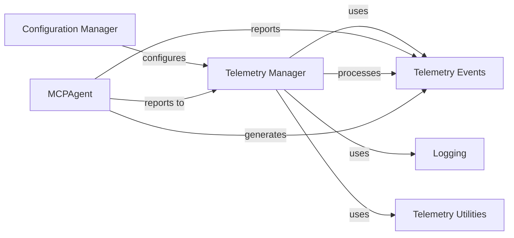

<Info>
This documentation was generated by [CodeBoarding](https://github.com/CodeBoarding/GeneratedOnBoardings) to provide comprehensive architectural insights into the mcp-agent framework.
</Info>

## Details

The `Telemetry` subsystem is designed to provide observability and analytics for the AI Agent Framework. It focuses on collecting and tracking usage data and agent execution metrics, offering insights into the framework's performance and behavior. This subsystem is crucial for monitoring the operational aspects of the system and understanding how agents perform in various scenarios.

### Telemetry Manager
This is the core component of the telemetry system. It is responsible for initializing the telemetry service, managing the collection of various events, and dispatching them for further processing or storage. It acts as the central hub for all telemetry-related operations within the framework.

**Related Classes/Methods**:

- <a href="https://github.com/CodeBoarding/mcp-use/blob/main/mcp_use/telemetry/telemetry.py#L1-L1" target="_blank" rel="noopener noreferrer">`Telemetry Manager` (1:1)</a>

### Telemetry Events
This component defines the structure and types of data that are collected by the telemetry system. It includes a base event class (`BaseTelemetryEvent`) and specific event implementations like `MCPAgentExecutionEvent`, which captures details about the agent's execution lifecycle. These events serve as the standardized data payloads for telemetry.

**Related Classes/Methods**:

- <a href="https://github.com/CodeBoarding/mcp-use/blob/main/mcp_use/telemetry/events.py#L1-L1" target="_blank" rel="noopener noreferrer">`Telemetry Events` (1:1)</a>

### MCPAgent
As the core AI agent of the framework, `MCPAgent` is a primary source of telemetry data. It generates and reports various execution-related events (e.g., start, end, tool usage) to the `Telemetry Manager`, enabling comprehensive monitoring of agent behavior and performance.

**Related Classes/Methods**:

- <a href="https://github.com/CodeBoarding/mcp-use/blob/main/mcp_use/agents/mcpagent.py#L1-L1" target="_blank" rel="noopener noreferrer">`MCPAgent` (1:1)</a>

### Configuration Manager
This component handles the overall configuration of the application, including settings specific to the telemetry system. It allows for enabling or disabling telemetry, defining reporting endpoints, and setting other operational parameters for the `Telemetry Manager`.

**Related Classes/Methods**:

- <a href="https://github.com/CodeBoarding/mcp-use/blob/main/config.py#L1-L1" target="_blank" rel="noopener noreferrer">`Configuration Manager` (1:1)</a>

### Logging
Provides a standardized logging mechanism for the entire framework. The `Telemetry Manager` utilizes this component for internal operational logging, debugging, and recording any issues related to telemetry data collection or dispatch.

**Related Classes/Methods**:

- <a href="https://github.com/CodeBoarding/mcp-use/blob/main/mcp_use/logging.py#L1-L1" target="_blank" rel="noopener noreferrer">`Logging` (1:1)</a>

### Telemetry Utilities
This component comprises helper functions and utility classes that support the `Telemetry Manager`. These utilities might include functionalities for data serialization, validation, or specific data transformations required before events are dispatched.

**Related Classes/Methods**:

- <a href="https://github.com/CodeBoarding/mcp-use/blob/main/mcp_use/telemetry/utils.py#L1-L1" target="_blank" rel="noopener noreferrer">`Telemetry Utilities` (1:1)</a>

### [FAQ](https://github.com/CodeBoarding/GeneratedOnBoardings/tree/main?tab=readme-ov-file#faq)
