# Tool Abstraction Management

```mermaid
graph LR
    Agent_Core["Agent Core"]
    LLM_Integration_Layer["LLM Integration Layer"]
    Tool_Abstraction_Management["Tool Abstraction & Management"]
    MCP_Server_Communication_Layer["MCP Server Communication Layer"]
    Configuration_Management["Configuration Management"]
    Asynchronous_Execution_Engine["Asynchronous Execution Engine"]
    Agent_Core -- "interacts with" --> LLM_Integration_Layer
    Agent_Core -- "interacts with" --> Tool_Abstraction_Management
    LLM_Integration_Layer -- "interacts with" --> Agent_Core
    LLM_Integration_Layer -- "relies on" --> Asynchronous_Execution_Engine
    Tool_Abstraction_Management -- "interacts with" --> Agent_Core
    Tool_Abstraction_Management -- "interacts with" --> MCP_Server_Communication_Layer
    Tool_Abstraction_Management -- "relies on" --> Configuration_Management
    MCP_Server_Communication_Layer -- "interacts with" --> Tool_Abstraction_Management
    MCP_Server_Communication_Layer -- "relies on" --> Asynchronous_Execution_Engine
    Configuration_Management -- "interacts with" --> Tool_Abstraction_Management
    Configuration_Management -- "interacts with" --> MCP_Server_Communication_Layer
    Asynchronous_Execution_Engine -- "supports" --> LLM_Integration_Layer
    Asynchronous_Execution_Engine -- "supports" --> MCP_Server_Communication_Layer
    click Agent_Core href "/codeboarding/Agent_Core.md" "Details"
    click Tool_Abstraction_Management href "/codeboarding/Tool_Abstraction_Management.md" "Details"
```

### Details

Abstract Components Overview

### Agent Core [[Expand]](./Agent_Core)
The central orchestrator of the AI agent framework. It interprets user requests, leverages the LLM Integration Layer for reasoning and decision-making, and utilizes the Tool Abstraction & Management component to dynamically select and execute appropriate tools to achieve its goals. This component embodies the "Agent-based Architecture" pattern.

**Related Classes/Methods**:

- <a href="https://github.com/mcp-use/mcp-use/blob/main/mcp_use/agents/mcpagent.py" target="_blank" rel="noopener noreferrer">`mcp_use.agents.mcpagent.MCPAgent`</a>

### LLM Integration Layer
Provides a standardized, abstract interface for interacting with various Large Language Models. It encapsulates the specifics of different LLM APIs, allowing the Agent Core to communicate with them seamlessly for tasks such as natural language understanding, generation, and complex reasoning.

**Related Classes/Methods**:

- <a href="https://github.com/mcp-use/mcp-use/blob/main/mcp_use/adapters/langchain_adapter.py" target="_blank" rel="noopener noreferrer">`mcp_use.adapters.langchain_adapter.LangChainAdapter`</a>

### Tool Abstraction & Management [[Expand]](./Tool_Abstraction_Management)
This component serves as the central Tool/Server Abstraction Layer. It provides a unified, high-level interface for agents to discover, manage, and execute tools exposed by connected MCP servers. It abstracts the complexities of tool interaction, server lifecycle management, and tool execution, aligning with the "Adapter Pattern" and "Client-Server Architecture (Internal)" principles. It is crucial for the framework's extensibility and modularity.

**Related Classes/Methods**:

- <a href="https://github.com/mcp-use/mcp-use/blob/main/mcp_use/managers/tools/disconnect_server.py#L15-L42" target="_blank" rel="noopener noreferrer">`mcp_use.managers.tools.disconnect_server.DisconnectServerTool` (15:42)</a>
- <a href="https://github.com/mcp-use/mcp-use/blob/main/mcp_use/managers/tools/get_active_server.py#L13-L28" target="_blank" rel="noopener noreferrer">`mcp_use.managers.tools.get_active_server.GetActiveServerTool` (13:28)</a>
- <a href="https://github.com/mcp-use/mcp-use/blob/main/mcp_use/managers/tools/list_servers_tool.py#L15-L51" target="_blank" rel="noopener noreferrer">`mcp_use.managers.tools.list_servers_tool.ListServersTool` (15:51)</a>
- <a href="https://github.com/mcp-use/mcp-use/blob/main/mcp_use/managers/tools/search_tools.py#L22-L54" target="_blank" rel="noopener noreferrer">`mcp_use.managers.tools.search_tools.SearchToolsTool` (22:54)</a>
- <a href="https://github.com/mcp-use/mcp-use/blob/main/mcp_use/managers/tools/ToolSearchEngine.py" target="_blank" rel="noopener noreferrer">`mcp_use.managers.tools.ToolSearchEngine`</a>
- <a href="https://github.com/mcp-use/mcp-use/blob/main/mcp_use/managers/tools/use_tool.py#L21-L153" target="_blank" rel="noopener noreferrer">`mcp_use.managers.tools.use_tool.UseToolFromServerTool` (21:153)</a>
- <a href="https://github.com/mcp-use/mcp-use/blob/main/mcp_use/managers/server_manager.py#L16-L89" target="_blank" rel="noopener noreferrer">`mcp_use.managers.server_manager.ServerManager` (16:89)</a>

### MCP Server Communication Layer
Responsible for the low-level, concrete communication with external MCP (Multi-Component Platform) servers. It handles network requests, data serialization/deserialization, and error handling specific to server interactions, translating abstract tool execution requests from the Tool Abstraction & Management component into concrete server API calls.

**Related Classes/Methods**:

- <a href="https://github.com/mcp-use/mcp-use/blob/main/mcp_use/connectors/http.py" target="_blank" rel="noopener noreferrer">`mcp_use.connectors.http.HttpConnector`</a>
- <a href="https://github.com/mcp-use/mcp-use/blob/main/mcp_use/connectors/sandbox.py" target="_blank" rel="noopener noreferrer">`mcp_use.connectors.sandbox.SandboxConnector`</a>
- <a href="https://github.com/mcp-use/mcp-use/blob/main/mcp_use/connectors/stdio.py" target="_blank" rel="noopener noreferrer">`mcp_use.connectors.stdio.StdioConnector`</a>
- <a href="https://github.com/mcp-use/mcp-use/blob/main/mcp_use/connectors/websocket.py" target="_blank" rel="noopener noreferrer">`mcp_use.connectors.websocket.WebSocketConnector`</a>

### Configuration Management
Manages the loading, parsing, and access of configuration settings for the entire framework. This includes details about registered MCP servers, API keys, and other operational parameters. It ensures that various components can dynamically retrieve necessary settings, supporting the "Configuration-Driven Design" pattern.

**Related Classes/Methods**:

- <a href="https://github.com/mcp-use/mcp-use/blob/main/mcp_use/config.py" target="_blank" rel="noopener noreferrer">`mcp_use.config.Config`</a>

### Asynchronous Execution Engine
Provides the core asynchronous capabilities for the framework, enabling non-blocking I/O operations and concurrent execution. It is fundamental for efficiently handling long-running tasks such as LLM API calls and external tool executions, leveraging asyncio throughout the system. This aligns with the "Asynchronous Processing" architectural pattern.

**Related Classes/Methods**:

- <a href="https://github.com/mcp-use/mcp-use/blob/main/mcp_use/task_managers/sse.py" target="_blank" rel="noopener noreferrer">`mcp_use.task_managers.sse.SseConnectionManager`</a>
- <a href="https://github.com/mcp-use/mcp-use/blob/main/mcp_use/task_managers/stdio.py" target="_blank" rel="noopener noreferrer">`mcp_use.task_managers.stdio.StdioConnectionManager`</a>
- <a href="https://github.com/mcp-use/mcp-use/blob/main/mcp_use/task_managers/streamable_http.py" target="_blank" rel="noopener noreferrer">`mcp_use.task_managers.streamable_http.StreamableHttpConnectionManager`</a>
- <a href="https://github.com/mcp-use/mcp-use/blob/main/mcp_use/task_managers/websocket.py" target="_blank" rel="noopener noreferrer">`mcp_use.task_managers.websocket.WebSocketConnectionManager`</a>
