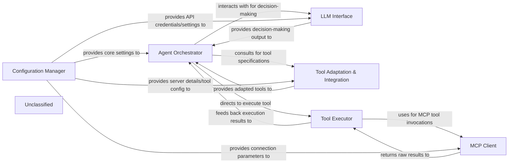

# Tool Adaptation Integration

### Details

The system operates as an intelligent agent framework, with the Agent Orchestrator at its core, managing the overall execution flow. User queries are initially handled by the Query Processor, which prepares them for the orchestrator. The Agent Orchestrator then interacts with the LLM Interface for reasoning and decision-making, leveraging Tool Adaptation & Integration to discover and adapt available tools. Once a tool is selected, the Tool Executor is responsible for its invocation, potentially communicating with external MCP services via the MCP Client. Throughout this process, the Configuration Manager provides essential settings. Finally, the Response Formatter prepares the consolidated output for the user.

### Agent Orchestrator
The central intelligence of the framework, responsible for managing the overall flow of execution. It receives processed queries, interacts with the LLM for reasoning and tool selection, orchestrates tool execution, and prepares the final response.

**Related Classes/Methods**:

- <a href="https://github.com/mcp-use/mcp-use/blob/main/mcp_use/agents/mcpagent.py#L48-L1107" target="_blank" rel="noopener noreferrer">QName:`mcp_use.agents.mcpagent.MCPAgent` FileRef: `mcp_use/agents/mcpagent.py`, Lines:(48:1107)</a>

### LLM Interface
Provides an abstraction layer for communicating with various Large Language Models. It handles sending prompts, managing API calls, and receiving raw LLM outputs.

**Related Classes/Methods**:

- QName:`langchain_core.language_models.base.BaseLanguageModel` FileRef: `langchain_core/language_models/base.py`

### Tool Adaptation & Integration
Adapts MCP-defined tools, resources, and prompts into a format compatible with external LLM frameworks (e.g., LangChain). This component is crucial for seamlessly integrating MCP tools into the agent's reasoning and execution pipeline, including functionalities for server management and tool discovery.

**Related Classes/Methods**:

- <a href="https://github.com/mcp-use/mcp-use/blob/main/mcp_use/adapters/base.py#L20-L190" target="_blank" rel="noopener noreferrer">QName:`mcp_use.adapters.base.BaseAdapter` FileRef: `mcp_use/adapters/base.py`, Lines:(20:190)</a>
- <a href="https://github.com/mcp-use/mcp-use/blob/main/mcp_use/adapters/langchain_adapter.py#L29-L268" target="_blank" rel="noopener noreferrer">QName:`mcp_use.adapters.langchain_adapter.LangChainAdapter` FileRef: `mcp_use/adapters/langchain_adapter.py`, Lines:(29:268)</a>
- <a href="https://github.com/mcp-use/mcp-use/blob/main/mcp_use/managers/server_manager.py#L11-L124" target="_blank" rel="noopener noreferrer">QName:`mcp_use.managers.server_manager.ServerManager` FileRef: `mcp_use/managers/server_manager.py`, Lines:(11:124)</a>
- <a href="https://github.com/mcp-use/mcp-use/blob/main/mcp_use/managers/tools/search_tools.py#L23-L55" target="_blank" rel="noopener noreferrer">QName:`mcp_use.managers.tools.search_tools.SearchTools` FileRef: `mcp_use/managers/tools/search_tools.py`, Lines:(23:55)</a>

### Tool Executor
Executes the adapted external tools or APIs as directed by the Agent Orchestrator, handling the actual invocation and result retrieval. This component leverages LangChain's AgentExecutor for tool management and execution.

**Related Classes/Methods**:

- <a href="https://github.com/mcp-use/mcp-use/blob/main/mcp_use/managers/tools/base_tool.py#L6-L19" target="_blank" rel="noopener noreferrer">QName:`mcp_use.managers.tools.base_tool.ExternalTool` FileRef: `mcp_use/managers/tools/base_tool.py`, Lines:(6:19)</a>

### MCP Client
Manages the client-side communication with MCP servers, sending requests for tool execution and receiving raw responses from the servers.

**Related Classes/Methods**:

- <a href="https://github.com/mcp-use/mcp-use/blob/main/mcp_use/client.py#L21-L326" target="_blank" rel="noopener noreferrer">QName:`mcp_use.client.MCPClient` FileRef: `mcp_use/client.py`, Lines:(21:326)</a>

### Configuration Manager
Centralizes the management of application settings, environment variables, API keys, and other configurable parameters, providing them to various components as needed.

**Related Classes/Methods**:

- <a href="https://github.com/mcp-use/mcp-use/blob/main/mcp_use/config.py#L10-L100" target="_blank" rel="noopener noreferrer">QName:`mcp_use.config.Config` FileRef: `mcp_use/config.py`, Lines:(10:100)</a>

### Unclassified
Component for all unclassified files and utility functions (Utility functions/External Libraries/Dependencies)

**Related Classes/Methods**: _None_
