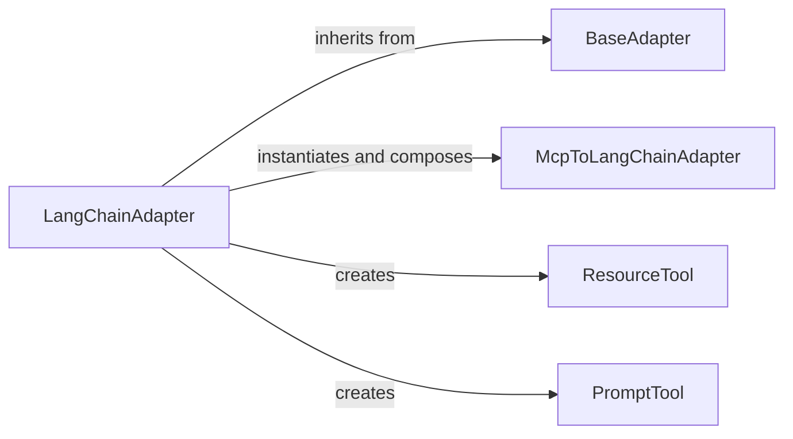

# Tool Adaptation Layer

### Details

The `Tool Adaptation Layer` subsystem is primarily encapsulated within the `mcp_use.adapters` Python package. Its core responsibility is to provide a flexible and extensible mechanism for converting generic tool definitions from the MCP (Multi-Component Protocol) system into formats that can be directly consumed by various AI frameworks, such as LangChain.

### BaseAdapter
Serves as the foundational abstract interface for managing and converting generic tools, resources, and prompts from different "connectors" into a standardized, framework-agnostic format. It defines the common lifecycle and core methods for tool adaptation.

**Related Classes/Methods**:

- <a href="https://github.com/mcp-use/mcp-use/blob/main/mcp_use/adapters/base.py#L20-L190" target="_blank" rel="noopener noreferrer">QName:`mcp_use.adapters.base.BaseAdapter` FileRef: `/home/ubuntu/CodeBoarding/repo/mcp-use/mcp_use/adapters/base.py`, Lines:(20:190)</a>

### LangChainAdapter
A concrete implementation of `BaseAdapter` specifically designed to adapt MCP tools, resources, and and prompts for seamless consumption within the LangChain framework. It handles LangChain-specific schema transformations, result parsing, and orchestrates the adaptation of individual tools.

**Related Classes/Methods**:

- <a href="https://github.com/mcp-use/mcp-use/blob/main/mcp_use/adapters/langchain_adapter.py#L29-L268" target="_blank" rel="noopener noreferrer">QName:`mcp_use.adapters.langchain_adapter.LangChainAdapter` FileRef: `/home/ubuntu/CodeBoarding/repo/mcp-use/mcp_use/adapters/langchain_adapter.py`, Lines:(29:268)</a>

### McpToLangChainAdapter
Acts as a specialized wrapper for individual MCP tools, making them directly compatible with LangChain's `Tool` interface. It encapsulates the logic for defining the tool's arguments and its execution within the LangChain agent's context.

**Related Classes/Methods**:

- <a href="https://github.com/mcp-use/mcp-use/blob/main/mcp_use/adapters/langchain_adapter.py#L119-L168" target="_blank" rel="noopener noreferrer">QName:`mcp_use.adapters.langchain_adapter.McpToLangChainAdapter` FileRef: `/home/ubuntu/CodeBoarding/repo/mcp-use/mcp_use/adapters/langchain_adapter.py`, Lines:(119:168)</a>

### ResourceTool
A specialized LangChain `Tool` representation specifically for interacting with MCP resources. It provides a LangChain-compatible interface to access or manipulate data resources exposed by the MCP system.

**Related Classes/Methods**:

- <a href="https://github.com/mcp-use/mcp-use/blob/main/mcp_use/adapters/langchain_adapter.py#L182-L209" target="_blank" rel="noopener noreferrer">QName:`mcp_use.adapters.langchain_adapter.ResourceTool` FileRef: `/home/ubuntu/CodeBoarding/repo/mcp-use/mcp_use/adapters/langchain_adapter.py`, Lines:(182:209)</a>

### PromptTool
A specialized LangChain `Tool` representation for dynamically generating or retrieving prompts from the MCP system. It allows LangChain agents to interact with and utilize MCP-defined prompts as callable tools.

**Related Classes/Methods**:

- <a href="https://github.com/mcp-use/mcp-use/blob/main/mcp_use/adapters/langchain_adapter.py#L247-L266" target="_blank" rel="noopener noreferrer">QName:`mcp_use.adapters.langchain_adapter.PromptTool` FileRef: `/home/ubuntu/CodeBoarding/repo/mcp-use/mcp_use/adapters/langchain_adapter.py`, Lines:(247:266)</a>
