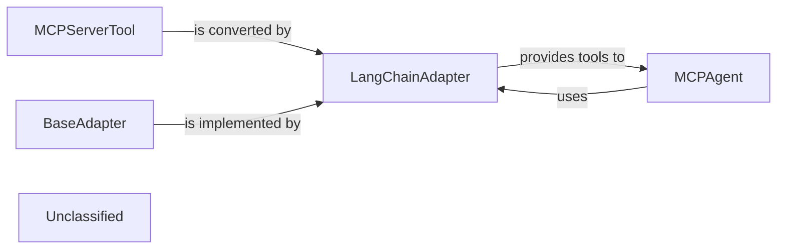

# Tool Adapter Framework

### Details

The `mcp-use` system employs an adaptable architecture for tool integration, centered around the `BaseAdapter` and its `LangChainAdapter` implementation. `MCPServerTool` defines the standard for internal tools, which the `LangChainAdapter` then transforms into a format compatible with the LangChain framework. This allows the `MCPAgent` to seamlessly discover, manage, and execute these adapted tools, enabling flexible interaction with various external systems and functionalities.

### MCPServerTool
Defines the fundamental interface and common behavior for all tools that can be managed and utilized by the agent within the `mcp-use` system. It serves as the abstract contract for any actionable capability, inheriting from `langchain_core.tools.BaseTool`.

**Related Classes/Methods**:

- <a href="https://github.com/mcp-use/mcp-use/blob/main/mcp_use/managers/tools/base_tool.py#L6-L19" target="_blank" rel="noopener noreferrer">QName:`mcp_use.managers.tools.base_tool.MCPServerTool` FileRef: `mcp_use/managers/tools/base_tool.py`, Lines:(6:19)</a>

### BaseAdapter
Establishes the abstract contract for all adapters. It outlines the methods and properties required to transform MCP-specific tools, resources, or prompts into a format compatible with external frameworks.

**Related Classes/Methods**:

- <a href="https://github.com/mcp-use/mcp-use/blob/main/mcp_use/adapters/base.py#L20-L190" target="_blank" rel="noopener noreferrer">QName:`mcp_use.adapters.base.BaseAdapter` FileRef: `mcp_use/adapters/base.py`, Lines:(20:190)</a>

### LangChainAdapter
A concrete implementation of `BaseAdapter` specifically designed to convert `mcp-use` tools or resources into a format usable by the LangChain framework. This component ensures interoperability with LangChain agents.

**Related Classes/Methods**:

- <a href="https://github.com/mcp-use/mcp-use/blob/main/mcp_use/adapters/langchain_adapter.py#L29-L270" target="_blank" rel="noopener noreferrer">QName:`mcp_use.adapters.langchain_adapter.LangChainAdapter` FileRef: `mcp_use/adapters/langchain_adapter.py`, Lines:(29:270)</a>

### MCPAgent
Responsible for orchestrating and utilizing tools. It interacts with adapter implementations to ensure tool compatibility and makes them accessible for execution.

**Related Classes/Methods**:

- <a href="https://github.com/mcp-use/mcp-use/blob/main/mcp_use/agents/mcpagent.py#L48-L1145" target="_blank" rel="noopener noreferrer">QName:`mcp_use.agents.mcpagent.MCPAgent` FileRef: `mcp_use/agents/mcpagent.py`, Lines:(48:1145)</a>

### Unclassified
Component for all unclassified files and utility functions (Utility functions/External Libraries/Dependencies)

**Related Classes/Methods**: _None_
