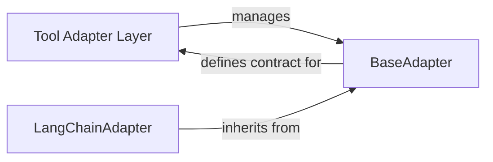

## Details

One paragraph explaining the functionality which is represented by this graph. What the main flow is and what is its purpose.

### Tool Adapter Layer [[Expand]](./Tool_Adapter_Layer)
Serves as the overarching abstraction layer responsible for integrating diverse external tools and primitives into the `mcp-use` framework. It provides a consistent interface for the Agent Core, promoting extensibility and tool interoperability by adapting various tool frameworks (e.g., LangChain) into a standardized format.

**Related Classes/Methods**:

- <a href="https://github.com/CodeBoarding/mcp-use/blob/main/mcp_use/adapters/__init__.py#L1-L1" target="_blank" rel="noopener noreferrer">`mcp_use.adapters` (1:1)</a>

### BaseAdapter
An abstract base class that defines the common interface and methods for all concrete tool adapters within the `mcp-use` framework. It establishes a consistent contract, ensuring that any new tool framework integrated will adhere to a predictable structure, thereby promoting modularity and maintainability.

**Related Classes/Methods**:

- <a href="https://github.com/CodeBoarding/mcp-use/blob/main/mcp_use/adapters/base.py#L1-L1" target="_blank" rel="noopener noreferrer">`mcp_use.adapters.base.BaseAdapter` (1:1)</a>

### LangChainAdapter
A concrete implementation of the `BaseAdapter`, specifically designed to integrate tools from the LangChain framework. Its primary responsibility is to translate LangChain-specific tool definitions, prompts, and resources into the `mcp-use` framework's standardized format, making LangChain tools usable by the Agent Core.

**Related Classes/Methods**:

- <a href="https://github.com/CodeBoarding/mcp-use/blob/main/mcp_use/adapters/langchain_adapter.py#L1-L1" target="_blank" rel="noopener noreferrer">`mcp_use.adapters.langchain_adapter.LangChainAdapter` (1:1)</a>
