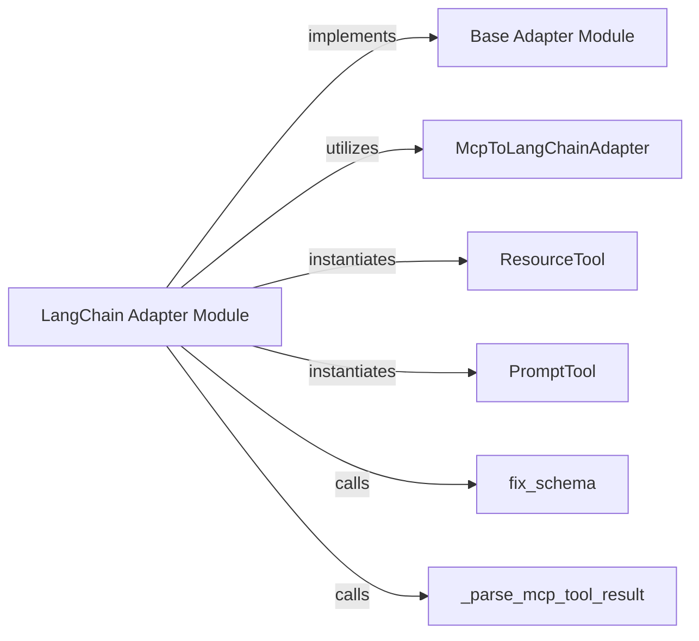

# Tool Adapters

### Details

The `Tool Adapters` subsystem is responsible for standardizing raw tool definitions into a format consumable by the `Agent Orchestration Core` and `LLM Integration Layer`. It acts as a crucial intermediary, ensuring seamless integration of diverse tools within the LLM agent framework.

### Base Adapter Module
Defines the abstract interface (BaseAdapter) and common workflow for creating and loading tools from various connectors. It establishes the contract for how different tool types (generic tools, resources, prompts) should be converted, ensuring extensibility for future adapter implementations.

**Related Classes/Methods**:

- <a href="https://github.com/mcp-use/mcp-use/blob/main/mcp_use/adapters/base.py#L20-L190" target="_blank" rel="noopener noreferrer">QName:`BaseAdapter` FileRef: `/home/ubuntu/CodeBoarding/repo/mcp-use/mcp_use/adapters/base.py`, Lines:(20:190)</a>

### LangChain Adapter Module
Implements the concrete logic for adapting generic MCP tool definitions (including resources and prompts) into the LangChain framework's tool format. It orchestrates the conversion process, handles schema normalization, and manages result parsing specific to LangChain.

**Related Classes/Methods**:

- <a href="https://github.com/mcp-use/mcp-use/blob/main/mcp_use/adapters/langchain_adapter.py#L1-L1" target="_blank" rel="noopener noreferrer">QName:`LangChain Adapter Module` FileRef: `/home/ubuntu/CodeBoarding/repo/mcp-use/mcp_use/adapters/langchain_adapter.py`</a>

### McpToLangChainAdapter
Directly translates a raw MCP tool definition (containing name, description, and input schema) into a structured LangChain `Tool` object, making it compatible with LangChain agents and the LLM Integration Layer. It's the core translation engine.

**Related Classes/Methods**:

- <a href="https://github.com/mcp-use/mcp-use/blob/main/mcp_use/adapters/langchain_adapter.py#L119-L168" target="_blank" rel="noopener noreferrer">QName:`McpToLangChainAdapter` FileRef: `/home/ubuntu/CodeBoarding/repo/mcp-use/mcp_use/adapters/langchain_adapter.py`, Lines:(119:168)</a>

### ResourceTool
Represents and encapsulates an external resource (e.g., a file, a service endpoint) as a LangChain-compatible tool. This allows agents to interact with and leverage various resources through a standardized LangChain tool interface.

**Related Classes/Methods**:

- <a href="https://github.com/mcp-use/mcp-use/blob/main/mcp_use/adapters/langchain_adapter.py#L182-L209" target="_blank" rel="noopener noreferrer">QName:`ResourceTool` FileRef: `/home/ubuntu/CodeBoarding/repo/mcp-use/mcp_use/adapters/langchain_adapter.py`, Lines:(182:209)</a>

### PromptTool
Represents and encapsulates a dynamic prompt or prompt template as a LangChain-compatible tool. This enables agents to dynamically access, manage, and utilize prompts within the LangChain framework, supporting flexible prompt engineering.

**Related Classes/Methods**:

- <a href="https://github.com/mcp-use/mcp-use/blob/main/mcp_use/adapters/langchain_adapter.py#L247-L266" target="_blank" rel="noopener noreferrer">QName:`PromptTool` FileRef: `/home/ubuntu/CodeBoarding/repo/mcp-use/mcp_use/adapters/langchain_adapter.py`, Lines:(247:266)</a>

### fix_schema
A utility function that normalizes and adjusts the input schema of tool definitions. Its purpose is to resolve any discrepancies and ensure the schema is compatible with LangChain's expected format, preventing parsing errors during tool invocation.

**Related Classes/Methods**:

- <a href="https://github.com/mcp-use/mcp-use/blob/main/mcp_use/adapters/langchain_adapter.py#L41-L56" target="_blank" rel="noopener noreferrer">QName:`fix_schema` FileRef: `/home/ubuntu/CodeBoarding/repo/mcp-use/mcp_use/adapters/langchain_adapter.py`, Lines:(41:56)</a>

### _parse_mcp_tool_result
Processes and parses the raw output received from an adapted MCP tool after its execution. It converts this output into a structured and usable format suitable for consumption by the Agent Orchestration Core or the LLM Integration Layer.

**Related Classes/Methods**:

- <a href="https://github.com/mcp-use/mcp-use/blob/main/mcp_use/adapters/langchain_adapter.py#L58-L100" target="_blank" rel="noopener noreferrer">QName:`_parse_mcp_tool_result` FileRef: `/home/ubuntu/CodeBoarding/repo/mcp-use/mcp_use/adapters/langchain_adapter.py`, Lines:(58:100)</a>
