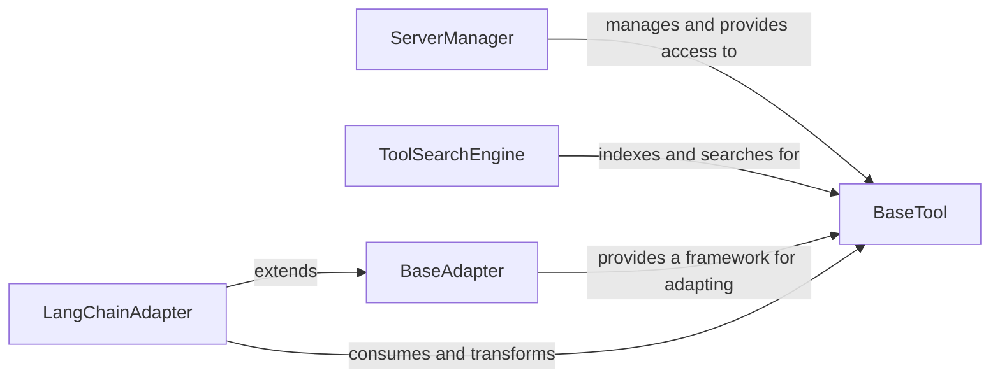

# Tool Management Adaptation

### Details

The MCP (Multi-Component Platform) system is designed around a flexible tool management and adaptation architecture. At its core, the `BaseTool` defines a universal interface for all tools, ensuring consistency and interoperability. The `ServerManager` acts as a central registry, managing the lifecycle and accessibility of server-hosted tools, making them available to various agents within the system. For dynamic discovery, the `ToolSearchEngine` indexes and facilitates searching for these tools based on their capabilities. To enable integration with external frameworks, the `BaseAdapter` provides an abstract mechanism for transforming MCP entities. A concrete implementation, the `LangChainAdapter`, specifically adapts MCP tools for seamless consumption by the LangChain framework, highlighting the system's extensibility and focus on external framework compatibility. This architecture promotes modularity, discoverability, and adaptability, crucial for a robust multi-component platform.

### BaseTool
Defines the abstract interface and foundational structure for all tools within the MCP ecosystem. It establishes a consistent contract for tool execution, input/output, and metadata, ensuring interoperability across different tool implementations.

**Related Classes/Methods**:

- <a href="https://github.com/mcp-use/mcp-use/blob/main/mcp_use/managers/tools/base_tool.py#L1-L1" target="_blank" rel="noopener noreferrer">QName:`BaseTool` FileRef: `/home/ubuntu/CodeBoarding/repo/mcp-use/mcp_use/managers/tools/base_tool.py`</a>

### ServerManager
Manages the discovery, registration, and provision of server-managed tools. It acts as a central registry for tools hosted or controlled by an MCP server, making them accessible to agents.

**Related Classes/Methods**:

- <a href="https://github.com/mcp-use/mcp-use/blob/main/examples/simple_server_manager_use.py#L53-L74" target="_blank" rel="noopener noreferrer">QName:`ServerManager` FileRef: `/home/ubuntu/CodeBoarding/repo/mcp-use/examples/simple_server_manager_use.py`, Lines:(53:74)</a>

### ToolSearchEngine
Indexes available tools and facilitates their dynamic discovery through search queries. It enables agents to find relevant tools based on their capabilities or descriptions, supporting the "search-enabled" aspect of tool access.

**Related Classes/Methods**:

- <a href="https://github.com/mcp-use/mcp-use/blob/main/mcp_use/managers/tools/search_tools.py#L58-L328" target="_blank" rel="noopener noreferrer">QName:`ToolSearchEngine` FileRef: `/home/ubuntu/CodeBoarding/repo/mcp-use/mcp_use/managers/tools/search_tools.py`, Lines:(58:328)</a>

### BaseAdapter
Provides a generic, abstract framework for adapting MCP-defined entities (including tools) into formats compatible with external systems or frameworks. It defines the common interface for conversion logic, promoting extensibility.

**Related Classes/Methods**:

- <a href="https://github.com/mcp-use/mcp-use/blob/main/mcp_use/adapters/base.py#L20-L190" target="_blank" rel="noopener noreferrer">QName:`BaseAdapter` FileRef: `/home/ubuntu/CodeBoarding/repo/mcp-use/mcp_use/adapters/base.py`, Lines:(20:190)</a>

### LangChainAdapter
Specializes the BaseAdapter to specifically translate MCP-defined tools into a format consumable by the LangChain framework. This is crucial for integrating MCP tools with LangChain-based LLM agents, directly addressing the adaptation to "external frameworks like LangChain."

**Related Classes/Methods**:

- <a href="https://github.com/mcp-use/mcp-use/blob/main/mcp_use/adapters/langchain_adapter.py#L29-L268" target="_blank" rel="noopener noreferrer">QName:`LangChainAdapter` FileRef: `/home/ubuntu/CodeBoarding/repo/mcp-use/mcp_use/adapters/langchain_adapter.py`, Lines:(29:268)</a>
