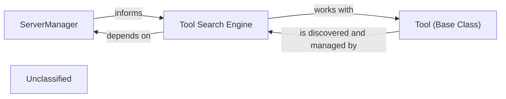

# Tool Management Discovery

### Details

This subsystem, 'Tool Management & Discovery', is responsible for connecting to external MCP servers, discovering and indexing the tools they offer, and providing a standardized interface for these tools to be utilized by the `MCPAgent`. Its main purpose is to act as the bridge between the agent's need for functionality and the available external services, ensuring dynamic and reliable access to tools.

### ServerManager
Manages the lifecycle and state of connections to various MCP servers. It acts as the central registry for available servers, handling connection establishment, disconnection, and potentially monitoring server health. This component is crucial for maintaining a dynamic and reliable connection landscape for the agent.

**Related Classes/Methods**:

- QName:`mcp_use.managers.server_manager.ServerManager` FileRef: `/home/ubuntu/CodeBoarding/repo/mcp-use/mcp_use/managers/server_manager.py`

### Tool Search Engine
Provides the capability to dynamically discover, index, and search for tools available across connected MCP servers. This component enables the `MCPAgent` to find and utilize tools based on specific criteria without prior explicit configuration, embodying the dynamic nature of agentic systems.

**Related Classes/Methods**:

- QName:`mcp_use.managers.tools.search_tools:search_tools` FileRef: `/home/ubuntu/CodeBoarding/repo/mcp-use/mcp_use/managers/tools/search_tools.py`

### Tool (Base Class)
Defines the abstract interface and common properties for all tools within the MCP ecosystem. This standardization is crucial for the `MCPAgent` to interact uniformly with diverse tools, regardless of their underlying implementation. It encapsulates attributes like name, description, and input/output schemas, ensuring interoperability.

**Related Classes/Methods**:

- QName:`mcp_use.managers.tools.base_tool.Tool` FileRef: `/home/ubuntu/CodeBoarding/repo/mcp-use/mcp_use/managers/tools/base_tool.py`

### Unclassified
Component for all unclassified files and utility functions (Utility functions/External Libraries/Dependencies)

**Related Classes/Methods**: _None_
