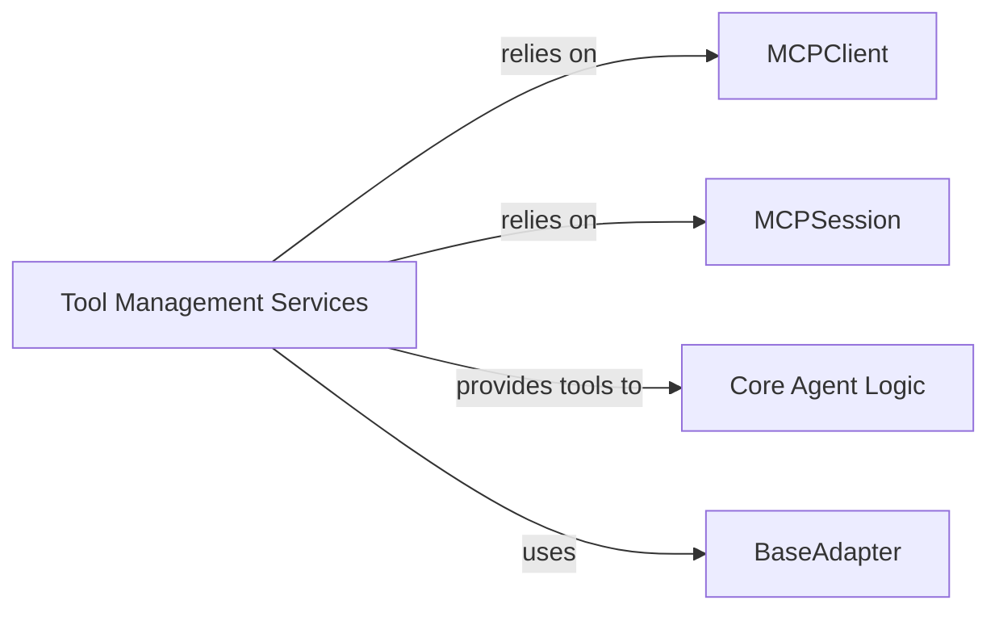

## Details

Abstract Components Overview of the MCP system.

### Tool Management Services [[Expand]](./Tool_Management_Services)
This component is central to enabling AI agents to interact with external capabilities provided by the MCP server. It encapsulates the logic for discovering, listing, and dynamically invoking tools exposed by the server. It acts as a crucial intermediary, abstracting the complexities of server-side tool management and presenting them in a usable format for the agent. This aligns with the "Tool/Primitive Abstraction" and "Client-Server (Internal)" architectural patterns, providing a standardized interface for tool interaction.

**Related Classes/Methods**:

- <a href="https://github.com/CodeBoarding/mcp-use/blob/main/mcp_use/managers/tools/connect_server.py#L15-L68" target="_blank" rel="noopener noreferrer">`mcp_use.managers.tools.connect_server.ConnectServerTool` (15:68)</a>
- <a href="https://github.com/CodeBoarding/mcp-use/blob/main/mcp_use/managers/tools/disconnect_server.py#L15-L42" target="_blank" rel="noopener noreferrer">`mcp_use.managers.tools.disconnect_server.DisconnectServerTool` (15:42)</a>
- <a href="https://github.com/CodeBoarding/mcp-use/blob/main/mcp_use/managers/tools/get_active_server.py#L13-L28" target="_blank" rel="noopener noreferrer">`mcp_use.managers.tools.get_active_server.GetActiveServerTool` (13:28)</a>
- <a href="https://github.com/CodeBoarding/mcp-use/blob/main/mcp_use/managers/tools/list_servers_tool.py#L15-L51" target="_blank" rel="noopener noreferrer">`mcp_use.managers.tools.list_servers_tool.ListServersTool` (15:51)</a>
- <a href="https://github.com/CodeBoarding/mcp-use/blob/main/mcp_use/managers/tools/search_tools.py#L22-L54" target="_blank" rel="noopener noreferrer">`mcp_use.managers.tools.search_tools.SearchToolsTool` (22:54)</a>
- <a href="https://github.com/CodeBoarding/mcp-use/blob/main/mcp_use/managers/tools/use_tool.py#L21-L153" target="_blank" rel="noopener noreferrer">`mcp_use.managers.tools.use_tool.UseToolFromServerTool` (21:153)</a>
- <a href="https://github.com/CodeBoarding/mcp-use/blob/main/mcp_use/managers/tools/base_tool.py#L5-L18" target="_blank" rel="noopener noreferrer">`mcp_use.managers.tools.base_tool.MCPServerTool` (5:18)</a>
- <a href="https://github.com/CodeBoarding/mcp-use/blob/main/mcp_use/managers/tools/search_tools.py#L57-L327" target="_blank" rel="noopener noreferrer">`mcp_use.managers.tools.search_tools.ToolSearchEngine` (57:327)</a>
- <a href="https://github.com/CodeBoarding/mcp-use/blob/main/mcp_use/managers/server_manager.py#L16-L89" target="_blank" rel="noopener noreferrer">`mcp_use.managers.server_manager.ServerManager` (16:89)</a>

### MCPClient
Essential for the "Client-Server (Internal)" pattern. It handles the low-level communication with the MCP server, abstracting network details and ensuring reliable data exchange. This separation allows for different transport layers or server types to be plugged in without affecting higher-level logic.

**Related Classes/Methods**:

- <a href="https://github.com/CodeBoarding/mcp-use/blob/main/mcp_use/client.py" target="_blank" rel="noopener noreferrer">`mcp_use.client.MCPClient`</a>

### MCPSession
Crucial for maintaining state in a client-server interaction. It encapsulates session-specific data, ensuring that interactions with the MCP server are contextualized and consistent. This aligns with good state management practices in a distributed system.

**Related Classes/Methods**:

- <a href="https://github.com/CodeBoarding/mcp-use/blob/main/mcp_use/session.py" target="_blank" rel="noopener noreferrer">`mcp_use.session.MCPSession`</a>

### Core Agent Logic
The heart of the system, representing the "Orchestration Layer." It contains the primary decision-making and execution flow of the AI agent. Its clear separation from tool management or server communication ensures that the agent's core reasoning remains independent of underlying infrastructure.

**Related Classes/Methods**:

- <a href="https://github.com/CodeBoarding/mcp-use/blob/main/mcp_use/agents/mcpagent.py" target="_blank" rel="noopener noreferrer">`mcp_use.agents.mcpagent.MCPAgent`</a>

### BaseAdapter
Implements the "Adapter/Plugin Pattern." It provides a standardized way to transform diverse server responses into a consistent format, crucial for maintaining modularity and extensibility when integrating with various external systems or different versions of the MCP server API.

**Related Classes/Methods**:

- <a href="https://github.com/CodeBoarding/mcp-use/blob/main/mcp_use/adapters/base.py" target="_blank" rel="noopener noreferrer">`mcp_use.adapters.base.BaseAdapter`</a>
